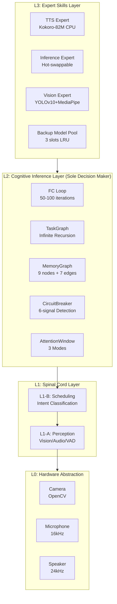

# Zulong (祖龙)

> **A Multi-layer Adaptive Intelligent Agent Cognitive Operating System with Heterogeneous Graph Memory**

[](LICENSE)
[](https://www.python.org/)
[](https://www.typescriptlang.org/)
[]()
[](https://github.com/beautistart/zulong/releases)

[English](./docs/README_EN.md) | [简体中文](./README.md)

---

## 🎯 The Story Behind Zulong

### Built Solo by an Interior Designer in 2 Months

**I'm an interior designer** with no technical background, no team, no funding.

But I believe AI assistants should have **real memory**, not starting from zero every conversation.

So I used **design thinking to redesign AI's memory system** — treating memory like spatial relationships in architecture — and solo-developed this multimodal AI Agent system that **surpasses big tech** in:

- ✅ **Heterogeneous Graph Memory** (9 node types + 7 edge types + Hebbian learning + Ebbinghaus forgetting)
- ✅ **6-Signal Deadlock Detection** (market's most comprehensive)
- ✅ **8-Layer Small Model Compensation** (enables 4B-8B models for complex tasks)

> "This isn't just a product — it's a story of an ordinary person fighting against tech monopoly."

**为什么一个室内设计师能做出这个？** → [阅读我的故事](./docs/MY_STORY.md)

---

## 🏗️ System Architecture

Zulong uses a **5-layer hierarchical architecture** (L0-L3). Philosophy: "The system handles cognitive infrastructure; the model only makes local decisions."



### Workflow

```
User Input (Voice/Text/Vision)
         ↓
┌─────────────────────┐
│  L1-B Intent Class  │ ← ALBERT (<10ms)
│  Voice Mode Detect  │
└─────────┬───────────┘
          ↓
┌─────────────────────┐
│  Memory Retrieval   │ ← BFS Activation + Hebbian
│  3D Tag Filtering   │
└─────────┬───────────┘
          ↓
┌─────────────────────┐
│  L2 Inference Engine│ ← 50-100 Auto-iterations
│  FC Loop + Planning │
└─────────┬───────────┘
          ↓
┌─────────────────────┐
│  Tool Exec + TTS    │ ← Multi-expert Parallel
└─────────────────────┘
  Loop: Understand → Memory → Plan → Execute → Learn
```

---

## ✨ Key Features

### 🧠 Heterogeneous Graph Memory System

- **9 Node Types**: TASK / DIALOGUE / KNOWLEDGE / EXPERIENCE / EPISODE / FILE / CONCEPT / PERSON / DOCUMENT
- **7 Edge Types**: HIERARCHY / DEPENDENCY / REFERENCE / TEMPORAL / SEMANTIC / CAUSAL / ASSOCIATION
- **Hebbian Learning**: Co-activated nodes strengthen connections, asymptotically approaching weight 1.0
- **Ebbinghaus Forgetting**: 6-level importance half-life (6h ~ permanent), LLM review for endangered edges
- **BFS Activation Spread**: 3-hop bidirectional propagation, simulating neural activation
- **Dual-path Retrieval**: Hot path (semantic-first) + Cold path (FAISS vector search)

### 🛡️ 6-Signal Deadlock Detection

| Signal | Detection Mechanism | Response |
|--------|---------------------|----------|
| Repeated Call | function_name + params hash identical | Immediate RED |
| Pattern Loop | Same tool 5 times, similarity >0.7 | YELLOW |
| Info Gain Decay | Result overlap >0.8 | YELLOW |
| Context Pressure | Messages token near 75% window | YELLOW |
| Repetitive Mode | BFS config unchanged 6 rounds | YELLOW |
| Wall-clock Time | Cumulative inference >120s | RED |

**Three-state Management**: GREEN → YELLOW → RED (dynamic relaxation mode)

### 🎯 8-Layer Small Model Compensation

Enables **4B-8B small models** for medium-complexity tasks:

1. 5-layer防护链 (format repair → safety filter → hallucination detection → consistency check → fallback)
2. CB 6-signal circuit breaker
3. Expert hot-switch (<10ms)
4. Dual-brain container (left-brain temp=0.3 logic + right-brain temp=0.8 creativity)
5. Small model fallback (RTX 3060 6GB runs fine)
6. Two-stage intent classification (coarse→fine, reduces LLM calls)
7. Dual-instance interruption
8. Multi-level retry degradation

### 🎙️ Complete Multimodal Capabilities

- **ASR**: SenseVoice-Small (ONNX, with emotion/event detection, ~244M)
- **TTS**: Kokoro-82M (CPU real-time inference <0.3s, 12 preset voices)
- **Vision**: YOLOv10 object detection + MediaPipe hand/pose tracking + optical flow motion detection
- **Voice Intent Classification**: ALBERT base model + independent 3-class head (TEXT_ONLY / AUTO_TTS / FORCED_TTS)

### 📋 Cross-Day Task Recovery

- Task snapshot persistence (dialogue + CB state + TaskGraph + rounds)
- LRU eviction (max 5 snapshots, 512MB memory limit)
- Semantic similarity auto-clustering (embedding threshold 0.55)
- Cross-day stateless recovery

---

## 📊 Technology Comparison

### vs Mainstream Agent Frameworks

| Capability | Zulong | AutoGen | LangGraph | Zep |
|-----------|:---:|:---:|:---:|:---:|
| Heterogeneous Graph Memory | **9/10** ⭐ | 2/10 | 3/10 | 8/10 |
| FC Loop Protection | **10/10** ⭐ | 5/10 | 5/10 | N/A |
| Small Model Compensation | **10/10** ⭐ | 0/10 | 0/10 | 0/10 |
| Context Management | **9/10** ⭐ | 6/10 | 7/10 | 5/10 |
| Dialogue Interrupt/Resume | **9/10** ⭐ | 0/10 | 3/10 | 0/10 |
| Multi-Agent Collaboration | 6/10 | **9/10** ⭐ | 7/10 | N/A |
| Voice Interaction (ASR/TTS) | **9/10** ⭐ | 0/10 | 0/10 | 0/10 |
| Product Maturity | 2/10 | 8/10 | 9/10 | **8/10** ⭐ |

### vs UI-TARS-desktop (ByteDance GUI Agent)

| Capability | Zulong | UI-TARS | Verdict |
|-----------|:---:|:---:|---------|
| GUI Automation Control | 2/10 | **10/10** | UI-TARS Leads |
| Multimodal Memory System | **9/10** | 1/10 | Zulong Leads |
| Long-term Dialogue Memory | **9/10** | 0/10 | Zulong Leads |
| Task Planning & Decomposition | **9/10** | 5/10 | Zulong Leads |
| Deadlock Protection | **10/10** | 3/10 | Zulong Far Ahead |
| Voice Interaction (ASR/TTS) | **9/10** | 0/10 | Zulong Leads |
| MCP Tool Integration | 6/10 | **9/10** | UI-TARS Leads |
| Ecosystem & Community | 1/10 | **8/10** | UI-TARS Leads |

**Conclusion**: Zulong and UI-TARS have **completely different positioning** — Zulong focuses on memory & dialogue, UI-TARS focuses on GUI control. They can be **complementary** (Zulong as cognitive brain + UI-TARS as GUI execution expert).

---

## 🚀 Quick Start

### Requirements

- **Python**: 3.10+
- **Node.js**: 18+
- **Memory**: 8GB+ (16GB recommended)
- **GPU**: RTX 3060 6GB+ (optional, CPU also works)
- **OS**: Windows / macOS / Linux

### Installation

#### 1. Clone Repository

```bash
git clone https://github.com/beautystart/zulong.git
cd zulong
```

#### 2. Install Python Dependencies

```bash
# Create virtual environment
python -m venv zulong_env
source zulong_env/bin/activate  # Linux/macOS
# or
zulong_env\Scripts\activate     # Windows

# Install dependencies
pip install -r requirements.txt
```

#### 3. Build VS Code Extension

```bash
cd zulong-ide
npm install
npm run protos
cd webview-ui && npm install && npm run build && cd ..
node esbuild.mjs --production
npx @vscode/vsce package --no-dependencies --allow-missing-repository --skip-license
code --install-extension zulong-ide-0.1.0.vsix --force
```

### Launch

```bash
# Start backend service
python -m zulong.ide.ide_server

# In VS Code, open command palette (Ctrl+Shift+P)
# Select "Zulong: Start Session"
```

### Configuration

Edit `config/zulong_config.yaml`:

```yaml
l2_inference:
  core_model: "qwen3.5:cloud"     # Cloud model
  backup_model: "qwen3.5:cloud"   # Backup model

audio.tts:
  backend: "kokoro"               # TTS engine
  voice: "zf_xiaoxiao"            # Voice preset
  device: "cpu"                   # Device

audio.asr:
  backend: "sensevoice"           # ASR engine
  device: "cuda"                  # Device (cpu/cuda)
```

---

## 📚 Documentation

### Technical Docs

- [Deep Technical Analysis Report](docs/祖龙系统深度技术分析报告.md)
- [Technical Specification v3.0](docs/TSD_v3.0.md)
- [MemoryGraph Architecture](docs/MemoryGraph_Architecture.md)
- [CircuitBreaker Design](docs/CircuitBreaker_Design.md)
- [AttentionWindow Mechanism](docs/AttentionWindow_Mechanism.md)

### User Guides

- [IDE Usage Guide](docs/Zulong_IDE使用指南.md)
- [Quick Start Guide](docs/快速启动指南.md)
- [Configuration Guide](docs/Configuration_Guide.md)
- [Docker Deployment](docs/DOCKER_DEPLOYMENT.md)

### Development Docs

- [Contributing Guide](CONTRIBUTING.md)
- [Changelog](CHANGELOG.md)
- [AGENTS.md](AGENTS.md) (Qoder Project Context)
- [Core Module Details](docs/CORE_MANAGER_MODULES.md)

---

## 🏆 Technical Highlights

### Code Statistics

| Module | File | Code Size | Maturity |
|--------|------|-----------|----------|
| L2 Inference Engine | `inference_engine.py` | 190KB, 5700+ lines | Production |
| Memory Graph | `memory_graph.py` | 148KB, 2784 lines | Production |
| IDE FC Loop | `ide_fc_runner.py` | 167KB | Production |
| IDE Server | `ide_server.py` | 62KB | Production |
| Circuit Breaker | `circuit_breaker.py` | 23KB | Production |
| **Total** | 49+ core files | **30,000+ lines** | Production Ready |

### Performance Metrics

- **Intent Classification Latency**: <10ms (ALBERT-tiny, CPU)
- **TTS Synthesis Time**: <0.3s (Kokoro-82M, CPU)
- **ASR Transcription Time**: 0.5-1s (SenseVoice, 5s audio)
- **Memory Retrieval Time**: 50-150ms (BFS + FAISS)
- **End-to-End Voice Latency**: 3-4s (microphone → speaker)
- **FC Loop Rounds**: 50-100 (adaptive)

### Deployment Modes

1. **Pure Local**: 4B-8B small model, RTX 3060 6GB, zero API cost
2. **Pure Cloud**: GPT-4/Claude, unlimited cognitive power
3. **Hybrid Mode**: Cloud decision + local execution, balanced cost & performance
4. **vLLM Mode**: Local vLLM service, high concurrency low latency

---

## 🤝 Contributing

We welcome all contributions!

- 🐛 **Bug Reports**: Use [GitHub Issues](https://github.com/beautystart/zulong/issues)
- 💡 **Feature Requests**: Use [GitHub Discussions](https://github.com/beautystart/zulong/discussions)
- 📝 **Code Contributions**: Read [Contributing Guide](CONTRIBUTING.md)
- 📢 **Spread the Word**: Give us a ⭐ Star and recommend to others

### Contributor License Agreement (CLA)

For contributions over 100 lines of code, a CLA must be signed to ensure:
1. You grant Zulong project permanent, non-exclusive usage rights
2. Your contributions can be used in the open-source version
3. Protection against future legal issues

---

## 📄 License

This project uses a **tiered license** strategy:

- **Core Code** (`zulong/l2/`, `zulong/memory/memory_graph.py`, etc.): [AGPL-3.0](LICENSE)
- **Frontend** (`zulong-ide/`, `zulong/config/`, etc.): [MIT](LICENSE-MIT)
- **Documentation** (`docs/`, `README.md`): [CC BY-NC-SA 4.0](LICENSE-DOCS)

See [LICENSE](LICENSE) file for details.

---

## 📞 Contact

- **GitHub Issues**: [Report Issues](https://github.com/beautystart/zulong/issues)
- **Discord**: [Join Community](https://discord.gg/zulong) (Coming Soon)
- **WeChat**: Scan QR code to join group (Coming Soon)

---

## 🙏 Acknowledgments

Thanks to all open-source project contributors. Zulong stands on the shoulders of giants:

- [ALBERT](https://github.com/google-research/albert) - Lightweight pre-trained language model
- [Kokoro-82M](https://github.com/hexgrad/kokoro) - 82M parameter TTS model
- [SenseVoice](https://github.com/FunAudioLLM/SenseVoice) - Multilingual speech recognition
- [LangGraph](https://github.com/langchain-ai/langgraph) - Agent framework reference
- [Cline](https://github.com/cline/cline) - VS Code Agent foundation

---

<p align="center">
  <strong>Zulong - Giving AI Real Memory</strong><br>
  <em>Built with ❤️ by an Interior Designer</em>
</p>
