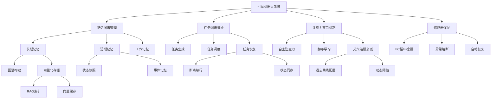

# Qoder 记忆导出 - 祖龙项目

> 导出时间: 2026-05-04
> 用途: 跨账号迁移，在新账号中作为项目上下文导入

---

## 一、项目介绍

### 1.1 项目功能树



### 1.2 祖龙系统项目概述

**项目名称**: 祖龙 (ZULONG) 机器人系统

**核心定位**: 面向AI机器人的生产级服务系统，支持多模态大模型（如InternVL）推理与状态管理

**启动机制**: 入口脚本 `/entrypoint.sh` → 执行 `python -m zulong.bootstrap`

**健康检查**: HTTP端点 `GET /health`，监听端口 `8000`

**默认环境**: `ZULONG_ENV=production`, `ZULONG_LOG_LEVEL=INFO`

### 1.3 祖龙系统项目介绍

祖龙系统是一个多层自适应GenAI智能体，核心机制包括记忆图谱（MemoryGraph）、任务图谱（TaskGraph）、注意力窗口（AttentionWindow）和熔断器（CircuitBreaker），支持BFS扩散激活、赫布学习、艾宾浩斯衰减等算法。

---

## 二、项目技术栈

### 2.1 核心技术栈

项目采用统一异构图架构，核心模块包括MemoryGraph（9种节点+7种边）、TaskGraph（树形任务分解）、AttentionWindow（三态注意力模式）和CircuitBreaker（六信号熔断器）；Web前端复用openclaw_bridge的D3.js力导向图谱和Dagre分层布局可视化组件。

### 2.2 模型与推理技术栈

项目使用Qwen/Qwen3.6-27B作为核心大模型，通过SiliconFlow API调用；备份模型为qwen3.5:4b，通过本地Ollama服务调用；嵌入模型为BAAI/bge-small-zh-v1.5，维度512，支持FAISS AVX2加速。

### 2.3 Docker技术栈

**基础运行时**: Python 3.10 + NVIDIA CUDA 11.7/CUDNN8 运行时镜像

**关键依赖**: `libglib2.0-0`, `libsm6`, `libxext6`, `libxrender-dev`, `libgomp1`

**安全实践**: 多阶段构建、非 root 用户 `zulong`、只读挂载模型卷

**模型约定**: 模型根路径 `/models`，默认子目录 `internvl`

### 2.4 Zulong IDE 项目整体概况与核心功能

Zulong IDE是一个基于Cline v3.82.0的VS Code插件，核心定位是AI编程助手。主要功能包括：通过自然语言描述任务自动执行文件读写、终端命令、浏览器操作和MCP工具调用；所有操作默认需人工批准，支持按类型开启自动批准或启用极速模式；提供聚焦链（维护任务进度清单）、子智能体（并行处理）、检查点（操作回滚）等高级功能；用户通过侧边栏图标、顶部导航栏（新建任务/MCP/历史/设置）和快捷键（Ctrl+Shift+P）进行交互。

### 2.5 Qoder 会话绑定机制

Qoder会话上下文绑定项目目录，不支持跨账号迁移。

---

## 三、项目依赖配置

### 3.1 FAISS 向量依赖

项目依赖FAISS向量数据库，配置AVX2指令集加速，用于记忆图谱的摘要侧车索引和RAG系统的向量检索。

---

## 四、环境配置

### 4.1 后端服务路由配置

祖龙后端服务运行在localhost:8090端口，已定义/ws路径提供WebSocket服务和/health路径提供健康检查，但未定义根路径/的HTTP路由，因此浏览器访问localhost:8090会返回404 Not Found。

### 4.2 任务与记忆数据存储与迁移方式

Zulong系统中的任务图和记忆图数据存储在Python后端的本地数据库或文件中，迁移时可通过拷贝对应数据文件至新环境完成。

### 4.3 系统环境配置

项目运行在production环境，配置文件为zulong_config.yaml，核心组件包括ConfigManager、CORE LLM、BACKUP LLM、EmbeddingModel、CircuitBreaker等。

### 4.4 Docker Compose 环境配置

**服务编排**: `zulong`主服务（GPU加速）、`prometheus`（指标采集）、`grafana`（可视化）、`loki`（日志）

**GPU配置**: `nvidia/cuda:11.7-cudnn8-runtime-ubuntu22.04` + `NVIDIA_VISIBLE_DEVICES=0` + `devices.reservations`

**卷挂载约定**: `/models`(ro), `/data`, `/logs`, `/checkpoints`

**端口映射**: `8000:8000`(API), `9090:9090`(Prometheus), `3000:3000`(Grafana), `3100:3100`(Loki)

---

## 五、项目构建配置

### 5.1 项目标准启动入口

项目当前唯一的标准启动入口是`python start.py`，它会启动统一启动器LauncherApp，提供Web界面供用户选择Full或IDE模式。

### 5.2 系统构建配置

项目采用防抖自动保存机制，设置2秒防抖窗口，避免频繁I/O；同时配置atexit安全网，在进程退出时强制刷盘所有待保存数据，确保数据一致性。

### 5.3 proto 文件生成配置

项目通过运行'npm run protos'命令生成TypeScript proto文件，依赖grpc-tools提供的protoc二进制。

### 5.4 npm 构建脚本配置

项目使用npm脚本进行构建，包括'build:webview'用于构建前端UI，'protos'用于生成TypeScript proto文件。

### 5.5 webview-ui 构建配置

项目前端UI（webview-ui）使用npm进行构建，需先安装其依赖，然后执行构建命令。

### 5.6 VSIX 打包配置

项目使用vsce工具打包为VSIX扩展包，命令为'npx @vscode/vsce package'，支持--no-dependencies等参数。

### 5.7 VS Code 扩展安装配置

构建完成的VSIX扩展包可通过'code --install-extension'命令安装到VS Code中。

---

## 六、Zulong IDE 插件项目规范

**使用场景**：在Zulong IDE项目中进行开发、调试或维护时，需要了解项目架构、构建流程和编码规范。

**概要**：Zulong IDE是基于Cline v3.82.0的VS Code插件，前端为React+Vite，后端为Python FastAPI+WebSocket，通信地址ws://127.0.0.1:8090/ide；组件名不翻译，用户界面全中文；导航含Chat/MCP/History/Settings四标签。

**获取详情方式**：使用read_file工具，从根目录读取agents.md

---

## 七、完整构建流程（参考）

```bash
# Full build sequence (run from zulong-ide/ directory):
npm run protos                    # Generate TypeScript proto files
cd webview-ui && npm install && npm run build && cd ..  # Build React webview
node esbuild.mjs --production     # Build extension with esbuild
npx @vscode/vsce package --no-dependencies --allow-missing-repository --skip-license  # Package VSIX
code --install-extension zulong-ide-0.1.0.vsix --force  # Install
```

---

## 八、迁移指南

在新账号的 Qoder 中，可以通过以下方式恢复这些记忆：

1. 打开祖龙项目目录
2. 让 Qoder 读取本文件：`请读取 docs/qoder_memory_export.md 并将其中的内容作为项目知识记住`
3. 同时确保 `AGENTS.md` 文件存在于项目根目录（该文件会被 Qoder 自动读取）
