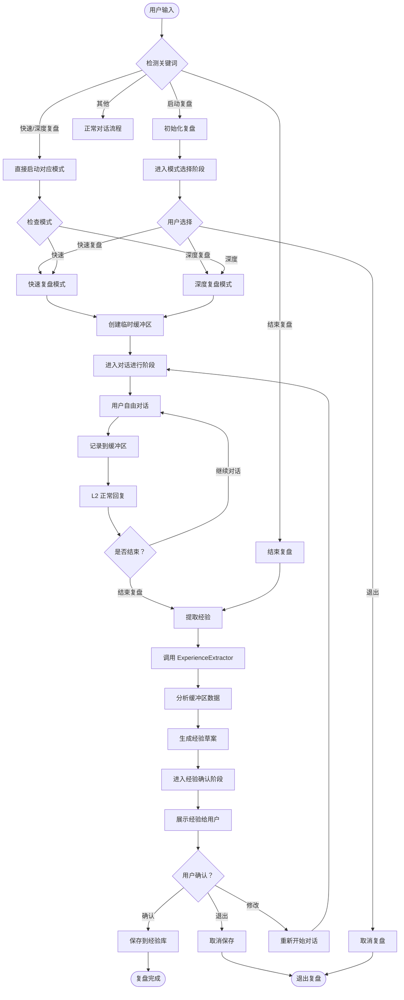
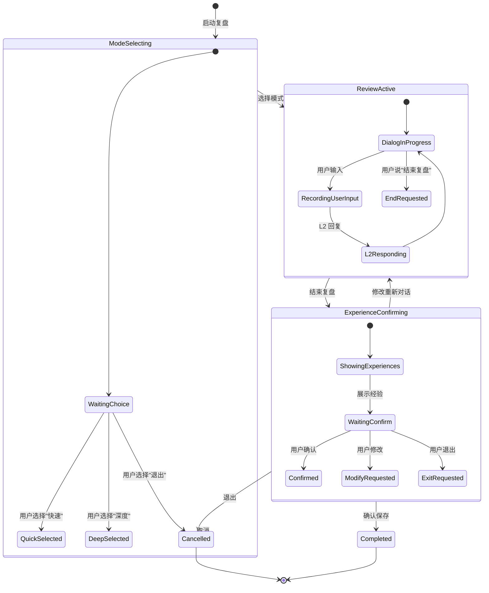
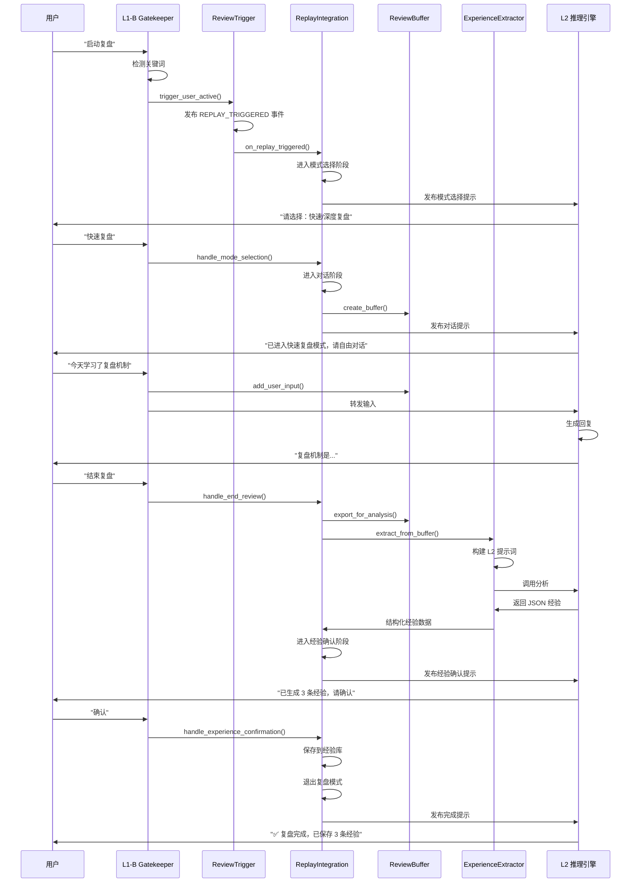
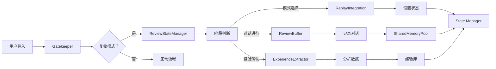

# 复盘机制流程图

## 完整复盘流程



## 三阶段状态机



## 组件交互流程



## 数据流



## 状态转换图

```mermaid
graph TD
    S0[空闲状态 IDLE] --> S1[模式选择 MODE_SELECTING]
    S1 --> S2[对话进行 REVIEW_ACTIVE]
    S2 --> S3[经验确认 EXPERIENCE_CONFIRMING]
    
    S1 --> S4[已取消 CANCELLED]
    S3 --> S5[已完成 COMPLETED]
    S3 --> S4
    S2 --> S4
    
    S5 --> S0
    S4 --> S0
    
    S0 -->|用户说"启动复盘"| S1
    S1 -->|用户选择模式 | S2
    S2 -->|用户说"结束复盘"| S3
    S3 -->|用户确认 | S5
    S3 -->|用户修改 | S2
    S3 -->|用户退出 | S4
    S1 -->|用户退出 | S4
    S2 -->|用户退出 | S4
    
    style S0 fill:#f9f,stroke:#333,stroke-width:2px
    style S1 fill:#ff9,stroke:#333,stroke-width:2px
    style S2 fill:#9f9,stroke:#333,stroke-width:2px
    style S3 fill:#99f,stroke:#333,stroke-width:2px
    style S4 fill:#f99,stroke:#333,stroke-width:2px
    style S5 fill:#9ff,stroke:#333,stroke-width:2px
```

## 关键决策点

```mermaid
graph TD
    Start([用户输入]) --> Check1{是否包含"复盘"？}
    
    Check1 -->|是 | Check2{是否已激活复盘模式？}
    Check1 -->|否 | Normal[正常处理]
    
    Check2 -->|否 | Check3{是否为启动指令？}
    Check2 -->|是 | Check4{当前阶段？}
    
    Check3 -->|"启动复盘"| TriggerReview[触发 ReviewTrigger]
    Check3 -->|"快速/深度复盘"| DirectStart[直接启动]
    Check3 -->|其他 | Ignore[忽略]
    
    Check4 -->|模式选择 | HandleModeSelect[处理模式选择]
    Check4 -->|对话进行 | Check5{是否为结束指令？}
    Check4 -->|经验确认 | HandleConfirm[处理确认]
    
    Check5 -->|是 | ExtractExperience[提取经验]
    Check5 -->|否 | RecordAndForward[记录并转发给 L2]
    
    TriggerReview --> End([结束])
    DirectStart --> End
    HandleModeSelect --> End
    ExtractExperience --> End
    HandleConfirm --> End
    RecordAndForward --> End
    Normal --> End
    Ignore --> End
```

---

**图例说明**：
- 🟪 粉色：空闲状态
- 🟨 黄色：模式选择阶段
- 🟩 绿色：对话进行阶段
- 🟦 蓝色：经验确认阶段
- 🟥 红色：已取消
- 🟦 青色：已完成

**创建时间**: 2026-04-14  
**维护者**: 祖龙系统产品团队
