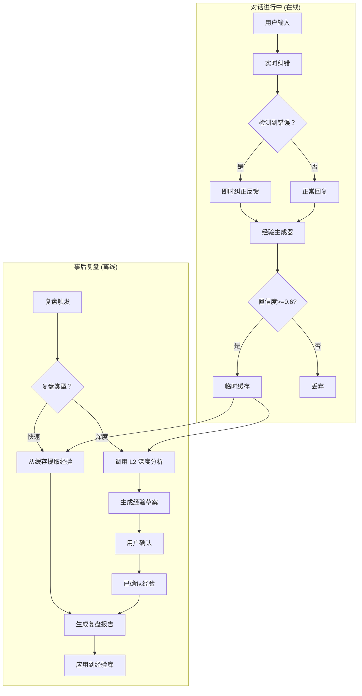
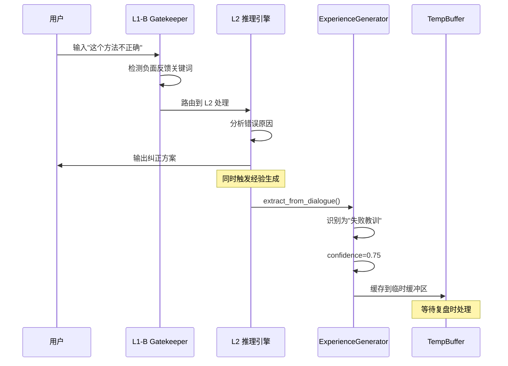
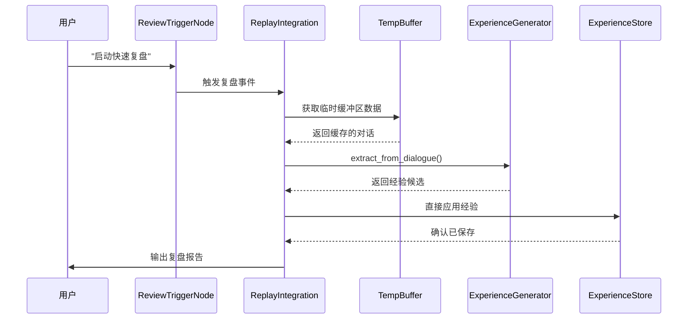
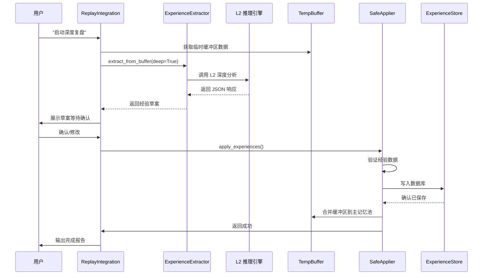
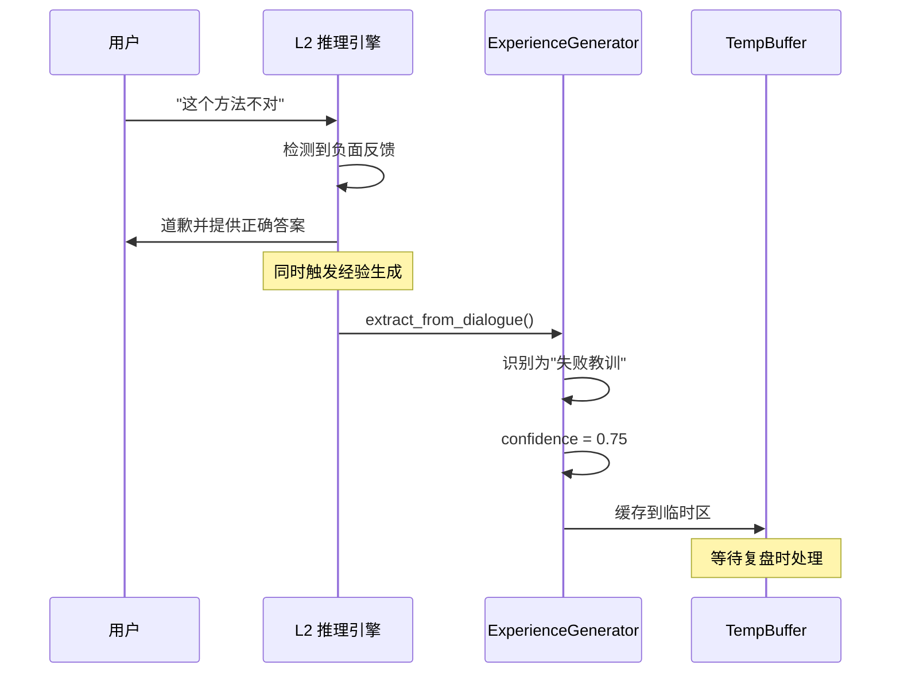
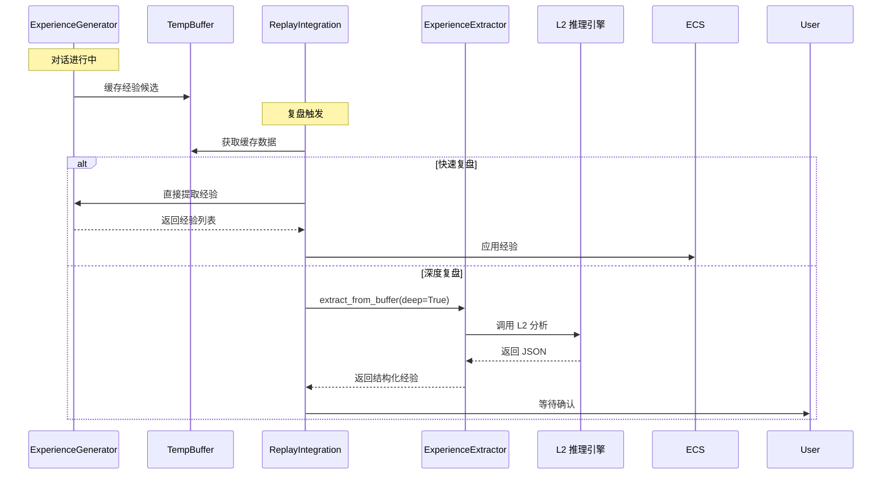
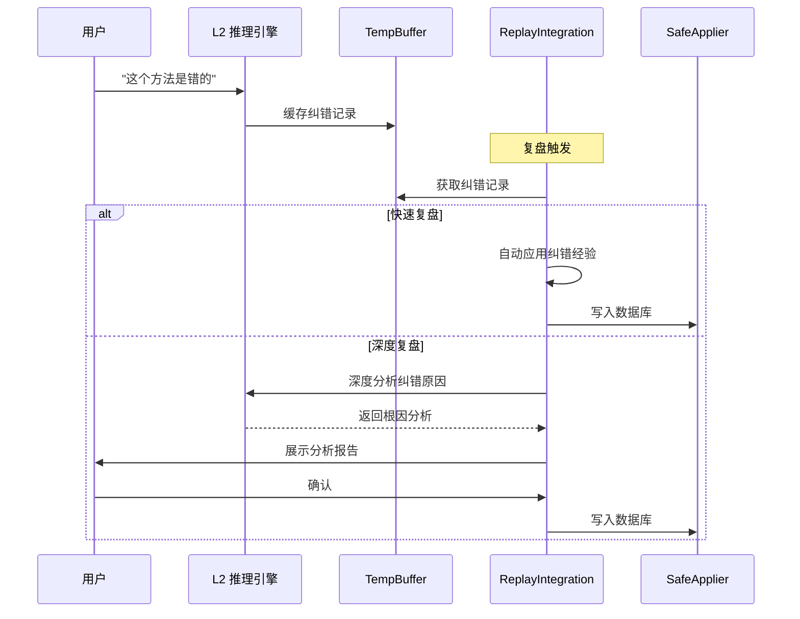
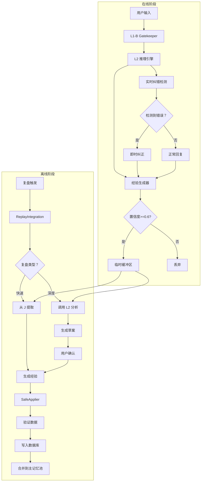
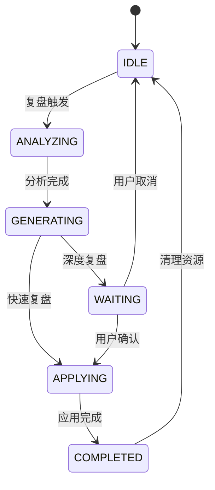
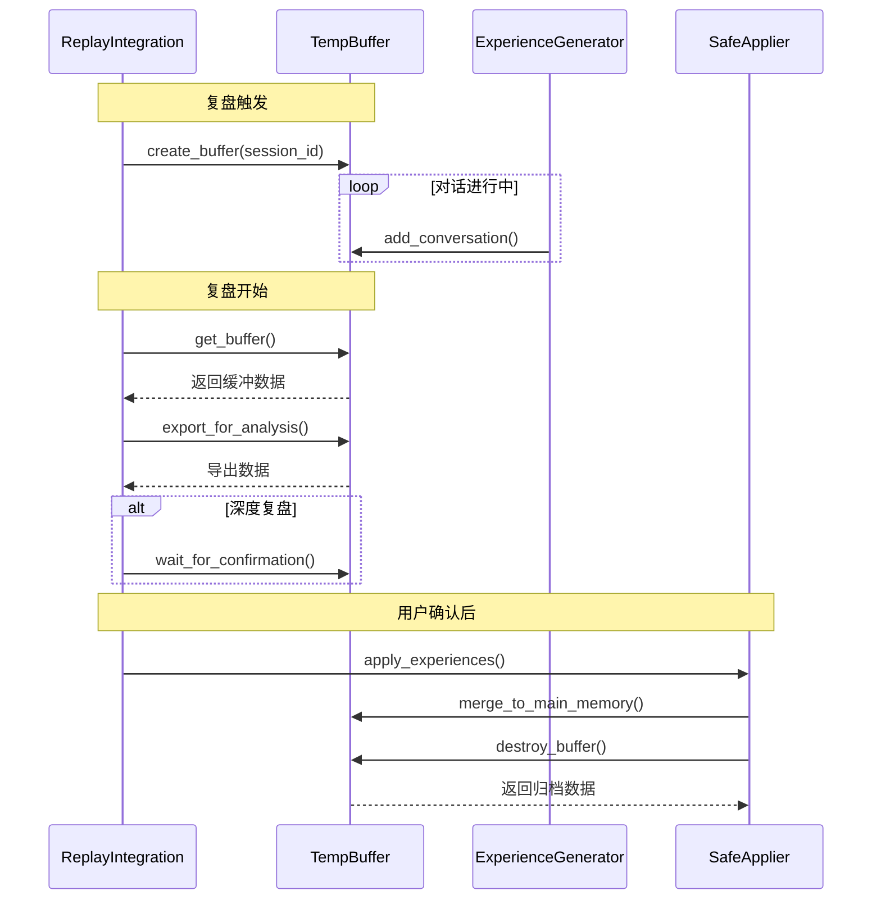

# 实时纠错、经验生成与复盘模块协作机制详解

**文档版本**: v1.0  
**创建日期**: 2026-04-05  
**系统版本**: TSD v2.3 (祖龙 β4)

---

## 一、概述

### 1.1 三大模块定位

| 模块 | 核心职责 | 工作时机 | 关键特性 |
|------|---------|---------|---------|
| **实时纠错** | 对话过程中的即时反馈和修正 | 对话进行中 (在线) | 低延迟、即时响应 |
| **经验生成** | 从对话中提取可复用知识 | 对话进行中 + 事后批量处理 | 模式识别、置信度评估 |
| **复盘模块** | 深度回顾和结构化总结 | 任务完成后/定期触发 (离线) | 深度分析、用户确认 |

### 1.2 协作关系总览



---

## 二、实时纠错模块详解

### 2.1 实时纠错的工作流程

**文件位置**: `zulong/l1b/scheduler_gatekeeper.py` 和 `zulong/l2/inference_engine.py`

#### 2.1.1 错误检测机制

实时纠错通过以下模式识别错误:

```python
# 错误检测模式 (来自 ExperienceGenerator.failure_patterns)
failure_patterns = [
    r"错误.*",
    r"失败.*",
    r"不正确.*",
    r"有问题.*",
    r"不行.*",
    r"错误：.*",
    r"Exception.*",
    r"Failed.*",
]
```

#### 2.1.2 纠错流程



#### 2.1.3 实时纠错的三种场景

**场景 1: 用户明确指出错误**
```
用户："你刚才说的是错误的"
→ 检测到负面反馈
→ L2 立即道歉并提供正确信息
→ 经验生成器标记为"失败教训"
```

**场景 2: 用户提出修正**
```
用户："不对，应该是这样做的..."
→ 检测到纠正模式
→ L2 接受纠正并感谢用户
→ 经验生成器提取用户提供的正确方法
```

**场景 3: 系统自检发现错误**
```
系统："抱歉，我之前的回答有误..."
→ 系统主动纠错
→ L2 重新生成正确答案
→ 经验生成器记录纠错过程
```

### 2.2 实时纠错与经验生成的集成

#### 2.2.1 InferenceEngine 中的自动提取

**文件**: `zulong/l2/inference_engine.py`

```python
class InferenceEngine:
    def __init__(self):
        # ✅ 经验生成器已集成
        self.experience_generator = ExperienceGenerator()
        self.experience_generator.set_rag_manager(self.rag_manager)
        
        # 对话历史记忆 (保留最近 10 轮)
        self.conversation_history = []
        self.max_history = 10
```

#### 2.2.2 实时纠错触发经验生成的时机

```python
# 伪代码示例
async def _process_with_memory_async(self, user_input: str, ...):
    # 1. 添加到对话历史
    self.conversation_history.append({
        "role": "user",
        "content": user_input
    })
    
    # 2. 检测是否包含纠错信号
    is_correction = self._detect_correction_signal(user_input)
    
    if is_correction:
        # 3. 立即触发经验提取
        candidates = self.experience_generator.extract_from_dialogue(
            self.conversation_history
        )
        
        # 4. 高优先级缓存 (纠错经验很重要)
        for candidate in candidates:
            if candidate.category == "失败教训":
                candidate.confidence = min(candidate.confidence + 0.1, 1.0)
                self._cache_experience(candidate)
```

---

## 三、经验生成模块详解

### 3.1 经验生成的双层架构

#### 3.1.1 在线层 (实时提取)

**特点**:
- 低延迟，简单规则匹配
- 基于关键词和模式识别
- 置信度快速评估
- 临时缓存，等待验证

**实现**: `ExperienceGenerator.extract_from_dialogue()`

```python
def extract_from_dialogue(self, dialogue_history: List[Dict]) -> List[ExperienceCandidate]:
    """从对话历史中提取经验 (在线层)"""
    candidates = []
    
    for turn in dialogue_history:
        # 检查用户反馈
        if turn.get("role") == "user":
            candidate = self._analyze_user_feedback(
                turn.get("content"),
                dialogue_history,
                turn_index
            )
            if candidate:
                candidates.append(candidate)
    
    return candidates
```

#### 3.1.2 离线层 (深度提炼)

**特点**:
- 调用 L2 进行结构化分析
- 深度语义理解
- 生成 JSON 格式经验
- 需要用户确认

**实现**: `ExperienceExtractor.extract_from_buffer()`

```python
async def extract_from_buffer(self, buffer_data: Dict, deep: bool = False):
    """从缓冲区提取经验 (离线层)"""
    # 1. 构建 L2 系统指令
    prompt = self._build_system_prompt(buffer_data, deep)
    
    # 2. 调用 L2 进行分析
    l2_response = await self._call_l2_for_analysis(prompt)
    
    # 3. 解析 L2 返回的 JSON
    structured_data = self._parse_l2_response(l2_response)
    
    return structured_data
```

### 3.2 经验生成的触发条件

#### 3.2.1 实时触发 (在线层)

| 触发条件 | 检测模块 | 置信度 | 处理方式 |
|---------|---------|--------|---------|
| 用户正面反馈 | `_analyze_user_feedback()` | 0.8-0.95 | 立即缓存 |
| 用户负面反馈 | `_analyze_user_feedback()` | 0.75 | 立即缓存 |
| 用户明确偏好 | `_analyze_user_feedback()` | 0.85 | 立即缓存 |
| AI 成功解决问题 | `_analyze_ai_response()` | 0.7 | 延迟处理 |

#### 3.2.2 批量触发 (离线层)

| 触发条件 | 触发器 | 处理方式 |
|---------|--------|---------|
| 对话达到 5 轮 | `InferenceEngine` 计数器 | 调用 L2 分析 |
| 任务完成 | `TASK_COMPLETED` 事件 | 调用 L2 分析 |
| 复盘触发 | `ReviewTrigger` | 调用 L2 深度分析 |

### 3.3 经验数据结构

#### 3.3.1 在线层数据结构

```python
@dataclass
class ExperienceCandidate:
    """经验候选 (在线层)"""
    content: str              # 经验内容
    category: str             # 分类 (成功/失败/偏好)
    confidence: float         # 置信度 (0-1)
    source: str              # 来源 (用户反馈/对话模式)
    timestamp: float         # 时间戳
    metadata: Dict[str, Any] # 元数据
```

#### 3.3.2 离线层数据结构

```json
{
  "summary": "对话整体总结",
  "experiences": [
    {
      "type": "decision|improvement|lesson|best_practice",
      "content": "经验内容",
      "confidence": 0.0-1.0,
      "tags": ["标签 1", "标签 2"],
      "evidence": "支撑该经验的对话原文引用"
    }
  ],
  "key_points": ["关键知识点"],
  "suggested_tags": ["建议标签"],
  "action_items": ["后续行动建议"]
}
```

---

## 四、复盘模块详解

### 4.1 复盘模块的三重触发机制

**文件**: `zulong/review/trigger.py`

#### 4.1.1 触发器类型

```python
class TriggerType(Enum):
    USER_ACTIVE = "user_active"    # 用户主动触发 (HIGH)
    QUIET_MODE = "quiet_mode"      # 安静模式触发 (MEDIUM)
    NIGHT_SCHEDULE = "night_schedule"  # 夜间定时触发 (LOW)
```

#### 4.1.2 触发条件

| 触发类型 | 触发条件 | 优先级 | 处理策略 |
|---------|---------|--------|---------|
| 用户主动 | 输入"启动复盘" | HIGH | 立即处理 |
| 安静模式 | 30 分钟无活动 | MEDIUM | 后台处理 |
| 夜间定时 | 每日凌晨 2:00 | LOW | 后台处理 |

### 4.2 复盘流程详解

#### 4.2.1 快速复盘流程



#### 4.2.2 深度复盘流程



### 4.3 复盘期间的上下文隔离

#### 4.3.1 临时缓冲区机制

**文件**: `zulong/review/temp_buffer.py`

```python
class ReviewTempBuffer:
    """复盘临时缓冲区 - 上下文隔离"""
    
    def __init__(self, session_id: str):
        self.session_id = session_id
        self.conversations: List[ReviewConversation] = []
        self.metadata: Dict[str, Any] = {...}
    
    def add_conversation(self, user_input: str, system_response: str):
        """添加复盘期间的对话"""
        # 隔离存储，不污染主记忆池
        conversation = ReviewConversation(
            id=str(uuid.uuid4())[:8],
            timestamp=time.time(),
            user_input=user_input,
            system_response=system_response
        )
        self.conversations.append(conversation)
```

#### 4.3.2 缓冲区合并策略

**文件**: `zulong/review/safe_applier.py`

```python
def merge_buffer_to_memory(self, buffer_data: Dict, confirmed_experiences: List):
    """合并临时缓冲区到主记忆池"""
    # 1. 提取关键对话 (与已确认经验相关的)
    key_conversations = self._extract_key_conversations(
        buffer_data, 
        confirmed_experiences
    )
    
    # 2. 高权重写入 (1.5 倍权重)
    self._write_to_shared_memory_pool(
        key_conversations, 
        weight=1.5
    )
    
    # 3. 更新记忆索引
    self._update_memory_index(confirmed_experiences)
```

---

## 五、三大模块协作详解

### 5.1 实时纠错 → 经验生成

#### 5.1.1 协作流程



#### 5.1.2 代码实现

```python
# InferenceEngine._process_with_memory_async()
async def _process_with_memory_async(self, user_input: str, ...):
    # 1. 检测是否包含纠错信号
    correction_patterns = ["不对", "错误", "不正确", "有问题"]
    is_correction = any(p in user_input for p in correction_patterns)
    
    if is_correction:
        # 2. 立即触发经验提取
        candidates = self.experience_generator.extract_from_dialogue(
            self.conversation_history
        )
        
        # 3. 高优先级缓存
        for candidate in candidates:
            if candidate.category == "失败教训":
                # 提高置信度
                candidate.confidence = min(candidate.confidence + 0.1, 1.0)
                
                # 缓存到临时缓冲区
                self._cache_to_temp_buffer(candidate)
```

### 5.2 经验生成 → 复盘模块

#### 5.2.1 协作流程



#### 5.2.2 代码实现

```python
# ReplayIntegration._handle_quick_review()
def _handle_quick_review(self, recent_data: Dict, context: Dict):
    # 1. 从临时缓冲区获取数据
    from zulong.review.temp_buffer import get_review_buffer_manager
    buffer_manager = get_review_buffer_manager()
    
    if buffer_manager.has_buffer():
        buffer_data = buffer_manager.get_buffer().export_for_analysis()
    else:
        buffer_data = recent_data
    
    # 2. 调用经验生成器提取
    candidates = self.experience_generator.extract_from_dialogue(
        buffer_data['conversations']
    )
    
    # 3. 直接应用经验
    experiences = self._generate_experiences(candidates)
    self._apply_experiences(experiences)
```

### 5.3 实时纠错 → 复盘模块

#### 5.3.1 协作流程



#### 5.3.2 纠错经验的特殊处理

```python
# SafeExperienceApplier.apply_experiences()
def apply_experiences(self, experiences: List, session_id: str):
    for exp in experiences:
        # 🔥 特殊处理：纠错经验的权重提升
        if exp.get('category') == '失败教训':
            # 1.5 倍权重写入
            self._write_with_weight(exp, weight=1.5)
            
            # 标记为"高优先级"
            exp['priority'] = 'high'
            
            # 添加到"避坑指南"
            self._add_to_avoidance_guide(exp)
```

---

## 六、完整协作场景演示

### 6.1 场景 1: 编程教学对话

#### 6.1.1 对话流程

```
用户："Python 中如何读取文件？"
AI："使用 open() 函数：f = open('file.txt')"
用户："不对，这样没有关闭文件，会泄漏资源"
AI："抱歉您说得对。正确做法是使用 with 语句：
     with open('file.txt') as f:
         content = f.read()
     这样会自动关闭文件。"
用户："很好，这才是最佳实践"
```

#### 6.1.2 模块协作分析

**阶段 1: 实时纠错**
```
1. 用户说"不对" → 检测到负面反馈
2. L2 立即道歉并提供正确答案
3. 经验生成器标记为"失败教训"
   - content: "避免直接使用 open() 而不关闭文件"
   - confidence: 0.75
   - category: "失败教训"
```

**阶段 2: 经验生成**
```
1. 用户说"很好" → 检测到正面反馈
2. 经验生成器提取"成功经验"
   - content: "使用 with 语句读取文件是最佳实践"
   - confidence: 0.9
   - category: "成功模式"
3. 缓存到临时缓冲区
```

**阶段 3: 复盘处理**
```
1. 用户输入"启动复盘"
2. 复盘模块从缓冲区获取 2 条经验
3. 快速复盘模式：
   - 直接应用到经验库
   - 权重：失败教训 1.5, 成功经验 1.0
4. 生成复盘报告：
   "本次对话生成了 2 条经验:
    - ❌ 避坑指南：避免直接 open() 不关闭
    - ✅ 最佳实践：使用 with 语句读取文件"
```

### 6.2 场景 2: 数学问题解答

#### 6.2.1 对话流程

```
用户："1+1 等于几？"
AI："等于 3"
用户："错了，应该是 2"
AI："非常抱歉，我犯了一个低级错误。1+1=2"
用户："以后这种简单问题要小心"
AI："谢谢提醒，我会记住的"
```

#### 6.2.2 模块协作分析

**实时纠错阶段**:
```python
# 经验生成器提取
candidates = [
    ExperienceCandidate(
        content="避免在简单数学问题上出错",
        category="失败教训",
        confidence=0.8,
        source="用户反馈"
    ),
    ExperienceCandidate(
        content="用户偏好：简单问题要更谨慎",
        category="用户偏好",
        confidence=0.85,
        source="用户直接表达"
    )
]
```

**复盘阶段**:
```python
# 深度复盘调用 L2 分析
prompt = """
请对以下对话进行深度分析：

用户：1+1 等于几？
AI：等于 3
用户：错了，应该是 2
AI：非常抱歉...
用户：以后这种简单问题要小心

请分析：
1. 错误原因 (注意力不集中？模型缺陷？)
2. 改进策略
3. 如何避免类似问题
"""

# L2 返回结构化分析
{
  "summary": "AI 在简单数学问题上出现错误，经用户纠正后改正",
  "experiences": [
    {
      "type": "lesson",
      "content": "即使是简单问题也要认真验证答案",
      "confidence": 0.9,
      "tags": ["质量控制", "自我验证"],
      "evidence": "用户说'错了'"
    }
  ],
  "action_items": [
    "在回答前进行自我验证",
    "对简单问题建立检查清单"
  ]
}
```

### 6.3 场景 3: 多轮对话累积经验

#### 6.3.1 对话流程 (5 轮)

```
轮次 1:
用户："如何学习 Python？"
AI："建议从基础语法开始，多写代码"

轮次 2:
用户："有什么推荐的项目？"
AI："可以尝试做爬虫、数据分析、Web 开发"

轮次 3:
用户："爬虫好学吗？"
AI："爬虫入门简单，但深入需要网络、HTML 等知识"
用户："感觉你讲得不够具体"

轮次 4:
AI："抱歉，我详细说下：
     1. 学习 requests 库发送请求
     2. 学习 BeautifulSoup 解析 HTML
     3. 学习 scrapy 框架
     4. 实践爬取网站数据"
用户："这样详细多了，很好"

轮次 5:
用户："启动复盘"
```

#### 6.3.2 模块协作分析

**经验生成器批量处理**:
```python
# InferenceEngine 每 5 轮自动触发
def _auto_extract_experience(self):
    candidates = self.experience_generator.extract_from_dialogue(
        self.conversation_history  # 5 轮对话
    )
    
    # 提取到 3 条经验
    candidates = [
        # 来自轮次 3 的负面反馈
        ExperienceCandidate(
            content="用户偏好：讲解要具体详细，避免笼统",
            category="用户偏好",
            confidence=0.85
        ),
        # 来自轮次 4 的正面反馈
        ExperienceCandidate(
            content="分步骤讲解 (1.2.3.4.) 获得用户认可",
            category="成功模式",
            confidence=0.8
        ),
        # AI 自我改进
        ExperienceCandidate(
            content="当用户反馈'不够具体'时，应提供详细步骤",
            category="改进点",
            confidence=0.75
        )
    ]
```

**复盘处理**:
```python
# 快速复盘
def _handle_quick_review(self, recent_data, context):
    # 从 5 轮对话中提取
    experiences = self._generate_experiences(analysis_result)
    
    # 生成 3 条经验
    experiences = [
        {"type": "preference", "content": "讲解要具体详细", "confidence": 0.85},
        {"type": "best_practice", "content": "分步骤讲解效果好", "confidence": 0.8},
        {"type": "improvement", "content": "根据用户反馈调整详细程度", "confidence": 0.75}
    ]
    
    # 应用到经验库
    self._apply_experiences(experiences)
    
    # 输出报告
    response = """
    ✅ 快速复盘完成
    
    📊 分析了 5 条对话
    💡 生成了 3 条经验
    💾 经验已应用到记忆库
    
    经验列表:
    1. 用户偏好：讲解要具体详细
    2. 最佳实践：分步骤讲解
    3. 改进点：根据反馈调整详细程度
    """
```

---

## 七、数据流与状态管理

### 7.1 数据流全景图



### 7.2 状态管理

#### 7.2.1 复盘状态机

**文件**: `zulong/review/state.py`

```python
class ReviewStage(Enum):
    IDLE = "idle"                    # 空闲
    ANALYZING = "analyzing"          # 分析中
    GENERATING = "generating"        # 生成经验
    WAITING_CONFIRM = "waiting"      # 等待确认
    APPLYING = "applying"            # 应用中
    COMPLETED = "completed"          # 完成
```

#### 7.2.2 状态转换



### 7.3 临时缓冲区生命周期



---

## 八、配置与优化

### 8.1 关键配置参数

#### 8.1.1 经验生成器配置

```python
# zulong/memory/experience_generator.py
class ExperienceGenerator:
    def __init__(self):
        self.min_confidence = 0.6      # 最小置信度阈值
        self.max_experience_length = 500  # 经验最大长度
        
        # 自动提取配置
        self.auto_extract_interval = 5  # 每 5 轮对话自动提取
        self.auto_extract_threshold = 8  # 对话达到 8 轮时触发
```

#### 8.1.2 复盘触发器配置

```python
# zulong/review/trigger.py
class ReviewTrigger:
    def __init__(self):
        self.quiet_mode_timeout_minutes = 30  # 安静模式超时
        self.night_trigger_hour = 2          # 夜间触发小时
        self.night_trigger_minute = 0        # 夜间触发分钟
        self.max_concurrent_triggers = 1     # 最大并发数
```

#### 8.1.3 临时缓冲区配置

```python
# zulong/review/temp_buffer.py
class ReviewTempBuffer:
    def __init__(self):
        self.max_buffer_size = 50       # 最大对话轮数
        self.buffer_ttl_seconds = 3600  # 缓冲区 TTL(1 小时)
```

### 8.2 性能优化建议

#### 8.2.1 实时纠错优化

```python
# 优化 1: 缓存模式匹配结果
class ExperienceGenerator:
    def __init__(self):
        # 🔥 预编译正则表达式
        self.success_patterns = [
            re.compile(p) for p in self.success_patterns
        ]
        self.failure_patterns = [
            re.compile(p) for p in self.failure_patterns
        ]
    
    def _analyze_user_feedback(self, user_content: str, ...):
        # 优化 2: 短路逻辑
        for pattern in self.success_patterns:
            if pattern.match(user_content):
                return self._extract_success(...)
        
        # 只有成功模式不匹配时才检查失败模式
        for pattern in self.failure_patterns:
            if pattern.match(user_content):
                return self._extract_failure(...)
```

#### 8.2.2 经验生成优化

```python
# 优化 1: 批量处理
def process_dialogue_batch(self, dialogue_history: List):
    """批量处理对话历史"""
    # 一次性提取所有候选
    candidates = self.extract_from_dialogue(dialogue_history)
    
    # 批量添加到 RAG
    added_count = 0
    for candidate in candidates:
        if self.add_experience_to_rag(candidate):
            added_count += 1
    
    # 返回统计信息
    return {
        "extracted": len(candidates),
        "added": added_count,
        "skipped": len(candidates) - added_count
    }

# 优化 2: 异步处理
async def _auto_extract_experience_async(self):
    """异步自动提取经验"""
    # 在后台线程中执行，不阻塞主对话流程
    loop = asyncio.get_event_loop()
    await loop.run_in_executor(
        None,
        self.process_dialogue_batch,
        self.conversation_history
    )
```

#### 8.2.3 复盘流程优化

```python
# 优化 1: 智能选择复盘类型
def _select_review_type(self, context: Dict) -> str:
    """根据上下文智能选择复盘类型"""
    # 对话轮数 < 3: 不需要复盘
    if context.get('conversation_count', 0) < 3:
        return 'none'
    
    # 对话轮数 3-10: 快速复盘
    elif context.get('conversation_count', 0) < 10:
        return 'quick'
    
    # 对话轮数 > 10 或包含"深度"关键词：深度复盘
    elif '深度' in context.get('user_input', ''):
        return 'deep'
    
    # 默认：快速复盘
    else:
        return 'quick'

# 优化 2: 经验去重
def _deduplicate_experiences(self, experiences: List) -> List:
    """经验去重"""
    seen_contents = set()
    unique_experiences = []
    
    for exp in experiences:
        content_hash = hash(exp['content'])
        if content_hash not in seen_contents:
            seen_contents.add(content_hash)
            unique_experiences.append(exp)
    
    return unique_experiences
```

---

## 九、测试与验证

### 9.1 单元测试用例

#### 9.1.1 实时纠错测试

```python
# tests/test_realtime_correction.py
def test_correction_detection():
    """测试纠错检测"""
    generator = ExperienceGenerator()
    
    # 测试负面反馈检测
    dialogue = [
        {"role": "assistant", "content": "使用 open() 打开文件"},
        {"role": "user", "content": "不对，这样会泄漏资源"}
    ]
    
    candidates = generator.extract_from_dialogue(dialogue)
    
    assert len(candidates) > 0
    assert candidates[0].category == "失败教训"
    assert candidates[0].confidence >= 0.7
```

#### 9.1.2 经验生成测试

```python
# tests/test_experience_generation.py
def test_batch_extraction():
    """测试批量经验提取"""
    generator = ExperienceGenerator()
    
    # 5 轮对话
    dialogue = [
        {"role": "user", "content": "如何学习 Python？"},
        {"role": "assistant", "content": "从基础开始..."},
        {"role": "user", "content": "有什么推荐项目？"},
        {"role": "assistant", "content": "爬虫、数据分析..."},
        {"role": "user", "content": "很好，谢谢"}
    ]
    
    stats = generator.process_dialogue_batch(dialogue)
    
    assert stats['extracted'] >= 1
    assert stats['added'] >= 0
```

#### 9.1.3 复盘流程测试

```python
# tests/test_review_workflow.py
async def test_quick_review():
    """测试快速复盘"""
    ri = ReplayIntegration()
    
    # 模拟对话数据
    recent_data = {
        'conversations': [
            {'user': '如何学习 Python？', 'system': '从基础开始...'},
            {'user': '很好，谢谢', 'system': '不客气'}
        ]
    }
    
    # 执行快速复盘
    ri._handle_quick_review(recent_data, {})
    
    # 验证生成了经验
    assert len(ri.generated_experiences) > 0
```

### 9.2 集成测试场景

#### 9.2.1 完整协作流程测试

```python
# tests/test_full_collaboration.py
async def test_correction_to_review():
    """测试从纠错到复盘的完整流程"""
    
    # 1. 模拟用户纠错
    user_input = "这个方法不对"
    await inference_engine.process(user_input)
    
    # 2. 验证实时纠错触发
    assert realtime_correction.detected == True
    
    # 3. 验证经验生成
    assert len(experience_generator.candidates) > 0
    
    # 4. 触发复盘
    review_trigger.record_user_activity()
    await review_trigger.trigger_user_active()
    
    # 5. 验证复盘完成
    assert replay_integration.completed == True
    assert len(replay_integration.experiences) > 0
```

---

## 十、总结与展望

### 10.1 核心协作机制总结

#### 10.1.1 三层协作架构

```
┌─────────────────────────────────────────┐
│         在线层 (实时响应)                │
│  ┌──────────┐  ┌──────────┐            │
│  │实时纠错  │→ │经验生成  │            │
│  └──────────┘  └──────────┘            │
│         ↓              ↓                │
│  ┌──────────────────────────┐          │
│  │    临时缓冲区 (共享)      │          │
│  └──────────────────────────┘          │
└─────────────────────────────────────────┘
                  ↓
┌─────────────────────────────────────────┐
│         离线层 (深度处理)                │
│  ┌──────────┐  ┌──────────┐            │
│  │复盘模块  │← │经验提取  │            │
│  └──────────┘  └──────────┘            │
│         ↓                                │
│  ┌──────────────────────────┐          │
│  │    经验库 (持久化)        │          │
│  └──────────────────────────┘          │
└─────────────────────────────────────────┘
```

#### 10.1.2 数据流转原则

1. **单向流动**: 在线层 → 临时缓冲区 → 离线层 → 经验库
2. **上下文隔离**: 复盘期间对话不污染主记忆池
3. **权重提升**: 纠错经验权重 1.5 倍
4. **用户确认**: 深度复盘经验需用户确认

### 10.2 当前问题与改进方向

#### 10.2.1 识别的问题

| 问题 | 影响 | 优先级 | 改进方案 |
|------|------|--------|---------|
| 缺少自动化触发 | 依赖用户手动触发 | P0 | 在 InferenceEngine 中添加定时提取 |
| 复盘触发器未完全集成 | 安静/夜间模式未启用 | P0 | 在 bootstrap.py 中启动 ReviewTrigger |
| 置信度阈值过高 | 错过有价值经验 | P1 | 降低到 0.5，引入分级存储 |
| 经验去重机制缺失 | 重复经验入库 | P1 | 添加基于语义的去重 |

#### 10.2.2 未来优化方向

**方向 1: 智能纠错预测**
```python
# 在错误发生前预测并预防
class PredictiveCorrection:
    def predict_potential_error(self, context: Dict) -> bool:
        """预测潜在错误"""
        # 基于历史错误模式
        # 基于问题复杂度
        # 基于置信度评估
        pass
```

**方向 2: 经验质量评估**
```python
# 定期评估经验库质量
class ExperienceQualityAssessor:
    def assess_quality(self, experience: Experience) -> float:
        """评估经验质量"""
        # 考虑因素:
        # - 访问次数 (热度)
        # - 置信度
        # - 时间衰减
        # - 用户反馈
        pass
```

**方向 3: 个性化复盘策略**
```python
# 学习用户偏好，自动选择复盘类型
class PersonalizedReview:
    def learn_user_preference(self, user_action: str):
        """从用户行为学习"""
        if user_action == "跳过复盘":
            # 降低频率
            self.review_interval *= 1.5
        elif user_action == "选择深度复盘":
            self.prefer_deep_review = True
```

### 10.3 最佳实践建议

#### 10.3.1 实时纠错最佳实践

1. **及时性**: 检测到错误立即纠正，不超过 1 秒
2. **谦逊态度**: 先道歉再提供正确答案
3. **详细解释**: 说明错误原因，避免再次犯错
4. **经验提取**: 每次纠错都提取经验教训

#### 10.3.2 经验生成最佳实践

1. **双层架构**: 在线层快速响应，离线层深度分析
2. **置信度分级**: 
   - >= 0.8: 高置信度，直接入库
   - 0.6-0.8: 中置信度，等待确认
   - < 0.6: 低置信度，丢弃或标记
3. **定期清理**: 每 24 小时评估一次经验质量

#### 10.3.3 复盘模块最佳实践

1. **仪式感**: 入口和出口都要有清晰的视觉反馈
2. **过程感知**: 让用户看到每个阶段的进度
3. **强制确认**: 深度复盘经验必须用户确认
4. **上下文隔离**: 使用临时缓冲区，避免污染

---

## 附录

### A. 相关文件索引

| 文件路径 | 模块 | 功能 |
|---------|------|------|
| `zulong/memory/experience_generator.py` | ExperienceGenerator | 经验提取和生成 |
| `zulong/review/trigger.py` | ReviewTrigger | 复盘触发器 |
| `zulong/review/integration.py` | ReplayIntegration | 复盘集成器 |
| `zulong/review/experience_extractor.py` | ExperienceExtractor | 经验结构化提取 |
| `zulong/review/temp_buffer.py` | ReviewTempBuffer | 临时缓冲区 |
| `zulong/review/safe_applier.py` | SafeExperienceApplier | 安全应用器 |
| `zulong/l2/inference_engine.py` | InferenceEngine | L2 推理引擎 |
| `zulong/l1b/review_trigger_node.py` | ReviewTriggerNode | L1-B 复盘触发检测 |

### B. 关键术语表

| 术语 | 定义 |
|------|------|
| **实时纠错** | 对话过程中即时检测和纠正错误的机制 |
| **经验生成** | 从对话中提取可复用知识的过程 |
| **复盘** | 对过去任务或对话的回顾和深度分析 |
| **临时缓冲区** | 复盘期间隔离对话的临时存储区 |
| **置信度** | 经验可靠性的量化指标 (0-1) |
| **在线层** | 实时响应的经验生成层 |
| **离线层** | 深度分析的经验生成层 |

### C. 配置示例

```yaml
# config/experience_generation.yml
experience_generator:
  min_confidence: 0.6
  auto_extract_interval: 5  # 每 5 轮对话
  max_experience_length: 500

review_trigger:
  quiet_mode_timeout_minutes: 30
  night_trigger_hour: 2
  night_trigger_minute: 0

temp_buffer:
  max_buffer_size: 50
  buffer_ttl_seconds: 3600
```

---

**文档编制**: AI 产品专家  
**完成时间**: 2026-04-05  
**下次更新**: 2026-04-12 (根据实施反馈更新)
