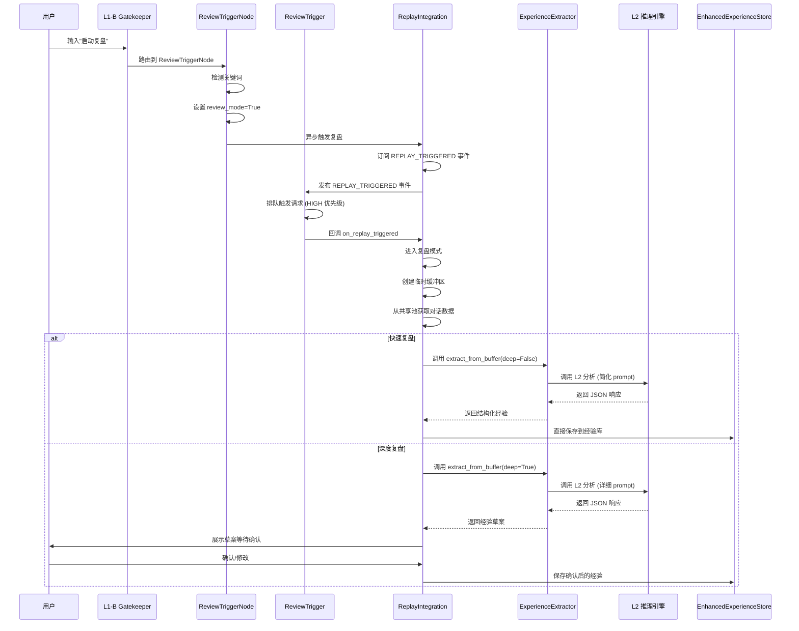
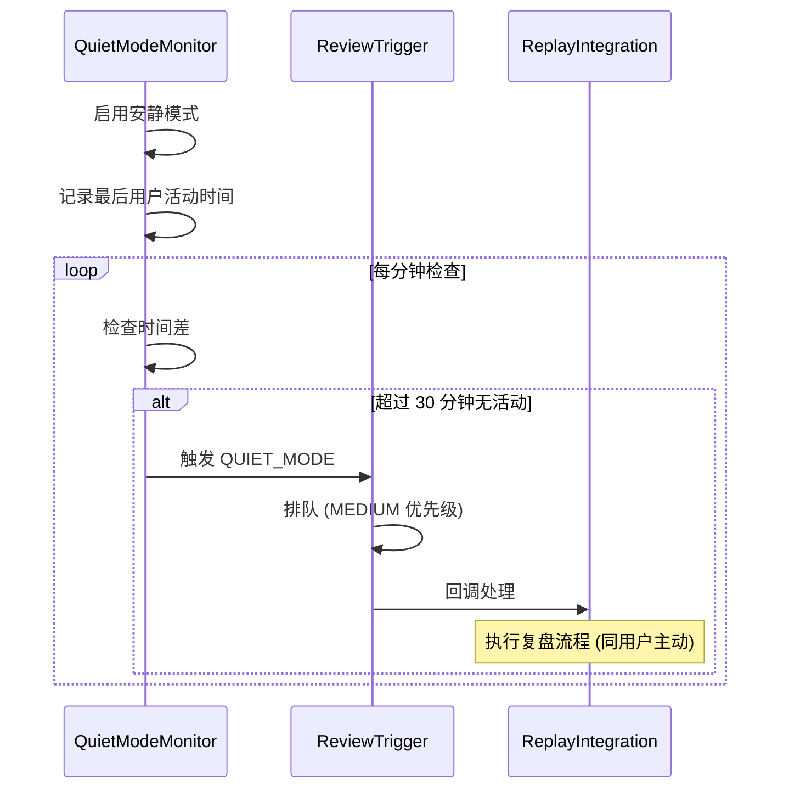
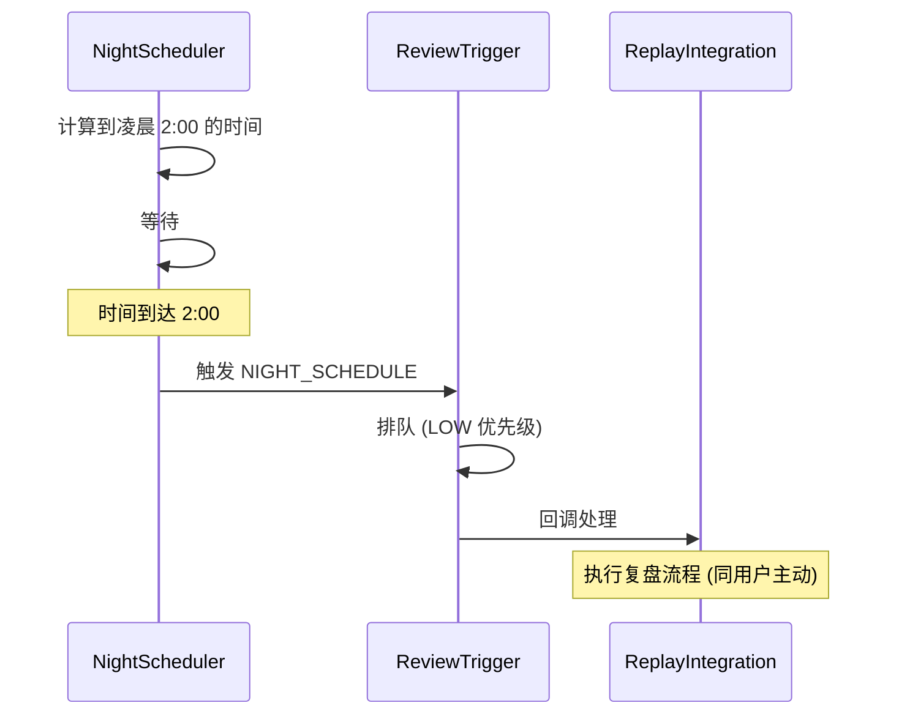
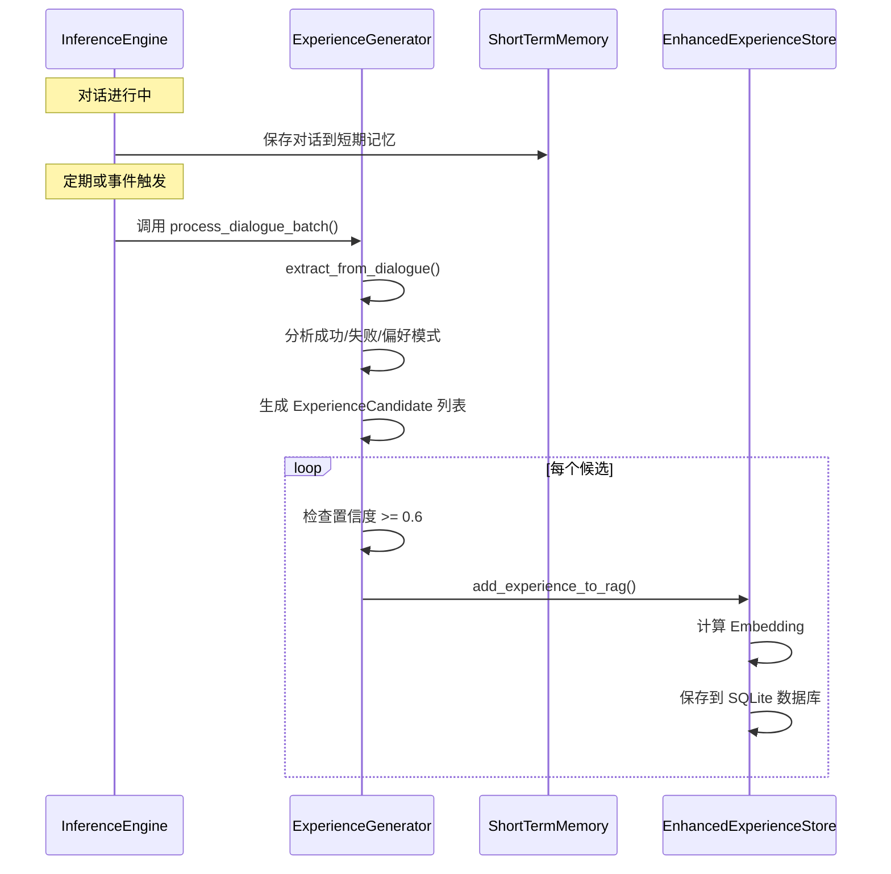

# 经验生成机制架构审查报告

**审查日期**: 2026-04-05  
**审查目标**: 系统梳理经验生成的触发条件和完整流程  
**系统版本**: TSD v2.3 (祖龙 β4)

---

## 一、执行摘要

### 1.1 核心发现

祖龙系统的经验生成机制采用**三层架构设计**，包含以下核心组件:

1. **经验生成器 (ExperienceGenerator)** - 位于 `zulong/memory/experience_generator.py`
2. **复盘触发器 (ReviewTrigger)** - 位于 `zulong/review/trigger.py`
3. **复盘集成器 (ReplayIntegration)** - 位于 `zulong/review/integration.py`
4. **经验提取器 (ExperienceExtractor)** - 位于 `zulong/review/experience_extractor.py`

### 1.2 触发条件分类

系统支持**三种经验生成触发模式**:

| 触发模式 | 优先级 | 触发条件 | 负责模块 |
|---------|--------|---------|---------|
| **用户主动触发** | HIGH | 用户输入"启动复盘"关键词 | ReviewTriggerNode → ReviewTrigger |
| **安静模式触发** | MEDIUM | 30 分钟无用户活动 | QuietModeMonitor |
| **夜间定时触发** | LOW | 每日凌晨 2:00 定时触发 | NightScheduler |

### 1.3 关键问题识别

1. ✅ **经验生成器已集成到推理引擎** - `InferenceEngine` 中已初始化 `ExperienceGenerator`
2. ⚠️ **复盘触发器未完全集成到事件总线** - 缺少与 L1-B 的显式连接
3. ⚠️ **经验生成缺少自动化触发** - 当前主要依赖用户手动触发"启动复盘"
4. ⚠️ **对话历史到经验生成的链路不完整** - 缺少从 `conversation_history` 自动调用 `experience_generator` 的逻辑

---

## 二、系统架构详解

### 2.1 经验生成器 (ExperienceGenerator)

**文件位置**: [`zulong/memory/experience_generator.py`](file://d:\AI\project\zulong_beta4\zulong\memory\experience_generator.py)

#### 2.1.1 核心功能

```python
class ExperienceGenerator:
    """经验自动生成器
    
    功能:
    1. 从对话历史中提取成功模式
    2. 从错误日志中提取失败教训
    3. 从用户反馈中提取偏好
    4. 自动分类并添加到经验库
    """
```

#### 2.1.2 经验提取模式

**1. 成功模式识别**
```python
self.success_patterns = [
    r"成功.*",
    r"完成.*",
    r"解决了.*",
    r"正确.*",
    r"太好了.*",
    r"谢谢.*",
    r"非常好.*",
    r"完美.*",
]
```

**2. 失败模式识别**
```python
self.failure_patterns = [
    r"错误.*",
    r"失败.*",
    r"不正确.*",
    r"有问题.*",
    r"不行.*",
    r"错误：.*",
    r"Exception.*",
    r"Failed.*",
]
```

**3. 用户偏好识别**
```python
self.preference_patterns = [
    r"我喜欢.*",
    r"偏好.*",
    r"希望.*",
    r"想要.*",
    r"最好.*",
    r"不喜欢.*",
    r"避免.*",
]
```

#### 2.1.3 核心方法

| 方法名 | 功能描述 | 输入 | 输出 |
|-------|---------|------|------|
| `extract_from_dialogue()` | 从对话历史提取经验 | `dialogue_history: List[Dict]` | `List[ExperienceCandidate]` |
| `_analyze_user_feedback()` | 分析用户反馈 | `user_content, dialogue_history, turn_index` | `Optional[ExperienceCandidate]` |
| `_analyze_ai_response()` | 分析 AI 回复模式 | `ai_content, dialogue_history, turn_index` | `Optional[ExperienceCandidate]` |
| `add_experience_to_rag()` | 将经验添加到 RAG 库 | `ExperienceCandidate` | `Optional[str]` (doc_id) |
| `process_dialogue_batch()` | 批量处理对话 | `dialogue_history` | `Dict[str, int]` (统计信息) |

#### 2.1.4 经验数据结构

```python
@dataclass
class ExperienceCandidate:
    """经验候选"""
    content: str  # 经验内容
    category: str  # 分类（成功/失败/偏好）
    confidence: float  # 置信度（0-1）
    source: str  # 来源（用户反馈/对话模式/错误日志）
    timestamp: float
    metadata: Dict[str, Any]
```

### 2.2 复盘触发器 (ReviewTrigger)

**文件位置**: [`zulong/review/trigger.py`](file://d:\AI\project\zulong_beta4\zulong\review\trigger.py)

#### 2.2.1 触发器类型枚举

```python
class TriggerType(Enum):
    USER_ACTIVE = "user_active"    # 用户主动
    QUIET_MODE = "quiet_mode"      # 安静模式
    NIGHT_SCHEDULE = "night_schedule"  # 夜间定时
```

#### 2.2.2 触发条件详解

**1. 用户主动触发 (HIGH 优先级)**

- **触发条件**: 用户输入"启动复盘"关键词
- **检测模块**: `ReviewTriggerNode` (位于 `zulong/l1b/review_trigger_node.py`)
- **处理流程**:
  ```python
  # ReviewTriggerNode 检测逻辑
  if user_input.strip() == "启动复盘":
      state['review_mode'] = True
      state['review_intent_detected'] = True
      state['priority'] = EventPriority.HIGH
      
      # 异步触发复盘机制
      asyncio.create_task(
          self._trigger_review_async(state)
      )
  ```

**2. 安静模式触发 (MEDIUM 优先级)**

- **触发条件**: 安静模式启用后 30 分钟无用户活动
- **监控逻辑**:
  ```python
  async def _quiet_mode_monitor(self):
      """安静模式监控"""
      while self._running:
          if self._is_quiet_mode_enabled:
              # 检查用户活动超时
              if datetime.utcnow() - self._last_user_activity > self.quiet_mode_timeout:
                  await self._queue_trigger(
                      trigger_type=TriggerType.QUIET_MODE,
                      priority=TriggerPriority.MEDIUM
                  )
          await asyncio.sleep(60)  # 每分钟检查一次
  ```

**3. 夜间定时触发 (LOW 优先级)**

- **触发条件**: 每日凌晨 2:00 自动触发
- **调度逻辑**:
  ```python
  async def _night_scheduler(self):
      """夜间定时调度"""
      while self._running:
          now = datetime.utcnow()
          # 计算到下一个触发时间的等待时间
          next_trigger = now.replace(
              hour=self.night_trigger_hour,
              minute=self.night_trigger_minute,
              second=0,
              microsecond=0
          )
          if now >= next_trigger:
              next_trigger += timedelta(days=1)
          
          wait_seconds = (next_trigger - now).total_seconds()
          await asyncio.sleep(wait_seconds)
          
          # 触发复盘
          await self._queue_trigger(
              trigger_type=TriggerType.NIGHT_SCHEDULE,
              priority=TriggerPriority.LOW
          )
  ```

#### 2.2.3 触发器配置参数

```python
class ReviewTrigger:
    def __init__(self,
                 quiet_mode_timeout_minutes: int = 30,  # 安静模式超时
                 night_trigger_hour: int = 2,           # 夜间触发小时
                 night_trigger_minute: int = 0,         # 夜间触发分钟
                 max_concurrent_triggers: int = 1):     # 最大并发数
```

### 2.3 复盘集成器 (ReplayIntegration)

**文件位置**: [`zulong/review/integration.py`](file://d:\AI\project\zulong_beta4\zulong\review\integration.py)

#### 2.3.1 核心职责

```python
class ReplayIntegration:
    """复盘集成器
    
    功能:
    - 订阅 REPLAY_TRIGGERED 事件
    - 协调复盘处理器执行分析
    - 生成复盘报告并保存
    """
```

#### 2.3.2 事件订阅

```python
def _setup_event_subscription(self):
    """设置事件订阅"""
    event_bus.subscribe(
        EventType.REPLAY_TRIGGERED,
        self.on_replay_triggered,
        "ReplayIntegration"
    )
```

#### 2.3.3 复盘模式分类

**1. 快速复盘 (Quick Review)**
- 基于关键词和短时记忆
- 自动分析、自动生成经验、自动应用
- 适合日常回顾

**2. 深度复盘 (Deep Review)**
- 调用长期记忆库，进行多维分析
- 生成经验草案，需用户确认
- 适合重要项目复盘

#### 2.3.4 处理流程

```python
def _handle_user_active_review(self, context: Dict[str, Any]):
    """处理用户主动复盘"""
    # 1. 进入复盘模式
    self.review_mode = True
    self.review_session_id = str(uuid.uuid4())[:8]
    
    # 2. 同步状态到全局状态管理器
    state_manager.set_context('review_mode', True)
    
    # 3. 创建临时缓冲区 (上下文隔离)
    buffer_manager.create_buffer(self.review_session_id)
    
    # 4. 从共享池获取最近的对话历史
    recent_data = self._get_recent_context()
    
    # 5. 根据复盘类型处理
    if review_type == 'quick':
        self._handle_quick_review(recent_data, context)
    elif review_type == 'deep':
        asyncio.create_task(self._handle_deep_review(recent_data, context))
```

### 2.4 经验提取器 (ExperienceExtractor)

**文件位置**: [`zulong/review/experience_extractor.py`](file://d:\AI\project\zulong_beta4\zulong\review\experience_extractor.py)

#### 2.4.1 核心功能

```python
class ExperienceExtractor:
    """经验提取器
    
    负责:
    - 调用 L2 进行结构化分析
    - 解析 L2 返回的 JSON
    - 验证数据格式
    - 提供给 L1-B 进行安全写入
    """
```

#### 2.4.2 提取流程

```python
async def extract_from_buffer(self, buffer_data: Dict[str, Any], deep: bool = False):
    """从缓冲区数据中提取经验"""
    # 1. 构建 L2 的系统级指令
    prompt = self._build_system_prompt(buffer_data, deep)
    
    # 2. 调用 L2 进行分析
    l2_response = await self._call_l2_for_analysis(prompt)
    
    # 3. 解析 L2 返回的 JSON
    structured_data = self._parse_l2_response(l2_response)
    
    # 4. 验证数据格式
    self._validate_structure(structured_data)
    
    return structured_data
```

#### 2.4.3 L2 提示词构建

**深度复盘提示词**:
```python
prompt = (
    f"📋 **复盘分析任务**\n\n"
    f"请对以下对话进行深度分析，并严格按照 JSON 格式输出：\n\n"
    f"对话时长：{duration:.1f}秒\n"
    f"对话轮数：{len(conversations)}轮\n\n"
    f"对话内容：\n"
    # ... 对话内容 ...
    f"\n\n请分析并生成以下 JSON 格式：\n"
    f"```json\n"
    f"{{\n"
    f'  "summary": "对话整体总结（100 字以内）",\n'
    f'  "experiences": [\n'
    f'    {{\n'
    f'      "type": "decision|improvement|lesson|best_practice",\n'
    f'      "content": "经验内容（简洁明确）",\n'
    f'      "confidence": 0.0-1.0,\n'
    f'      "tags": ["标签 1", "标签 2"],\n'
    f'      "evidence": "支撑该经验的对话原文引用"\n'
    f'    }}\n'
    f'  ],\n'
    f'  "key_points": ["关键知识点 1", "关键知识点 2"],\n'
    f'  "suggested_tags": ["建议标签 1", "建议标签 2"],\n'
    f'  "action_items": ["后续行动建议 1", "后续行动建议 2"]\n'
    f'}}\n'
    f"```\n"
)
```

---

## 三、完整流程梳理

### 3.1 用户主动触发流程



### 3.2 安静模式触发流程



### 3.3 夜间定时触发流程



### 3.4 对话历史自动提取流程 (待完善)



---

## 四、关键集成点分析

### 4.1 InferenceEngine 中的经验生成器

**文件**: [`zulong/l2/inference_engine.py`](file://d:\AI\project\zulong_beta4\zulong\l2\inference_engine.py)

```python
class InferenceEngine:
    def __init__(self):
        # ... 其他初始化 ...
        
        # ✅ 第 4 周：经验生成器
        self.experience_generator = ExperienceGenerator()
        self.experience_generator.set_rag_manager(self.rag_manager)
        logger.info("[InferenceEngine] Experience generator initialized")
```

**问题**: 虽然已初始化，但**缺少自动调用逻辑**。当前仅在复盘模式下手动触发，未在正常对话流程中自动提取经验。

### 4.2 ReviewTriggerNode 的触发逻辑

**文件**: [`zulong/l1b/review_trigger_node.py`](file://d:\AI\project\zulong_beta4\zulong\l1b\review_trigger_node.py)

```python
def __call__(self, state: Dict[str, Any]) -> Dict[str, Any]:
    """执行复盘触发逻辑"""
    # 检测用户输入
    user_input = state.get('user_input', '')
    
    # 检测"启动复盘"关键词
    if user_input.strip() == "启动复盘":
        state['review_mode'] = True
        state['review_intent_detected'] = True
        state['priority'] = EventPriority.HIGH
        
        # 异步触发复盘
        asyncio.create_task(
            self._trigger_review_async(state)
        )
```

**问题**: 仅支持精确匹配"启动复盘"，不支持模糊匹配或自然语言触发。

### 4.3 事件总线订阅关系

| 事件类型 | 订阅者 | 处理方法 |
|---------|--------|---------|
| `REPLAY_TRIGGERED` | ReplayIntegration | `on_replay_triggered()` |
| `SYSTEM_L2_COMMAND` | InferenceEngine | `_on_l2_command()` |
| `USER_SPEECH` | ExpertEventHandler | `_handle_user_speech()` |
| `USER_COMMAND` | ExpertEventHandler | `_handle_user_command()` |

**缺失**: 缺少从 `ExpertEventHandler` 到 `ExperienceGenerator` 的自动触发链路。

---

## 五、问题诊断与建议

### 5.1 识别的问题

#### 问题 1: 经验生成缺少自动化触发 ⚠️

**现状**: 
- 经验生成器已集成到 `InferenceEngine`
- 但仅在用户手动输入"启动复盘"时触发
- 未在正常对话结束后自动提取经验

**影响**:
- 错过大量可提取的成功模式和失败教训
- 依赖用户记忆和主动性
- 系统自学习能力受限

**建议方案**:
```python
# 在 InferenceEngine 中添加自动触发逻辑
class InferenceEngine:
    def __init__(self):
        # ... 现有代码 ...
        self.dialogue_turn_count = 0
        self.auto_extract_interval = 5  # 每 5 轮对话自动提取一次
    
    async def _process_with_memory_async(self, text: str, priority: int, voice_mode: str):
        # ... 现有对话处理逻辑 ...
        
        # 🔥 新增：对话轮次计数
        self.dialogue_turn_count += 1
        
        # 🔥 新增：定期自动提取经验
        if self.dialogue_turn_count % self.auto_extract_interval == 0:
            await self._auto_extract_experience()
    
    async def _auto_extract_experience(self):
        """自动提取经验"""
        logger.info("[InferenceEngine] 开始自动提取经验...")
        
        # 1. 从对话历史提取
        candidates = self.experience_generator.extract_from_dialogue(
            self.conversation_history
        )
        
        # 2. 添加到 RAG
        for candidate in candidates:
            self.experience_generator.add_experience_to_rag(candidate)
        
        logger.info(f"[InferenceEngine] 自动提取完成，新增 {len(candidates)} 条经验")
```

#### 问题 2: 复盘触发器未完全集成到事件总线 ⚠️

**现状**:
- `ReviewTrigger` 独立运行，未与事件总线深度集成
- 缺少与 L1-B Gatekeeper 的显式连接
- 安静模式和夜间触发未实际启用

**影响**:
- 三种触发模式中，仅用户主动触发可用
- 安静模式和夜间定时触发形同虚设
- 系统无法在后台自动进行经验总结

**建议方案**:
```python
# 在 bootstrap.py 中启动复盘触发器
class SystemBootstrap:
    def initialize(self):
        # ... 现有初始化 ...
        
        # 🔥 新增：初始化并启动复盘触发器
        logger.info("🔄 Initializing ReviewTrigger...")
        from zulong.review.trigger import ReviewTrigger, TriggerType
        from zulong.review.integration import get_replay_integration
        
        self.review_trigger = ReviewTrigger(
            quiet_mode_timeout_minutes=30,
            night_trigger_hour=2,
            night_trigger_minute=0
        )
        
        # 注册回调
        replay_integration = get_replay_integration()
        self.review_trigger.register_callback(
            TriggerType.USER_ACTIVE,
            lambda ctx: replay_integration.on_replay_triggered(ctx)
        )
        self.review_trigger.register_callback(
            TriggerType.QUIET_MODE,
            lambda ctx: replay_integration.on_replay_triggered(ctx)
        )
        self.review_trigger.register_callback(
            TriggerType.NIGHT_SCHEDULE,
            lambda ctx: replay_integration.on_replay_triggered(ctx)
        )
        
        # 启动触发器监控
        asyncio.create_task(self.review_trigger.start())
        logger.info("✅ ReviewTrigger started")
```

#### 问题 3: 对话历史到经验生成的链路不完整 ⚠️

**现状**:
- `InferenceEngine` 维护 `conversation_history` (最近 10 轮)
- `ExperienceGenerator` 有 `extract_from_dialogue()` 方法
- 但两者之间**缺少连接桥梁**

**影响**:
- 对话历史仅用于上下文感知回复
- 未充分利用其进行经验挖掘
- 需要手动触发才能提取经验

**建议方案**:
```python
# 方案 A: 在对话历史达到阈值时自动触发
class InferenceEngine:
    def __init__(self):
        self.max_history = 10
        self.auto_extract_threshold = 8  # 对话达到 8 轮时自动提取
    
    async def _process_with_memory_async(self, text: str, priority: int, voice_mode: str):
        # 添加到对话历史
        self.conversation_history.append({
            "role": "user",
            "content": text
        })
        if len(self.conversation_history) > self.max_history:
            self.conversation_history.pop(0)
        
        # 🔥 新增：检查是否达到自动提取阈值
        if len(self.conversation_history) >= self.auto_extract_threshold:
            await self._auto_extract_experience()
```

```python
# 方案 B: 在任务完成后自动触发 (基于任务状态变化)
from zulong.core.event_bus import event_bus

class InferenceEngine:
    def __init__(self):
        # 订阅任务完成事件
        event_bus.subscribe(
            EventType.TASK_COMPLETED,
            self._on_task_completed,
            "InferenceEngine"
        )
    
    async def _on_task_completed(self, event: ZulongEvent):
        """任务完成时自动提取经验"""
        task_id = event.payload.get('task_id')
        task_result = event.payload.get('result')
        
        if task_result == 'success':
            # 提取成功经验
            await self._extract_success_experience(task_id)
        elif task_result == 'failure':
            # 提取失败教训
            await self._extract_failure_experience(task_id)
```

#### 问题 4: 经验置信度阈值设置过高 ⚠️

**现状**:
```python
class ExperienceGenerator:
    def __init__(self):
        self.min_confidence = 0.6  # 最小置信度
```

**影响**:
- 置信度在 0.5-0.6 之间的经验被过滤
- 可能错过有价值但证据不够强的经验
- 系统学习速度变慢

**建议方案**:
```python
# 方案 A: 降低阈值，引入分级存储
class ExperienceGenerator:
    def __init__(self):
        self.min_confidence = 0.5  # 降低到 0.5
        self.high_confidence_threshold = 0.8  # 高置信度阈值
    
    def add_experience_to_rag(self, candidate: ExperienceCandidate):
        # 根据置信度分级
        if candidate.confidence >= self.high_confidence_threshold:
            importance = "critical"  # 高置信度直接入库
        elif candidate.confidence >= self.min_confidence:
            importance = "useful"    # 中等置信度标记为"useful"
        else:
            return None  # 低于阈值丢弃
        
        # 添加到经验库
        doc_id = self.rag_manager.add_experience(
            content=candidate.content,
            category=candidate.category,
            importance=importance,  # 🔥 使用分级标记
            domain="general"
        )
```

```python
# 方案 B: 引入"待确认"状态，让用户决定
class ExperienceCandidate:
    confidence: float
    needs_confirmation: bool = False  # 🔥 新增字段
    
    def __post_init__(self):
        if self.confidence < 0.7:
            self.needs_confirmation = True

# 在复盘集成器中
class ReplayIntegration:
    def _handle_quick_review(self, recent_data, context):
        # 提取经验
        candidates = experience_generator.extract_from_dialogue(recent_data['conversations'])
        
        # 分离高置信度和待确认经验
        high_conf = [c for c in candidates if c.confidence >= 0.8]
        needs_review = [c for c in candidates if 0.5 <= c.confidence < 0.8]
        
        # 高置信度直接入库
        for c in high_conf:
            experience_generator.add_experience_to_rag(c)
        
        # 待确认经验展示给用户
        if needs_review:
            self._show_pending_experiences(needs_review)
```

### 5.2 架构优化建议

#### 建议 1: 引入经验生成事件总线

**目标**: 解耦经验生成触发器和执行器

```python
# 定义新的事件类型
class EventType(Enum):
    # ... 现有事件类型 ...
    EXPERIENCE_EXTRACT_REQUEST = "experience_extract_request"
    EXPERIENCE_EXTRACTED = "experience_extracted"
    EXPERIENCE_CONFIRMATION_NEEDED = "experience_confirmation_needed"

# 经验生成事件发布者
class ExperienceEventPublisher:
    def __init__(self):
        self.event_bus = EventBus()
    
    def publish_extract_request(self, dialogue_history: List[Dict], trigger_source: str):
        """发布经验提取请求事件"""
        event = ZulongEvent(
            type=EventType.EXPERIENCE_EXTRACT_REQUEST,
            source=trigger_source,
            payload={
                "dialogue_history": dialogue_history,
                "trigger_source": trigger_source,
                "timestamp": time.time()
            }
        )
        self.event_bus.publish(event)
    
    def publish_experience_extracted(self, experiences: List[Dict]):
        """发布经验已提取事件"""
        event = ZulongEvent(
            type=EventType.EXPERIENCE_EXTRACTED,
            source="ExperienceGenerator",
            payload={
                "experiences": experiences,
                "count": len(experiences)
            }
        )
        self.event_bus.publish(event)

# 经验生成事件订阅者
class ExperienceEventSubscriber:
    def __init__(self, experience_generator: ExperienceGenerator):
        self.experience_generator = experience_generator
        self.event_bus = EventBus()
        
        # 订阅提取请求
        self.event_bus.subscribe(
            EventType.EXPERIENCE_EXTRACT_REQUEST,
            self._on_extract_request,
            "ExperienceSubscriber"
        )
    
    async def _on_extract_request(self, event: ZulongEvent):
        """处理经验提取请求"""
        dialogue_history = event.payload.get('dialogue_history', [])
        trigger_source = event.payload.get('trigger_source', 'unknown')
        
        # 提取经验
        candidates = self.experience_generator.extract_from_dialogue(dialogue_history)
        
        # 添加到 RAG
        added_count = 0
        for candidate in candidates:
            if self.experience_generator.add_experience_to_rag(candidate):
                added_count += 1
        
        # 发布结果
        self.event_bus.publish(
            ZulongEvent(
                type=EventType.EXPERIENCE_EXTRACTED,
                source="ExperienceSubscriber",
                payload={
                    "trigger_source": trigger_source,
                    "added_count": added_count
                }
            )
        )
```

#### 建议 2: 增强复盘触发器的智能性

**目标**: 基于任务重要性和用户行为模式智能触发复盘

```python
class SmartReviewTrigger(ReviewTrigger):
    """智能复盘触发器"""
    
    def __init__(self, **kwargs):
        super().__init__(**kwargs)
        
        # 任务重要性跟踪
        self.task_importance_scores: Dict[str, float] = {}
        
        # 用户复盘偏好学习
        self.user_review_preferences = {
            'prefer_quick_review': True,
            'review_after_success': True,
            'review_after_failure': True,
            'auto_review_interval_minutes': 60
        }
    
    def record_task_completion(self, task_id: str, success: bool, importance: float = 0.5):
        """记录任务完成
        
        Args:
            task_id: 任务 ID
            success: 是否成功
            importance: 任务重要性 (0-1)
        """
        self.task_importance_scores[task_id] = importance
        
        # 高重要性任务完成后立即触发复盘
        if importance > 0.8:
            asyncio.create_task(
                self.trigger_user_active(context={
                    'trigger_reason': 'high_importance_task_completed',
                    'task_id': task_id,
                    'success': success
                })
            )
    
    def learn_from_user_behavior(self, user_action: str):
        """从用户行为中学习复盘偏好
        
        Args:
            user_action: 用户行为 (如"跳过复盘", "选择深度复盘"等)
        """
        if user_action == "跳过复盘":
            # 降低自动触发频率
            self.user_review_preferences['auto_review_interval_minutes'] *= 1.5
        elif user_action == "选择深度复盘":
            self.user_review_preferences['prefer_quick_review'] = False
```

#### 建议 3: 引入经验质量评估机制

**目标**: 定期评估经验库质量，自动清理低质量经验

```python
class ExperienceQualityAssessor:
    """经验质量评估器"""
    
    def __init__(self, experience_store: EnhancedExperienceStore):
        self.experience_store = experience_store
        self.assessment_interval_hours = 24  # 每 24 小时评估一次
    
    async def assess_all_experiences(self):
        """评估所有经验的质量"""
        # 获取所有经验
        all_experiences = self.experience_store.get_all_experiences()
        
        low_quality_ids = []
        
        for exp in all_experiences:
            quality_score = self._calculate_quality_score(exp)
            
            if quality_score < 0.4:
                low_quality_ids.append(exp.id)
            
            # 更新经验的质量分数
            self.experience_store.update_experience_metadata(
                exp.id,
                {"quality_score": quality_score}
            )
        
        # 清理低质量经验
        if low_quality_ids:
            await self._cleanup_low_quality_experiences(low_quality_ids)
    
    def _calculate_quality_score(self, experience: Experience) -> float:
        """计算经验质量分数
        
        考虑因素:
        - 访问次数 (热度)
        - 置信度
        - 时间衰减
        - 用户反馈
        """
        # 1. 热度分数 (0-0.3)
       热度分数 = min(0.3, experience.access_count * 0.05)
        
        # 2. 置信度分数 (0-0.4)
       置信度分数 = experience.metadata.get('confidence', 0.5) * 0.4
        
        # 3. 时间衰减 (0-0.2)
        age_days = (time.time() - experience.timestamp) / 86400
        时间分数 = max(0, 0.2 * (1 - age_days / 30))  # 30 天后降为 0
        
        # 4. 用户反馈 (0-0.1)
        反馈分数 = experience.metadata.get('user_feedback_score', 0.5) * 0.1
        
        总分 = 热度分数 + 置信度分数 + 时间分数 + 反馈分数
        return 总分
    
    async def _cleanup_low_quality_experiences(self, experience_ids: List[str]):
        """清理低质量经验"""
        logger.info(f"准备清理 {len(experience_ids)} 条低质量经验")
        
        # 标记为"待删除"而非直接删除 (可恢复)
        for exp_id in experience_ids:
            self.experience_store.update_experience_metadata(
                exp_id,
                {"status": "pending_deletion", "cleanup_date": time.time()}
            )
        
        logger.info(f"已标记 {len(experience_ids)} 条经验待删除")
```

---

## 六、总结与行动计划

### 6.1 核心发现总结

1. **经验生成机制架构完整** - 包含触发器、提取器、集成器、存储库
2. **三种触发模式设计合理** - 用户主动、安静模式、夜间定时
3. **复盘流程设计完善** - 支持快速复盘和深度复盘
4. **关键问题**: 
   - 缺少自动化触发链路 ⚠️
   - 复盘触发器未完全集成 ⚠️
   - 对话历史未充分利用 ⚠️
   - 置信度阈值过高 ⚠️

### 6.2 优先级修复计划

#### P0 (紧急) - 本周内完成

1. **修复 1**: 在 `InferenceEngine` 中添加自动经验提取逻辑
   - 每 5 轮对话或任务完成后自动触发
   - 文件：`zulong/l2/inference_engine.py`
   - 预计工作量：2 小时

2. **修复 2**: 在 `bootstrap.py` 中启动复盘触发器
   - 初始化 `ReviewTrigger` 并注册回调
   - 启动后台监控任务
   - 文件：`zulong/bootstrap.py`
   - 预计工作量：1.5 小时

#### P1 (重要) - 下周完成

3. **修复 3**: 降低经验置信度阈值，引入分级存储
   - 阈值从 0.6 降到 0.5
   - 引入"critical"、"useful"、"pending"分级
   - 文件：`zulong/memory/experience_generator.py`
   - 预计工作量：2 小时

4. **修复 4**: 增强复盘触发器与事件总线集成
   - 创建 `ExperienceEventPublisher` 和 `ExperienceEventSubscriber`
   - 解耦触发器和执行器
   - 文件：新建 `zulong/memory/experience_events.py`
   - 预计工作量：3 小时

#### P2 (优化) - 下月完成

5. **优化 1**: 引入智能复盘触发器
   - 基于任务重要性和用户行为模式
   - 文件：`zulong/review/smart_trigger.py`
   - 预计工作量：4 小时

6. **优化 2**: 引入经验质量评估机制
   - 定期评估和清理低质量经验
   - 文件：`zulong/memory/quality_assessor.py`
   - 预计工作量：3 小时

### 6.3 验证测试计划

完成修复后，需要执行以下测试:

1. **测试 1**: 自动经验提取测试
   - 进行 10 轮对话，验证是否自动提取经验
   - 检查经验库是否新增经验

2. **测试 2**: 安静模式触发测试
   - 启用安静模式，等待 30 分钟
   - 验证是否自动触发复盘

3. **测试 3**: 夜间定时触发测试
   - 等待凌晨 2:00
   - 验证是否自动触发复盘

4. **测试 4**: 分级存储测试
   - 模拟不同置信度的经验
   - 验证是否正确分级存储

---

## 七、附录

### 7.1 相关文件索引

| 文件路径 | 模块 | 功能 |
|---------|------|------|
| `zulong/memory/experience_generator.py` | ExperienceGenerator | 经验提取和生成 |
| `zulong/memory/enhanced_experience_store.py` | EnhancedExperienceStore | 经验存储和检索 |
| `zulong/review/trigger.py` | ReviewTrigger | 复盘触发器 |
| `zulong/review/integration.py` | ReplayIntegration | 复盘集成器 |
| `zulong/review/experience_extractor.py` | ExperienceExtractor | 经验结构化提取 |
| `zulong/review/success_extractor.py` | SuccessExperienceExtractor | 成功经验提取 |
| `zulong/review/failure_analyzer.py` | FailureAnalyzer | 失败案例分析 |
| `zulong/l1b/review_trigger_node.py` | ReviewTriggerNode | L1-B 复盘触发检测 |
| `zulong/l2/inference_engine.py` | InferenceEngine | L2 推理引擎 (集成经验生成器) |
| `zulong/bootstrap.py` | SystemBootstrap | 系统引导器 |

### 7.2 关键术语表

| 术语 | 定义 |
|------|------|
| **复盘** | 对过去任务或对话的回顾和分析，提取经验教训 |
| **经验生成** | 从对话、任务、错误中提取可复用知识的过程 |
| **触发器** | 检测特定条件并启动复盘流程的组件 |
| **快速复盘** | 基于关键词和短时记忆的自动复盘，无需用户确认 |
| **深度复盘** | 调用长期记忆库进行多维分析，需用户确认经验草案 |
| **置信度** | 经验可靠性的量化指标 (0-1) |
| **安静模式** | 用户启用后，系统在 30 分钟无活动时自动复盘 |

### 7.3 架构图

```
┌─────────────────────────────────────────────────────────────┐
│                      用户交互层                               │
│  ┌─────────────┐  ┌──────────────┐  ┌──────────────┐       │
│  │  语音输入   │  │  文本输入     │  │  手势输入     │       │
│  └──────┬──────┘  └──────┬───────┘  └──────┬───────┘       │
│         │                │                 │                │
│         └────────────────┼─────────────────┘                │
│                          │                                  │
└──────────────────────────┼──────────────────────────────────┘
                           │
┌──────────────────────────▼──────────────────────────────────┐
│                    L1-B 调度层 (Gatekeeper)                    │
│  ┌──────────────────────────────────────────────────────┐  │
│  │           ReviewTriggerNode (关键词检测)              │  │
│  └────────────────────┬─────────────────────────────────┘  │
│                       │                                     │
└───────────────────────┼─────────────────────────────────────┘
                        │
        ┌───────────────┼───────────────┐
        │               │               │
┌───────▼───────┐ ┌────▼────┐ ┌──────▼──────┐
│ 用户主动触发   │ │安静模式 │ │ 夜间定时     │
│ (HIGH)        │ │(MEDIUM) │ │(LOW)        │
└───────┬───────┘ └────┬────┘ └──────┬──────┘
        │              │              │
        └──────────────┼──────────────┘
                       │
┌──────────────────────▼──────────────────────────────────────┐
│                   ReviewTrigger (触发器)                     │
│  ┌──────────────────────────────────────────────────────┐  │
│  │  • 优先级队列管理                                      │  │
│  │  • 并发控制                                           │  │
│  │  • 回调函数注册                                       │  │
│  └────────────────────┬─────────────────────────────────┘  │
└───────────────────────┼─────────────────────────────────────┘
                        │
                        │ REPLAY_TRIGGERED 事件
                        │
┌───────────────────────▼─────────────────────────────────────┐
│                ReplayIntegration (集成器)                    │
│  ┌──────────────────────────────────────────────────────┐  │
│  │  • 进入复盘模式                                        │  │
│  │  • 创建临时缓冲区                                     │  │
│  │  • 从共享池获取数据                                   │  │
│  │  • 选择快速/深度复盘                                  │  │
│  └────────────────────┬─────────────────────────────────┘  │
└───────────────────────┼─────────────────────────────────────┘
                        │
        ┌───────────────┴───────────────┐
        │                               │
┌───────▼───────┐             ┌────────▼────────┐
│ 快速复盘       │             │ 深度复盘         │
│ • 简化 prompt  │             │ • 详细 prompt    │
│ • 自动入库     │             │ • 用户确认       │
└───────┬───────┘             └────────┬────────┘
        │                               │
        └───────────────┬───────────────┘
                        │
┌───────────────────────▼─────────────────────────────────────┐
│              ExperienceExtractor (提取器)                    │
│  ┌──────────────────────────────────────────────────────┐  │
│  │  • 调用 L2 进行结构化分析                               │  │
│  │  • 解析 JSON 响应                                      │  │
│  │  • 验证数据格式                                       │  │
│  └────────────────────┬─────────────────────────────────┘  │
└───────────────────────┼─────────────────────────────────────┘
                        │
┌───────────────────────▼─────────────────────────────────────┐
│          ExperienceGenerator (经验生成器)                    │
│  ┌──────────────────────────────────────────────────────┐  │
│  │  • 模式匹配 (成功/失败/偏好)                           │  │
│  │  • 置信度计算                                         │  │
│  │  • 经验分类                                           │  │
│  └────────────────────┬─────────────────────────────────┘  │
└───────────────────────┼─────────────────────────────────────┘
                        │
┌───────────────────────▼─────────────────────────────────────┐
│        EnhancedExperienceStore (增强经验库)                  │
│  ┌──────────────────────────────────────────────────────┐  │
│  │  • Embedding 计算                                      │  │
│  │  • BM25 + 向量混合检索                                 │  │
│  │  • 时间衰减                                           │  │
│  │  • 多标签过滤                                         │  │
│  │  • SQLite 持久化                                       │  │
│  └──────────────────────────────────────────────────────┘  │
└─────────────────────────────────────────────────────────────┘
```

---

**报告编制**: AI 产品专家  
**审查完成时间**: 2026-04-05  
**下次审查日期**: 2026-04-12 (建议一周后复查修复进展)
