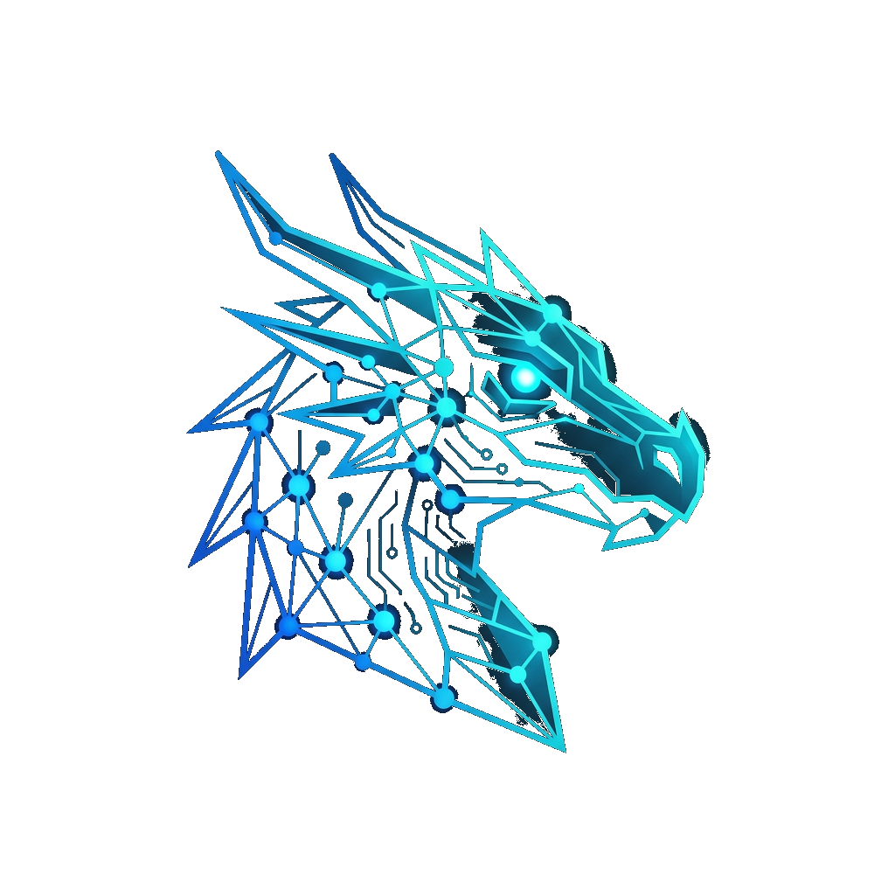

<div align="center">



# Zulong (祖龙)

### The "Hippocampus" That Gives AI Agents Year-Level Complete Memory

**82K+ Lines Python | Built by a Designer with AI**

[](https://www.gnu.org/licenses/agpl-3.0)
[](https://www.python.org/)
[](https://code.visualstudio.com/)
[](https://github.com/beautistart/zulong/releases)
[](https://discord.gg/zZMgtSyHV)
[](https://juejin.cn/post/7639026628014014473)
[](https://github.com/beautistart/zulong)

[English](./README_EN.md) | [简体中文](../README.md)

</div>

---

> **Zulong is not just another Agent framework. Zulong equips AI agents with a "hippocampus" capable of maintaining year-level complete memory, making long-cycle complex companionship a reality.**

<p align="center">
  <a href="https://discord.gg/zZMgtSyHV" target="_blank">
    
  </a>
</p>

<p align="center">
  <a href="https://juejin.cn/post/7639026628014014473" target="_blank"> Tech Analysis</a>
</p>

---

## Why Would an Interior Designer Dare to Build an AI Brain?

I'm an interior designer who independently developed Zulong's **82,000+ lines of code** in **2 months**.

Don't be surprised—because a designer's expertise is being the "chief engineer" of a project, planning blueprints and letting professionals in various fields implement them.

I designed Zulong's architectural blueprint and used AI-powered coding IDEs to help me implement the code:

- **Qwen Desktop** - Project Advisor
- **trae** - Early-stage backend code engineer
- **qoder** - Late-stage project correction + feature implementation
- **codearts** - Late-stage project correction + code review + feature implementation

**What is Zulong?**

> Zulong is an AI Agent cognitive system with a unified memory graph, employing Hebbian learning and Ebbinghaus decay algorithms under dynamic attention control, achieving year-level complete memory. It implements infinite context at the system level, and can run full memory + inference + multimodal capabilities.

**🎬 Video Demo**

<p align="center">Zulong's three-layer attention mechanism and ultra-complex project memory file demonstration</p>

<p align="center">
  <a href="https://youtu.be/-W-WYg_eQz4" target="_blank">
    
  </a>
</p>

<p align="center"><b>👆 Click image to watch video</b></p>

---

> **📢 v1.0.0 Official Release (2026-05-12)**
>
> After major architecture upgrades to the memory system, this is Zulong's first official release, including complete memory graph, infinite loop detection, year-level complete memory, and other core capabilities.
>
> **Key Updates**:
> - ✅ **MemoryGraph** - 9 node types + 7 edge types + Hebbian learning + Ebbinghaus decay
> - ✅ **CircuitBreaker 6-Signal Detection** - Information gain decay and 5 other signals
> - ✅ **Year-Level Complete Memory** - Full state serialization
> - ✅ **5-Layer Protection Chain** - Based on qwen3.6-27B model
> - ✅ **Complete VS Code Extension + TTS/ASR Voice Interaction**
>
> See [CHANGELOG.md](./CHANGELOG.md) for details

---

## ✨ Core Highlights

### 1. 🔮 Unified Memory Graph (MemoryGraph)

- **Persistent unified memory graph** (LMDB + GraphML storage)
- **Hebbian learning engine**: Co-activation count ≥ 3 automatically creates ASSOCIATION edges
- **Ebbinghaus forgetting curve**: 6 importance levels with half-life (TRIVIAL 6h → MUST_REMEMBER ∞)
- **Dual-path retrieval**: Hot path BFS (<50ms) + Cold path FAISS (<200ms)
- **Automatic semantic edge discovery**: Cosine similarity > 0.7 automatically creates SEMANTIC edges

### 2. ️ CircuitBreaker Infinite Loop Detector

**6-signal comprehensive circuit breaker**: Repeated call, pattern loop, information gain decay, context pressure, time elapsed, no progress idle

State machine: `GREEN → YELLOW(warning injection) → RED(force stop)`

| Project | Detection Method |
|---------|------------------|
| **Zulong** | 6-signal comprehensive circuit breaker + information gain detection |
| LangChain | max_iterations hard limit |
| CrewAI | max_iterations hard limit |
| OpenDevin | Time/step limit |

### 3. ⏸️ Cross-Day Task Suspend/Resume

Supports: `Pause → Shutdown → Next day boot → Resume and continue`

Use cases: 24-hour companion robots, ultra-long project management (cross-week/cross-month), automatic re-evaluation after environment changes

### 4.  Two-Stage Intent Classification + FC Loop

```
Round 1: Intent Classification → CHAT/COMPLEX/RESUME
Round 2: Scenario Execution
  ├─ CHAT: Direct conversation
  ├─ COMPLEX: Start FC loop + TaskGraph auto-planning
  └─ RESUME: Restore from snapshot + continue execution
```

With 5-layer protection chain (CB forced convergence, RuleGuardian premature completion interception, InfoGap information gap detection, etc.)

### 5. ️ Voice Interaction (TTS + ASR)

- **TTS (Kokoro-82M)**: 82M params, <0.3s (CPU), zf_xiaoxiao Chinese female voice
- **ASR (SenseVoice-Small)**: 244M (ONNX INT8 quantized), CN/EN/JP/KR/Cantonese + emotion recognition + event detection
- **Overall latency**: 3-4s (end-to-end, cloud API calls)

### 6. Embodied Robotics

Zulong is positioned as an **Embodied Robot Cognitive Brain Backend**, implementing a complete sensor-to-cognition pipeline through its four-layer architecture:

- **L0 Device Layer**: USB camera/mic/speaker drivers, GPU-accelerated optical flow motion detection (RTX 3060, 150+ FPS), multi-joint actuator simulation (position/velocity/torque tracking)
- **L1 Modular Plugin Architecture**: Hot-pluggable design with 4-level priority scheduling (CRITICAL > HIGH > NORMAL > LOW)
  - **L1-A Reflex Layer**: Obstacle auto-braking (<50ms), emergency stop, fall protection, audio fusion, motion control (supports vendor modules or end-to-end models), closely cooperates with L1-C/L1-D
  - **L1-B Scheduler Layer**: Three-layer attention (no attention -> silent attention -> interactive attention), ALBERT-tiny 15-class fine-grained intent classification (different from L1-C/D interaction intent judgment), ~90% event storm reduction
  - **L1-C Vision Layer**: YOLOv10 human detection -> MediaPipe pose/gesture (10 types) -> MobileNetV4-TSM action classification -> interaction intent judgment (5 types: WAVING/APPROACHING/GAZING/STILL/UNKNOWN), supports lightweight visual interaction intent model
  - **L1-D Auditory Layer**: Audio capture -> pre-emphasis+filter(80Hz) -> YAMNet(521 classes) -> VAD -> SenseVoice-Small single inference(transcription+emotion+event+language) -> interaction intent judgment(based on event tags) -> L1-B serial collaboration(ALBERT 15 classes); wake words("你好"/"救命"/"小紫"), "救命" CRITICAL bypass to L1-B
  - **L1-E Safety Layer**: MQ-2 smoke sensor -> gas detection(500ppm) -> CRITICAL event penetration to L1-B + voice alarm, 60s cooldown
- **L2 Cognitive Layer**: Inference and decision-making, no intent judgment
- **L3 Navigation Expert**: A* pathfinding + DWA dynamic window obstacle avoidance (2s trajectory prediction, 0.5m safety distance)
- **OpenClaw Bridge**: Physical robot integration module, real-time EventBus communication with Zulong L1-B

**Complementary to NVIDIA GR00T**: GR00T handles vision-action mapping and motion generalization; Zulong handles cognitive planning, memory retrieval, and long-horizon reasoning. Both can be deployed on the same robot.

> Detailed technical analysis: [Deep Analysis Report §3.9](./architecture/system-overview.md) | [L1 Plugin Guide](./architecture/l1-plugin-guide.md)

---

## 🏗️ System Architecture

### Four-Layer Inference Model

```
L3 Expert Layer              - Expert model pool, hot switching < 10ms
  ↓
L2 Cognitive Layer           - InferenceEngine (5700+ lines), inference & decision (no intent judgment)
  ↓
L1-B Scheduler Layer         - Gatekeeper + AttentionController, event priority routing
  ↓
L1-A Reflex Layer            - Obstacle braking/emergency stop/motion control + cooperates with L1-C/D
L1-C Vision Layer            - YOLOv10 -> MediaPipe -> MobileNetV4-TSM -> interaction intent judgment
L1-D Auditory Layer          - YAMNet -> VAD -> SenseVoice-Small -> interaction intent judgment
L1-E Safety Layer            - MQ-2 gas detection -> CRITICAL penetration
  ↓ → Output(text/voice/action)
L0 Device Layer              - USB camera/mic/speaker drivers, motion detection
```

### Frontend-Backend Separated Architecture

```
VS Code Extension (Frontend)  ←WebSocket→  Python Backend (Backend)
  ├─ React + Vite Webview                 ├─ FastAPI + WebSocket
  ├─ TypeScript + esbuild                 ├─ L2 Inference Engine
  └─ Tool Execution + UI Rendering        ├─ MemoryGraph Memory System
                                          └─ TTS/ASR Voice Interaction
```

---

## 🚀 Quick Start

### Requirements

- Python 3.10+
- Node.js 18+
- VS Code
- Recommended: AI MAX 395 128G (pure CPU capable)

### Installation

```bash
# 1. Clone repository
git clone https://github.com/beautistart/zulong.git
cd zulong

# 2. Install Python backend dependencies
python -m venv zulong_env
source zulong_env/bin/activate  # Windows: zulong_env\Scripts\activate
pip install -r requirements.txt

# 3. Install frontend dependencies
cd zulong-ide
npm install
cd webview-ui && npm install && cd ..

# 4. Build VS Code extension
npm run protos                      # Generate TypeScript proto files
node esbuild.mjs --production       # esbuild bundling
npx @vscode/vsce package --no-dependencies --allow-missing-repository --skip-license

# 5. Install extension to VS Code
code --install-extension zulong-ide-0.1.0.vsix --force
```

### Start Service

Zulong uses start.py for unified startup (run from project root):

```bash
# Unified startup script (at project root)
python start.py

# Or with sensor simulation mode
python start.py --mock-sensors

# Open VS Code, click Zulong icon to start session
```

### Configuration

Edit `config/zulong_config.yaml`:

```yaml
# LLM Configuration
llm:
  backend: "vllm"  # Options: ollama, lm_studio, openai
  model_id: "Qwen/Qwen2.5-7B-Instruct"
  
# WebSocket port
ide_server:
  port: 8090
  host: "127.0.0.1"
  
# Voice Configuration
audio:
  tts:
    backend: kokoro
    voice: zf_xiaoxiao
  asr:
    backend: sensevoice
    language: zh
```

---

## 🆚 Comparison

| Dimension | Zulong | LangChain | CrewAI | MemGPT/Letta | AutoGPT |
|-----------|--------|-----------|--------|--------------|---------|
| **Unified Memory Graph** | ✅ LMDB + GraphML | ❌ Memory DAG |  | ❌ Single-path vector | ❌ File-based |
| **Hebbian Learning** | ✅ Co-activation enhancement | ❌ | ❌ |  | ❌ |
| **Ebbinghaus Decay** | ✅ exp decay | ❌ | ❌ | ❌ | ❌ Age-based |
| **Dual-Path Retrieval** | ✅ BFS + FAISS | ❌ | ❌ | ❌ Single-path | ❌ Single-path |
| **Infinite Loop Detection** | ✅ 6-signal circuit breaker | ❌ Hard limit | ❌ Hard limit | ❌ | ❌ Hard limit |
| **Task Suspend/Resume** | ✅ Cross-day | ❌ | ❌ | ❌ | ❌ |
| **Voice Interaction** | ✅ TTS + ASR | ❌ | ❌ | ❌ |  |
| **Embodied Robotics** | ✅ L0-L3 four-layer + navigation | ❌ | ❌ | ❌ | ❌ |
| **Safety Reflex** | ✅ 3-tier interrupt + auto-brake | ❌ | ❌ | ❌ | ❌ |

---

## 📂 Project Structure

```
zulong_beta4/
├── zulong-ide/                 # VS Code Extension Frontend (React + TypeScript)
├── zulong/                     # Python Backend Core
│   ├── ide/                    # IDE Mode (WebSocket Service + Tool Registry)
│   ├── l2/                     # L2 Inference Engine (Inference + Memory + Breaker + Task Graph)
│   ├── memory/                 # Memory System (MemoryGraph + RAG)
│   ├── l0/                     # L0 Device Layer (Camera/Mic/Actuator/Motion Detection)
│   ├── l1a/ / l1b/ / l1c/     # Perception Layer (Audio Fusion/Scheduler/Vision)
│   ├── l3/                     # L3 Multi-Expert Model Layer
│   ├── expert_skills/          # L3 Expert Skills (Navigation/DWA/Vision)
│   ├── modules/l1/             # L1 Modular Plugin Interface
│   └── plugins/                # L1 Plugin Implementations (Motor/Vision/Voice/Gas)
├── openclaw_bridge/            # Physical Robot Bridge (EventBus + Adapters)
├── config/                     # Configuration (zulong_config.yaml, l1_plugins.yaml)
├── docs/                       # Technical Docs & User Guides
└── requirements.txt            # Python Dependencies
```

---

## 🔧 Core Modules

| Module | File | Lines | Core Capabilities |
|--------|------|-------|-------------------|
| **MemoryGraph** | `zulong/memory/memory_graph.py` | 2784 | Dual-path retrieval, Hebbian learning, Ebbinghaus decay, BFS activation |
| **CircuitBreaker** | `zulong/l2/circuit_breaker.py` | 800+ | 6-signal detection, State machine (GREEN→YELLOW→RED) |
| **TaskGraph** | `zulong/l2/task_graph.py` | 1500+ | Infinite depth recursive tree, template nodes, task dependency management |
| **InferenceEngine** | `zulong/l2/inference_engine.py` | 5700+ | Two-stage inference, memory retrieval, attention window, FC loop, 5-layer protection |
| **L1 Plugin Manager** | `zulong/modules/l1/core/plugin_manager.py` | - | Hot-plug, priority scheduling, fault isolation, shared memory |
| **Navigation Expert** | `zulong/expert_skills/navigation_skill.py` | 16K | A* pathfinding, DWA dynamic window obstacle avoidance |

---

## 🛠️ Tool System

**Internal Tools** (Backend execution): `task_create_plan` | `task_add_node` | `task_mark_status` | `recall_memory` | `read_memory_node` | `save_memory_note` | `discover_related` | `focus_on_chain`

**Remote Tools** (Frontend execution): `read_file` | `write_to_file` | `execute_command` | `search_files` | `browser_action`

---

## 📖 MCP Protocol Support

Zulong provides an independent MCP Server, enabling use of Zulong's memory capabilities in other IDEs:

```python
# mcp_server.py
Server("zulong-memory")

# 7 MCP Tools
- zulong_memory_search    # Project-level memory search
- zulong_memory_save      # Save project memory
- zulong_task_search      # Historical task search
- zulong_experience_search # Experience base search
- zulong_knowledge_query  # Knowledge base query
- zulong_graph_query      # Memory graph query
- zulong_entity_link      # Entity linking
```

---

## 📚 Documentation

**Quick Navigation**: [Documentation Index](./docs/index.md) - Find the docs you need

### Technical Docs
- [Technical Specification (TSD)](./docs/architecture/technical-spec-v3.md) - Complete system architecture design
- [In-Depth Technical Analysis](./docs/architecture/system-overview.md) - Code review and competitor comparison
- [L1 Perception & Embodied Control](./docs/architecture/system-overview.md#39-l0l1-感知与具身控制层-深度技术分析) - L0/L1 layer deep technical analysis
- [L1 Plugin Development Guide](./docs/architecture/l1-plugin-guide.md) - Custom L1 plugin development
- [Heterogeneous Graph Memory System](./docs/memory_graph/) - MemoryGraph design and implementation
- [CircuitBreaker Design Doc](./docs/CircuitBreaker_Design.md) - 6-signal infinite loop detection mechanism

### User Guides
- [IDE User Guide](./docs/Zulong_IDE使用指南.md) - User operation manual
- [Quick Start Guide](./docs/guides/quick-start.md) - 3-step installation and startup
- [Configuration Guide](./docs/guides/configuration.md) - System configuration instructions
- [Docker Deployment Guide](./docs/guides/docker-deployment.md) - Containerized deployment

### Development Docs
- [Contributing Guide](./CONTRIBUTING.md) - How to contribute code
- [Changelog](./CHANGELOG.md) - Version update records

---

## 🤝 Contributing

Contributions welcome! See [CONTRIBUTING.md](./CONTRIBUTING.md) for details.

### Roadmap

- [ ] Expand MCP toolset (7 → 30+)
- [ ] Add benchmark data
- [ ] TaskGraph UI visualization
- [ ] Multi-Agent collaboration support
- [ ] Performance optimization (critical path Rust/Cython rewrite)

---

## 📄 License

This repository uses layered licensing:

- **Core Code** (`zulong/`): AGPL-3.0
- **VS Code Extension** (`zulong-ide/`): MIT
- **Documentation** (`docs/`): CC BY-NC-SA 4.0

See [LICENSE](./LICENSE) file for details.

---

## 👨‍💻 Author

**An interior designer who independently developed Zulong with AI assistants in 2 months**

- GitHub: [@beautistart](https://github.com/beautistart)
- Email: beautistart@qq.com

---

## 🙏 Acknowledgments

Zulong's development would not be possible without numerous excellent open-source projects and community contributions. Sincere thanks to the following project teams:

### Core Frameworks

- **[Cline](https://github.com/cline/cline)** v3.82.0 - Zulong IDE is built on Cline framework
- **[PyTorch](https://github.com/pytorch/pytorch)** - Deep learning framework for model inference
- **[FastAPI](https://github.com/fastapi/fastapi)** + **[Uvicorn](https://github.com/encode/uvicorn)** - High-performance async web framework
- **[Hugging Face Transformers](https://github.com/huggingface/transformers)** - Pre-trained model loading and inference

### Memory System & Vector Computing

- **[NetworkX](https://github.com/networkx/networkx)** - Core graph computation engine for memory graph
- **[LMDB](https://lmdb.readthedocs.io/)** - High-performance embedded key-value database
- **[FAISS](https://github.com/facebookresearch/faiss)** - Facebook AI vector similarity search
- **[Qdrant](https://github.com/qdrant/qdrant)** - Vector database and semantic retrieval

### Voice Interaction

- **[FunASR / SenseVoice](https://github.com/modelscope/FunASR)** - Alibaba DAMO Academy ASR engine
- **[Kokoro-82M](https://huggingface.co/hexgrad/Kokoro-82M)** - Lightweight TTS model (82M params)
- **[edge-tts](https://github.com/rany2/edge-tts)** - Microsoft cloud TTS alternative
- **[Whisper](https://github.com/openai/whisper)** - OpenAI multilingual ASR model

### Frontend & UI

- **[React](https://github.com/facebook/react)** - Frontend UI framework
- **[Tailwind CSS](https://tailwindcss.com/)** - Atomic CSS framework
- **[Radix UI](https://www.radix-ui.com/)** - Headless UI component library
- **[Vite](https://vitejs.dev/)** - Frontend build tool
- **[esbuild](https://esbuild.github.io/)** - Fast JS/TS bundler

### Dev Tools & Infrastructure

- **[Model Context Protocol (MCP)](https://modelcontextprotocol.io/)** - Model context protocol SDK
- **[OpenTelemetry](https://opentelemetry.io/)** - Observability and tracing
- **[Playwright](https://playwright.dev/)** - Browser automation testing
- **[Mermaid](https://mermaid.js.org/)** - Diagram and flowchart rendering

### Models & Weights

#### Intent & Inference Models

- **[Qwen Series](https://github.com/QwenLM/Qwen)** - Alibaba Tongyi Qwen (Zulong's core inference model)
- **[ALBERT-tiny-chinese](https://github.com/ymcui/Chinese-ALBERT)** - HIT Chinese lightweight intent recognition (15-class)

#### Voice Models

- **[SenseVoice-Small](https://github.com/modelscope/FunASR)** - Alibaba DAMO ASR (244M, ONNX INT8)
- **[sherpa-onnx](https://github.com/k2-fsa/sherpa-onnx)** - Speech recognition ONNX inference engine
- **[Kokoro-82M](https://huggingface.co/hexgrad/Kokoro-82M)** - TTS main engine (82M, CPU real-time <0.3s)
- **[Whisper](https://github.com/openai/whisper)** - OpenAI multilingual ASR fallback
- **[edge-tts](https://github.com/rany2/edge-tts)** - Microsoft cloud TTS alternative

#### Embedding Models

- **[BAAI BGE Series](https://github.com/FlagOpen/FlagEmbedding)** - BAAI text embedding models

#### Vision & Multimodal

- **[MediaPipe](https://google.github.io/mediapipe/)** - Google ML pipeline (face/hand/pose detection)

### Agent Frameworks

- **[LangGraph](https://github.com/langchain-ai/langgraph)** - Graph-based AI Agent orchestration
- **[LangChain](https://github.com/langchain-ai/langchain)** - Multi-LLM application framework
- **[VLLM](https://github.com/vllm-project/vllm)** - High-performance LLM inference engine

### Vision & Multimodal

- **[OpenCV](https://github.com/opencv/opencv)** - Computer vision library

### NLP

- **[NLTK](https://www.nltk.org/)** - Natural language processing toolkit
- **[jieba](https://github.com/fxsjy/jieba)** - Chinese word segmentation

### Numerical & Scientific Computing

- **[NumPy](https://numpy.org/)** - Numerical computing and arrays
- **[SciPy](https://scipy.org/)** - Scientific computing and linear algebra

### Security & Parsing

- **[PyJWT](https://github.com/jpadilla/pyjwt)** - JSON Web Token creation and validation
- **[Tree-sitter](https://tree-sitter.github.io/)** - Incremental code parser generator

### AI Coding Tools

Thanks to AI coding tools that helped in Zulong's development:

- **Qwen Desktop** - Project Advisor
- **trae** - Early-stage backend code engineer
- **qoder** - Late-stage project correction + feature implementation
- **codearts** - Late-stage project correction + code review + feature implementation

---

## ⭐ Star History

If this project helps you, please give it a ⭐ Star to support!

[](https://star-history.com/#beautistart/zulong&Date)

---

<div align="center">

**Made with ❤️ by an Interior Designer turned AI Developer**

**Zulong - Giving AI True Memory**

</div>
