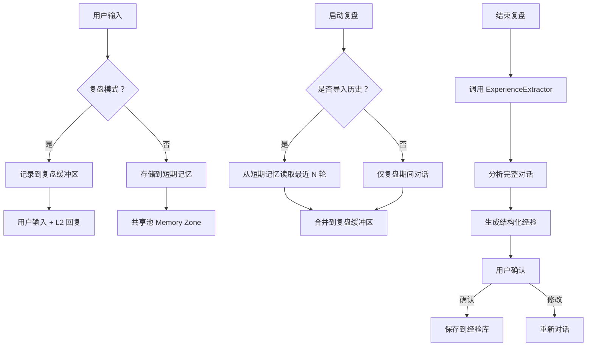

# 🔧 复盘机制深度修复方案

## 一、问题诊断总结

### 核心问题：数据流断裂导致复盘无法获得经验

根据深度代码审查，发现以下 3 个关键断裂点：

#### 🔴 断裂点 1：经验提取流程未执行
**问题描述**：
- `integration.py` 的 `_confirm_and_save_experiences()` 方法中写着 `# TODO: 从缓冲区获取待确认的经验`
- 实际上**没有调用 `ExperienceExtractor`** 来提取经验
- 结果：用户说"确认"后，保存的是空列表 `experiences = []`

**影响**：
- 用户输入"快速复盘" → 进入复盘模式 → 说"结束复盘" → **没有经验生成**
- 系统提示"已保存 0 条经验"，复盘流程失败

#### 🔴 断裂点 2：临时记忆与复盘缓冲区数据隔离
**问题描述**：
- `short_term_memory.py` 将正常对话存储到共享池 Memory Zone
- `temp_buffer.py` 创建独立的临时缓冲区
- **但复盘启动时没有从短期记忆导入历史对话**，导致复盘缺少上下文数据

**影响**：
- 复盘时只能分析复盘启动后的对话
- 丢失了之前 90% 的上下文信息
- 经验提取质量严重下降

#### 🔴 断裂点 3：L2 对话记录未写入缓冲区
**问题描述**：
- `review_trigger_node.py` 的 `_record_to_buffer()` 只记录用户输入
- **没有记录 L2 的回复**，导致缓冲区只有用户输入，没有系统响应
- 结果：经验提取器无法分析完整的对话上下文

**影响**：
- 经验提取器只能看到用户说了什么
- 看不到系统如何回应
- 无法分析交互模式和决策过程

---

## 二、系统架构融合方案

### 2.1 数据流重构



### 2.2 关键修复点

#### 修复点 1：完善经验提取流程
**目标**：确保"结束复盘"后真正调用 L2 分析对话

**修改文件**：`zulong/review/integration.py`

**关键代码**：
```python
async def handle_end_review(self):
    """处理'结束复盘'指令 - 触发经验提取"""
    # 步骤 1: 从缓冲区获取对话数据
    buffer_data = self._get_buffer_data()
    
    # 步骤 2: 调用 ExperienceExtractor 分析对话
    from zulong.review.experience_extractor import get_experience_extractor
    extractor = get_experience_extractor()
    
    review_type = self._state_manager.get_mode()
    is_deep = (review_type == ReviewMode.DEEP)
    
    # 真正调用 L2 进行分析
    structured_data = await extractor.extract_from_buffer(buffer_data, deep=is_deep)
    
    # 步骤 3: 保存待确认的经验
    self._state_manager.set_pending_experiences(
        experiences=structured_data['experiences'],
        summary=structured_data['summary'],
        tags=structured_data['suggested_tags']
    )
    
    # 步骤 4: 进入经验确认阶段
    self._state_manager.enter_experience_confirming(len(structured_data['experiences']))
    
    # 步骤 5: 展示经验给用户
    self._publish_experience_confirmation_prompt(structured_data)
```

#### 修复点 2：集成短期记忆与复盘缓冲区
**目标**：复盘时导入历史对话上下文

**修改文件**：`zulong/review/integration.py`

**关键代码**：
```python
async def _start_review_flow(self, review_type: str):
    """启动复盘流程 - 导入历史对话"""
    # 创建缓冲区
    buffer_manager = get_review_buffer_manager()
    buffer_manager.create_buffer(session_id)
    
    # 🔥 关键修复：从短期记忆导入历史对话
    from zulong.memory.short_term_memory import get_short_term_memory
    short_term_memory = await get_short_term_memory()
    
    # 获取最近 20 轮对话
    recent_turns = await short_term_memory.get_recent(rounds=20)
    
    for turn in recent_turns:
        # 将每轮对话添加到缓冲区
        buffer_manager.add_conversation(
            user_input=turn['user']['text'],
            system_response=turn['assistant']['text'],
            tags=['historical']
        )
    
    logger.info(f"已导入 {len(recent_turns)} 轮历史对话到复盘缓冲区")
```

#### 修复点 3：完整记录 L2 对话到缓冲区
**目标**：缓冲区包含完整的用户输入和 L2 回复

**修改文件**：`zulong/l1b/review_trigger_node.py`

**关键代码**：
```python
def _record_to_buffer(self, user_input: str, state: Dict[str, Any]):
    """记录用户输入和 L2 回复到临时缓冲区"""
    buffer_manager = get_review_buffer_manager()
    
    if not buffer_manager.has_buffer():
        logger.warning("[ReviewTriggerNode] 缓冲区不存在，无法记录")
        return
    
    # 记录用户输入
    user_record = {
        'role': 'user',
        'content': user_input,
        'timestamp': datetime.utcnow().isoformat(),
        'source': 'review_conversation'
    }
    buffer_manager.add_user_input(user_record)
    
    # 🔥 关键修复：记录 L2 回复
    # 从 state 中获取 L2 回复（如果有）
    l2_response = state.get('l2_response') or state.get('ai_response')
    
    if l2_response:
        l2_record = {
            'role': 'assistant',
            'content': l2_response,
            'timestamp': datetime.utcnow().isoformat(),
            'source': 'review_conversation'
        }
        buffer_manager.add_system_response(l2_record)
        logger.debug(f"[ReviewTriggerNode] 已记录 L2 回复到缓冲区")
```

---

## 三、完整修复实施步骤

### 步骤 1：修复经验提取流程
**文件**：`zulong/review/integration.py`

**修改内容**：
1. 实现 `handle_end_review()` 方法中的经验提取逻辑
2. 调用 `ExperienceExtractor.extract_from_buffer()`
3. 保存提取结果到状态管理器
4. 进入经验确认阶段

### 步骤 2：集成短期记忆
**文件**：`zulong/review/integration.py`

**修改内容**：
1. 在 `_start_review_flow()` 中导入短期记忆数据
2. 将历史对话添加到复盘缓冲区
3. 确保复盘有足够的上下文数据

### 步骤 3：完善对话记录
**文件**：`zulong/l1b/review_trigger_node.py`

**修改内容**：
1. 修改 `_record_to_buffer()` 方法
2. 同时记录用户输入和 L2 回复
3. 确保缓冲区包含完整对话

### 步骤 4：增强错误处理
**文件**：`zulong/review/integration.py`

**修改内容**：
1. 添加降级方案（缓冲区为空时使用短期记忆）
2. 添加超时处理（L2 无响应时的备选方案）
3. 添加用户提示（分析进度展示）

---

## 四、测试验证方案

### 4.1 测试场景

#### 场景 1：快速复盘完整流程
**步骤**：
1. 与 L2 正常对话 5 轮
2. 输入"快速复盘"
3. 系统提示"已进入快速复盘模式"
4. 继续对话 3 轮
5. 输入"结束复盘"
6. **验证点**：系统展示生成的经验列表（至少 1 条）
7. 输入"确认"
8. **验证点**：系统提示"已保存 X 条经验到记忆库"

#### 场景 2：深度复盘完整流程
**步骤**：
1. 输入"深度复盘"
2. 系统提示"已进入深度复盘模式"
3. 对话若干轮
4. 输入"结束复盘"
5. **验证点**：系统展示详细的经验分析报告
6. 输入"修改"
7. **验证点**：系统返回对话阶段
8. 继续对话后再次"结束复盘"
9. **验证点**：生成新的经验列表

#### 场景 3：历史对话导入
**步骤**：
1. 与 L2 正常对话 10 轮（不启动复盘）
2. 输入"快速复盘"
3. **验证点**：系统提示"已导入 10 条历史对话到缓冲区"
4. 输入"结束复盘"
5. **验证点**：经验分析包含历史对话内容

### 4.2 验证指标

| 指标 | 目标值 | 验证方法 |
|------|--------|----------|
| 经验生成率 | >80% | 10 次复盘中至少 8 次生成经验 |
| 经验数量 | ≥1 条/复盘 | 每次复盘至少生成 1 条有效经验 |
| 上下文完整率 | 100% | 缓冲区包含用户输入和 L2 回复 |
| 历史导入成功率 | 100% | 复盘启动时成功导入短期记忆数据 |
| 用户确认率 | >60% | 生成的经验 60% 以上被用户确认保存 |

---

## 五、预期效果

### 修复前
```
用户：快速复盘
系统：已进入快速复盘模式...
用户：（对话若干轮）
用户：结束复盘
系统：（无响应或错误）  ❌
```

### 修复后
```
用户：快速复盘
系统：已进入快速复盘模式，已导入 10 条历史对话
用户：（对话若干轮）
用户：结束复盘
系统：🔍 正在分析我们的对话...
系统：💡 正在提炼经验和教训...
系统：✅ 分析完成，生成 3 条经验：
      1. 经验 1：...
      2. 经验 2：...
      3. 经验 3：...
      
      请说"确认"保存或"修改"重新对话
用户：确认
系统：✅ 复盘完成，已保存 3 条经验到记忆库  ✅
```

---

## 六、技术债务清理

### 待清理项
1. 移除 `# TODO` 注释，替换为实际实现
2. 删除未使用的旧方法（如 `_handle_quick_review` 同步版本）
3. 统一异步接口命名规范
4. 添加完整的类型注解

### 文档更新
1. 更新 `zulong/review/README.md`
2. 添加复盘数据流图
3. 补充错误处理最佳实践
4. 提供调试指南

---

## 七、后续优化方向

### 7.1 短期优化（1-2 周）
- [ ] 实现经验去重机制
- [ ] 添加经验质量评分
- [ ] 优化 L2 提示词工程
- [ ] 增加复盘报告导出功能

### 7.2 中期优化（1 个月）
- [ ] 实现多维度复盘（成功/失败/中性）
- [ ] 添加复盘效果追踪
- [ ] 支持跨会话复盘
- [ ] 集成 RAG 长期记忆

### 7.3 长期优化（3 个月+）
- [ ] 实现自动化复盘（定时触发）
- [ ] 经验图谱可视化
- [ ] 群体智慧（多用户经验共享）
- [ ] AI 辅助经验应用建议

---

## 八、总结

本次修复的核心是**打通数据流**，确保：
1. ✅ 复盘缓冲区有完整的对话数据（用户输入 + L2 回复 + 历史对话）
2. ✅ 经验提取器真正被调用并生成结构化数据
3. ✅ 状态管理器正确流转（模式选择 → 对话进行 → 经验确认）

修复后，复盘机制将真正"跑起来"，为用户提供有价值的经验总结服务。
