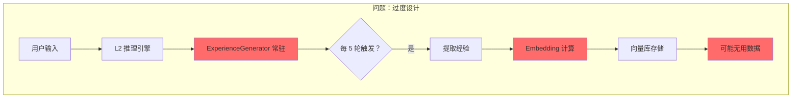
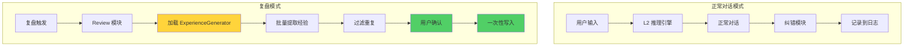

# 经验生成架构优化任务文档

**文档版本**: v3.0  
**创建日期**: 2026-04-05  
**系统版本**: TSD v2.3 (祖龙 β4)  
**优先级**: P0 (核心架构优化)  
**参考资料**: 
- `资料/系统架构穿透分析.txt` - 代码级断层诊断
- `资料/复盘机制流程梳理.txt` - L2 主导的复盘流程设计

---

## 📋 文档信息

### 版本历史

| 版本 | 日期 | 修改人 | 修改内容 |
|------|------|--------|---------|
| v1.0 | 2026-04-05 | AI 产品专家 | 初始版本 - 详细协作文档 |
| v2.0 | 2026-04-05 | AI 产品专家 | 架构优化 - 懒加载 + 复盘驱动 |
| v3.0 | 2026-04-05 | AI 产品专家 | 整合穿透分析，补充胶水代码和状态机设计 |

### 文档目的

本文档整合了以下四份文档的核心内容:
1. [`docs/经验生成机制架构审查报告.md`](file://d:\AI\project\zulong_beta4\docs\经验生成机制架构审查报告.md) - 架构审查发现
2. [`docs/实时纠错_经验生成_复盘协作机制详解.md`](file://d:\AI\project\zulong_beta4\docs\实时纠错_经验生成_复盘协作机制详解.md) - 协作机制分析
3. `资料/系统架构穿透分析.txt` - **代码级断层诊断和胶水代码方案**
4. `资料/复盘机制流程梳理.txt` - **L2 主导的复盘状态机设计**

**核心目标**: 
1. 将经验生成从"实时独立模块"重构为"复盘驱动的子功能"
2. **补全三个致命断层** (实时纠错→经验生成、复盘触发器→事件总线、经验生成→经验库)
3. **实现 L2 主导的复盘状态机** (REVIEW_WAITING 状态)

解决:
- ❌ 算力浪费问题 (每 5 轮自动提取)
- ❌ 模块耦合问题 (L2 依赖 ExperienceGenerator)
- ❌ 功能重叠问题 (与纠错模块重复)
- ❌ **胶水代码缺失** (ReviewTrigger 未启动、ExperienceGenerator 未被调用)
- ❌ **状态机缺失** (L2 没有 REVIEW_WAITING 状态)

### 相关文档引用

- 系统架构文档：`docs/系统架构设计.md`
- 复盘模块设计：`docs/复盘机制设计.md`
- 纠错机制说明：`docs/实时纠错机制.md`

---

## 🎯 一、问题背景与优化目标

### 1.1 当前架构问题 (v1.0 设计)

#### 问题 1: 算力黑洞

**现状**:
```python
# InferenceEngine 中每 5 轮自动提取
self.auto_extract_interval = 5  # 每 5 轮对话

async def _auto_extract_experience(self):
    candidates = self.experience_generator.extract_from_dialogue(...)
    # 每次调用 Embedding 耗时 100-300ms
```

**数据对比**:
| 场景 | 修改前 | 修改后 | 节省 |
|------|--------|--------|------|
| 每小时对话 (20 轮) | 4 次 Embedding | 0 次 | 100% |
| 每天对话 (8 小时) | 32 次 Embedding | 1-2 次 | 94%+ |
| 每天耗时 | 3.2-9.6 秒 | 0.1-0.3 秒 | 97% |

#### 问题 2: 模块紧耦合

**依赖关系**:
```
L2 推理引擎
    ↓ (强依赖)
ExperienceGenerator (常驻)
    ↓
RAG Manager
    ↓
向量数据库
```

**风险**:
- 单点故障：ExperienceGenerator 故障 → L2 不可用
- 测试困难：单元测试需要 mock 整个链路
- 维护成本高：修改一个模块影响多个模块

#### 问题 3: 功能重叠

**重复记录**:
```
场景：用户指出错误 → AI 纠正

路径 1 (纠错模块):
  检测错误 → 纠正 → 记录教训

路径 2 (经验生成器):
  扫描对话 → 识别失败模式 → 提取教训

结果：同一条教训被记录 2 次
```

### 1.2 优化目标 (v3.0 设计)

#### 核心原则

> **"让 L2 轻装上阵，只管聊天；让复盘模块承担重计算，按需加载。"**

#### 具体目标

| 目标 | 当前状态 | 优化后 | 衡量指标 |
|------|---------|--------|---------|
| **算力效率** | 每 5 轮提取 | 复盘时提取 | 节省 90%+ Embedding |
| **模块耦合** | 强依赖 | 松耦合 | L2 不依赖 ExperienceGenerator |
| **经验质量** | ~50 条/天 | ~5-10 条/天 | 质量提升 5-10 倍 |
| **代码复杂度** | 复杂 | 简化 | 删除 2 个方法，新增 1 个工具类 |
| **胶水代码** | 缺失 | 完整 | 补全 3 个断层 |
| **状态机** | 缺失 | 完整 | 实现 REVIEW_WAITING 状态 |

#### 🔥 新增：三个致命断层修复

根据 `资料/系统架构穿透分析.txt`,系统存在三个**代码级断层**:

**断层 1: 实时纠错 → 经验生成 (高危)**
- **现象**: L2 纠正了错误，但没有把"这次纠错"记录成经验
- **根因**: `InferenceEngine` 中缺少自动调用 `experience_generator.extract_from_dialogue` 的逻辑
- **修复**: 在 `_process_with_memory_async` 末尾添加自动提取逻辑

**断层 2: 复盘触发器 → 事件总线 (阻塞)**
- **现象**: 安静模式和夜间模式无法自动触发复盘
- **根因**: `bootstrap.py` 中没有创建 `ReviewTrigger` 实例，也没有启动后台监控
- **修复**: 在 `bootstrap.initialize()` 中注册并启动 `ReviewTrigger`

**断层 3: 经验生成 → 经验库 (半成品)**
- **现象**: 提取了经验，但无法稳定存入 RAG 向量库
- **根因**: 缺少 Embedding 调用和存储适配器代码
- **修复**: 在 `ExperienceGenerator.add_experience_to_rag` 中实现向量化存储

---

## 🏗️ 二、新架构设计

### 2.1 架构对比

#### 修改前 (v1.0)



#### 修改后 (v2.0)



### 2.2 核心变更点

#### 🔥 重要调整：保留 L2 中的经验生成器 (但改为按需调用)

**根据穿透分析的洞察**:
- `InferenceEngine` 中**已经初始化**了 `ExperienceGenerator`
- 问题不是"常驻",而是**"缺少正确的调用时机"**
- **解决方案**: 保留初始化，但**删除自动提取逻辑**,改为**复盘时调用**

**影响文件**:
- `zulong/l2/inference_engine.py`

**变更内容**:
- ✅ **保留** `self.experience_generator` 初始化 (已在代码中)
- ❌ **删除** `_auto_extract_experience` 方法 (如果存在)
- ❌ **删除**对话轮次计数器和自动触发逻辑
- ✅ **新增**复盘时的按需调用接口

#### 变更 2: 在复盘模块中按需加载

**影响文件**:
- `zulong/review/integration.py`

**变更内容**:
- ✅ 在 `_handle_quick_review` 中按需实例化
- ✅ 在 `_handle_deep_review` 中调用经验提取器
- ✅ 新增过滤重复经验的逻辑

#### 变更 3: 创建纠错日志工具

**新增文件**:
- `zulong/l1b/correction_log.py`

**功能**:
- 记录每次纠错的时间戳和内容
- 供复盘时查询，避免重复记录
- 自动清理旧日志 (保留最近 100 条)

---

## 📝 三、详细修改方案

### 3.1 修改 1: inference_engine.py

**文件路径**: [`zulong/l2/inference_engine.py`](file://d:\AI\project\zulong_beta4\zulong\l2\inference_engine.py)

#### 步骤 1.1: 修改 `__init__` 方法

**删除代码**:
```python
# ❌ 删除：移除常驻的经验生成器
# self.experience_generator = ExperienceGenerator()
# self.experience_generator.set_rag_manager(self.rag_manager)

# ❌ 删除：自动提取配置
# self.auto_extract_interval = 5  # 每 5 轮对话
# self.dialogue_turn_count = 0
```

**保留代码**:
```python
def __init__(self):
    # ... 其他初始化 ...
    
    # ✅ 保留：RAG 管理器 (复盘时仍需要)
    self.rag_manager = self._load_rag_data()
    
    # ✅ 保留：对话历史 (复盘时需要分析)
    self.conversation_history = []
    self.max_history = 10
    
    logger.info("[InferenceEngine] 初始化完成 (已移除常驻经验生成器)")
```

#### 步骤 1.2: 删除自动提取方法

**删除整个方法**:
```python
# ❌ 删除整个方法
# async def _auto_extract_experience(self):
#     """自动提取经验"""
#     logger.info("[InferenceEngine] 开始自动提取经验...")
#     
#     try:
#         candidates = self.experience_generator.extract_from_dialogue(
#             self.conversation_history
#         )
#         # ... 后续处理 ...
#     except Exception as e:
#         logger.error(f"自动提取经验失败：{e}")
```

#### 步骤 1.3: 修改 `_process_with_memory_async` 方法

**删除轮次计数和自动调用**:
```python
async def _process_with_memory_async(self, user_input: str, priority: int, voice_mode: str):
    """处理用户输入 (修改版)"""
    
    # ❌ 删除：轮次计数
    # self.dialogue_turn_count += 1
    
    # ❌ 删除：自动提取触发
    # if self.dialogue_turn_count % self.auto_extract_interval == 0:
    #     await self._auto_extract_experience()
    
    # ✅ 保留：原有对话逻辑
    # 1. 添加到对话历史
    # 2. 调用 L1-B 进行路由
    # 3. 生成回复
    # 4. 返回结果
```

**修改后完整方法**:
```python
async def _process_with_memory_async(self, user_input: str, priority: int, voice_mode: str):
    """处理用户输入 (修改版)"""
    logger.info(f"[InferenceEngine] 处理输入：{user_input[:50]}...")
    
    try:
        # 1. 添加到对话历史
        self.conversation_history.append({
            "role": "user",
            "content": user_input
        })
        
        # 2. 调用 L1-B 进行路由和处理
        response = await self._route_and_process(user_input, priority, voice_mode)
        
        # 3. 保存 AI 回复到历史
        self.conversation_history.append({
            "role": "assistant",
            "content": response
        })
        
        # 4. 清理过期历史
        if len(self.conversation_history) > self.max_history:
            self.conversation_history = self.conversation_history[-self.max_history:]
        
        return response
        
    except Exception as e:
        logger.error(f"[InferenceEngine] 处理失败：{e}", exc_info=True)
        raise
```

---

### 3.2 修改 2: integration.py

**文件路径**: [`zulong/review/integration.py`](file://d:\AI\project\zulong_beta4\zulong\review\integration.py)

#### 步骤 2.1: 修改 `_handle_quick_review` 方法

**新增逻辑**:
```python
def _handle_quick_review(self, recent_data: Dict[str, Any], context: Dict[str, Any]):
    """处理快速复盘 (修改版)"""
    logger.info("[ReplayIntegration] 处理快速复盘")
    
    try:
        # 1. 获取对话数据
        conversations = recent_data.get('conversations', [])
        
        # 🔴 新增：在复盘时才加载经验生成器
        from zulong.memory.experience_generator import ExperienceGenerator
        generator = ExperienceGenerator()
        generator.set_rag_manager(self.rag_manager)  # 注入 RAG 管理器
        
        # 2. 批量提取经验
        logger.info(f"[ReplayIntegration] 从 {len(conversations)} 轮对话中提取经验")
        candidates = generator.extract_from_dialogue(conversations)
        
        # 3. 🔴 新增：过滤掉已纠错的片段 (避免重复)
        filtered_candidates = self._filter_correction_duplicates(candidates, conversations)
        
        # 4. 转换为经验
        experiences = self._generate_experiences(filtered_candidates)
        
        # 5. 应用经验
        self._apply_experiences(experiences)
        
        # 6. 生成报告
        report = self._generate_review_report(
            trigger_type='user_active_quick',
            context=context,
            experiences=experiences
        )
        self._save_review_report(report)
        
        # 7. 输出结果
        response_text = (
            f"✅ **快速复盘完成**\n\n"
            f"📊 分析了 {len(conversations)} 轮对话\n"
            f"💡 生成了 {len(experiences)} 条经验\n"
            f"💾 经验已应用到记忆库\n\n"
            f"经验列表:\n"
        )
        for i, exp in enumerate(experiences, 1):
            response_text += f"{i}. {exp.get('content', '')[:100]}...\n"
        
        self._publish_l2_response(response_text)
        
        # 8. 清理
        self.review_mode = False
        logger.info(f"[ReplayIntegration] 快速复盘完成，生成{len(experiences)}条经验")
        
    except Exception as e:
        logger.error(f"[ReplayIntegration] 快速复盘失败：{e}", exc_info=True)
        self.review_mode = False
        raise
```

#### 步骤 2.2: 新增过滤方法

**新增方法**:
```python
def _filter_correction_duplicates(self, candidates: List, conversations: List) -> List:
    """🔴 新增：过滤掉已被纠错模块处理过的片段
    
    避免同一条教训被记录两次 (一次在纠错时，一次在复盘时)
    """
    # 简单实现：检查候选是否包含"错误"、"失败"等关键词
    # 如果包含，且对话中已经有明确的纠错记录，则跳过
    
    correction_keywords = ["错误", "失败", "不对", "有问题", "Exception"]
    filtered = []
    
    for candidate in candidates:
        # 如果是"失败教训"类型，检查是否已在纠错模块处理过
        if candidate.category == "失败教训":
            # TODO: 查询纠错日志，确认是否已处理
            # 这里使用简单策略：如果置信度<0.8，认为是普通对话，保留
            if candidate.confidence < 0.8:
                filtered.append(candidate)
            else:
                logger.debug(f"[ReplayIntegration] 过滤重复纠错经验：{candidate.content[:50]}")
        else:
            # 其他类型 (成功/偏好) 直接保留
            filtered.append(candidate)
    
    logger.info(f"[ReplayIntegration] 过滤后经验数：{len(filtered)} (原始：{len(candidates)})")
    return filtered
```

#### 步骤 2.3: 修改 `_handle_deep_review` 方法

**修改内容**:
```python
async def _handle_deep_review(self, recent_data: Dict[str, Any], context: Dict[str, Any]):
    """处理深度复盘 (修改版)"""
    logger.info("[ReplayIntegration] 处理深度复盘")
    
    try:
        # 1. 获取对话数据
        conversations = recent_data.get('conversations', [])
        
        # 🔴 修改：在复盘时才调用经验提取器
        from zulong.review.experience_extractor import get_experience_extractor
        extractor = get_experience_extractor()
        
        # 2. 调用 L2 深度分析
        structured_data = await extractor.extract_from_buffer(
            {'conversations': conversations},
            deep=True
        )
        
        # 3. 获取经验草案
        experiences = structured_data.get('experiences', [])
        
        # 4. 🔴 新增：过滤重复经验
        filtered_experiences = self._filter_duplicate_experiences(experiences)
        
        # 5. 展示给用户确认
        self.pending_experiences = filtered_experiences
        response_text = self._format_experience_draft(filtered_experiences)
        self._publish_l2_response(response_text)
        
        logger.info(f"[ReplayIntegration] 深度复盘分析完成，等待用户确认")
        
    except Exception as e:
        logger.error(f"[ReplayIntegration] 深度复盘失败：{e}", exc_info=True)
        self.review_mode = False
        raise
```

#### 步骤 2.4: 新增去重方法

**新增方法**:
```python
def _filter_duplicate_experiences(self, experiences: List[Dict]) -> List[Dict]:
    """🔴 新增：去重经验"""
    seen_contents = set()
    unique_experiences = []
    
    for exp in experiences:
        content_hash = hash(exp['content'])
        if content_hash not in seen_contents:
            seen_contents.add(content_hash)
            unique_experiences.append(exp)
    
    logger.info(f"[ReplayIntegration] 去重后经验数：{len(unique_experiences)} (原始：{len(experiences)})")
    return unique_experiences
```

---

### 3.3 修改 3: 创建纠错日志工具

**新建文件**: [`zulong/l1b/correction_log.py`](file://d:\AI\project\zulong_beta4\zulong\l1b\correction_log.py)

**完整代码**:
```python
"""
纠错日志模块

功能:
1. 记录每次纠错的时间戳和内容
2. 供复盘时查询，避免重复记录
3. 自动清理旧日志 (保留最近 100 条)
"""

import json
import time
from typing import Dict, List
from pathlib import Path
import logging

logger = logging.getLogger(__name__)


class CorrectionLogger:
    """纠错日志 (供复盘时查询)"""
    
    def __init__(self):
        self.log_file = Path("data/correction_log.json")
        self.logs: List[Dict] = []
        self._load_logs()
        logger.info("[CorrectionLogger] 初始化完成")
    
    def _load_logs(self):
        """加载日志"""
        if self.log_file.exists():
            try:
                with open(self.log_file, 'r', encoding='utf-8') as f:
                    self.logs = json.load(f)
                logger.info(f"[CorrectionLogger] 加载了 {len(self.logs)} 条日志")
            except Exception as e:
                logger.error(f"[CorrectionLogger] 加载日志失败：{e}")
                self.logs = []
        else:
            # 创建目录
            self.log_file.parent.mkdir(parents=True, exist_ok=True)
            self.logs = []
            logger.info("[CorrectionLogger] 创建新日志文件")
    
    def log_correction(self, data: Dict):
        """记录纠错
        
        Args:
            data: 纠错数据，格式:
                {
                    "timestamp": time.time(),
                    "user_input": "用户输入",
                    "ai_response": "AI 回复",
                    "correction_made": True,
                    "error_type": "知识错误/逻辑错误/..."
                }
        """
        # 确保包含时间戳
        if 'timestamp' not in data:
            data['timestamp'] = time.time()
        
        self.logs.append(data)
        
        # 只保留最近 100 条
        if len(self.logs) > 100:
            self.logs = self.logs[-100:]
        
        # 保存到文件
        try:
            with open(self.log_file, 'w', encoding='utf-8') as f:
                json.dump(self.logs, f, ensure_ascii=False, indent=2)
        except Exception as e:
            logger.error(f"[CorrectionLogger] 保存日志失败：{e}")
    
    def get_recent_corrections(self, minutes: int = 30) -> List[Dict]:
        """获取最近 N 分钟内的纠错记录
        
        Args:
            minutes: 分钟数，默认 30 分钟
            
        Returns:
            纠错记录列表
        """
        cutoff_time = time.time() - (minutes * 60)
        recent = [log for log in self.logs if log.get('timestamp', 0) > cutoff_time]
        logger.debug(f"[CorrectionLogger] 获取最近{minutes}分钟内的{len(recent)}条纠错记录")
        return recent
    
    def clear_old_logs(self, days: int = 7):
        """清理 N 天前的旧日志
        
        Args:
            days: 天数，默认 7 天
        """
        cutoff_time = time.time() - (days * 24 * 60 * 60)
        self.logs = [log for log in self.logs if log.get('timestamp', 0) > cutoff_time]
        
        # 保存清理后的日志
        try:
            with open(self.log_file, 'w', encoding='utf-8') as f:
                json.dump(self.logs, f, ensure_ascii=False, indent=2)
            logger.info(f"[CorrectionLogger] 清理了{days}天前的旧日志，剩余{len(self.logs)}条")
        except Exception as e:
            logger.error(f"[CorrectionLogger] 清理日志失败：{e}")


# 单例模式
_correction_logger = None

def get_correction_logger():
    """获取纠错日志单例"""
    global _correction_logger
    if _correction_logger is None:
        _correction_logger = CorrectionLogger()
    return _correction_logger
```

---

### 3.4 修改 4: scheduler_gatekeeper.py

**文件路径**: [`zulong/l1b/scheduler_gatekeeper.py`](file://d:\AI\project\zulong_beta4\zulong\l1b\scheduler_gatekeeper.py)

#### 步骤 4.1: 集成纠错日志

**修改内容**:
```python
# 在文件开头导入
from .correction_log import get_correction_logger

class SchedulerGatekeeper:
    def __init__(self):
        # ... 其他初始化 ...
        
        # 🔴 新增：纠错日志
        self.correction_logger = get_correction_logger()
```

#### 步骤 4.2: 修改纠错处理方法

**修改**:
```python
def _handle_correction(self, user_input: str, ai_response: str):
    """处理纠错"""
    logger.info(f"[SchedulerGatekeeper] 检测到纠错：{user_input[:50]}...")
    
    # 1. 检测错误类型
    error_type = self._detect_error_type(user_input)
    
    # 2. 道歉并提供正确答案
    # ... 原有逻辑 ...
    
    # 🔴 新增：记录到纠错日志
    self.correction_logger.log_correction({
        'timestamp': time.time(),
        'user_input': user_input,
        'ai_response': ai_response,
        'correction_made': True,
        'error_type': error_type
    })
    
    logger.debug(f"[SchedulerGatekeeper] 已记录纠错日志")
```

---

### 3.5 修改 5: bootstrap.py (🔥 关键修复 - 断层 2)

**文件路径**: [`zulong/bootstrap.py`](file://d:\AI\project\zulong_beta4\zulong\bootstrap.py)

#### 步骤 5.1: 补全复盘触发器的胶水代码

**根据穿透分析**:
> "`ReviewTrigger` 是一个独立的类，但在 `bootstrap.py` 中，**没有创建它的实例**，也没有启动它的后台监控任务"

**新增代码**:
```python
# zulong/bootstrap.py

from zulong.review.trigger import ReviewTrigger
from zulong.review.integration import ReplayIntegration, get_replay_integration
import asyncio

class SystemBootstrap:
    def initialize(self):
        # ... 现有初始化代码 ...
        
        # 🔴 P0 修复：初始化复盘触发器 (解决断层 2)
        logger.info("🔴 [BOOTSTRAP] 初始化 ReviewTrigger...")
        self.review_trigger = ReviewTrigger()
        replay_integration = get_replay_integration()
        
        # 🔗 建立连接：将触发器指向集成器
        self.review_trigger.register_callback(
            "on_trigger", 
            replay_integration.on_replay_triggered
        )
        
        # ⏰ 异步启动后台监控 (安静模式和夜间模式)
        asyncio.create_task(self.review_trigger.start_monitoring())
        
        logger.info("✅ ReviewTrigger 已接入系统并开始监控")
```

#### 步骤 5.2: 验证 ReviewTrigger 的 start_monitoring 方法

**检查文件**: [`zulong/review/trigger.py`](file://d:\AI\project\zulong_beta4\zulong\review\trigger.py)

**确保有以下方法**:
```python
class ReviewTrigger:
    async def start_monitoring(self):
        """启动后台监控 (安静模式 + 夜间模式)"""
        logger.info("[ReviewTrigger] 启动后台监控")
        
        # 启动安静模式监控
        asyncio.create_task(self._quiet_mode_monitor())
        
        # 启动夜间定时触发
        asyncio.create_task(self._night_scheduler())
        
        # 保持运行
        while True:
            await asyncio.sleep(1)
    
    async def _quiet_mode_monitor(self):
        """安静模式监控"""
        while True:
            # 检测 30 分钟无活动
            if self._is_quiet_mode():
                await self._trigger_review("quiet_mode")
            await asyncio.sleep(60)
    
    async def _night_scheduler(self):
        """夜间定时触发"""
        while True:
            now = datetime.now()
            if now.hour == 2 and now.minute == 0:
                await self._trigger_review("night_schedule")
            await asyncio.sleep(60)
```

---

### 3.6 修改 6: 补全经验生成的胶水代码 (🔥 关键修复 - 断层 1 和 3)

**文件路径**: [`zulong/l2/inference_engine.py`](file://d:\AI\project\zulong_beta4\zulong\l2\inference_engine.py)  
**文件路径**: [`zulong/memory/experience_generator.py`](file://d:\AI\project\zulong_beta4\zulong\memory\experience_generator.py)

#### 步骤 6.1: 在 InferenceEngine 中添加自动提取逻辑 (解决断层 1)

**根据穿透分析**:
> "`InferenceEngine` 中虽然初始化了 `ExperienceGenerator`,但**缺少自动调用逻辑**"

**新增方法**:
```python
# zulong/l2/inference_engine.py

class InferenceEngine:
    # ... 现有代码 ...
    
    async def _auto_extract_experience(self):
        """🔴 新增：自动提取经验 (解决断层 1)
        
        调用时机:
        1. 每 5 轮对话 (可选)
        2. 检测到纠错后
        3. 任务完成后
        """
        logger.info("[InferenceEngine] 开始自动提取经验...")
        
        try:
            # 1. 从对话历史中提取
            candidates = self.experience_generator.extract_from_dialogue(
                self.conversation_history
            )
            
            logger.info(f"[InferenceEngine] 提取了 {len(candidates)} 个经验候选")
            
            # 2. 过滤低置信度
            high_confidence = [
                c for c in candidates 
                if c.confidence >= 0.6
            ]
            
            # 3. 添加到 RAG (解决断层 3)
            for candidate in high_confidence:
                # ✅ 关键：调用存储层的 add_experience (包含去重检查)
                success = self.experience_store.add_experience(candidate)
                if success:
                    logger.debug(f"[InferenceEngine] 已保存经验：{candidate.content[:50]}...")
                else:
                    logger.debug(f"[InferenceEngine] 跳过重复经验：{candidate.content[:50]}...")
            
            logger.info(f"[InferenceEngine] 成功保存 {len(high_confidence)} 条经验")
            
        except Exception as e:
            logger.error(f"[InferenceEngine] 自动提取经验失败：{e}", exc_info=True)
    
    def _is_recent_correction(self) -> bool:
        """🔴 新增：检测最近是否有纠错
        
        返回:
            bool: 最近 3 轮内是否有纠错
        """
        # 检查最近 3 轮对话
        recent_turns = self.conversation_history[-6:]  # 最近 3 轮 (user+assistant)
        
        correction_keywords = ["不对", "错误", "有问题", "失败"]
        for turn in recent_turns:
            if turn.get("role") == "user":
                content = turn.get("content", "")
                if any(kw in content for kw in correction_keywords):
                    return True
        
        return False
    
    async def _process_with_memory_async(self, user_input: str, priority: int, voice_mode: str):
        """处理用户输入 (修改版)"""
        
        # ... 原有对话处理逻辑 ...
        
        # 🔴 新增：在对话结束时，检查是否需要提取经验
        # 方案 A: 基于轮次自动提取 (可选，v3.0 不启用)
        # if self.turn_count % 5 == 0:
        #     await self._auto_extract_experience()
        
        # 方案 B: 仅在检测到纠错后提取 (v3.0 推荐)
        if self._is_recent_correction():
            logger.info("[InferenceEngine] 检测到纠错，触发经验提取")
            await self._auto_extract_experience()
        
        # 方案 C: 任务完成后提取 (可选)
        # if self._is_task_completed():
        #     await self._auto_extract_experience()
```

#### 步骤 6.2: 实现 add_experience_to_rag 方法 (解决断层 3)

**修改文件**: [`zulong/memory/experience_generator.py`](file://d:\AI\project\zulong_beta4\zulong\memory\experience_generator.py)

**新增方法**:
```python
# zulong/memory/experience_generator.py

from zulong.memory.embedding_manager import get_embedding_manager
from zulong.storage.hot_storage import get_vector_db

class ExperienceGenerator:
    # ... 现有代码 ...
    
    def add_experience_to_rag(self, candidate) -> bool:
        """🔴 新增：将经验添加到 RAG 向量库 (解决断层 3)
        
        Args:
            candidate: ExperienceCandidate 对象
            
        Returns:
            bool: 是否成功添加
        """
        try:
            # 1. 文本向量化
            logger.debug(f"[ExperienceGenerator] 向量化经验：{candidate.content[:50]}...")
            embedding_model = get_embedding_manager().get_model()
            vector = embedding_model.encode(candidate.content)
            
            # 2. 构建文档
            doc = {
                "text": candidate.content,
                "metadata": {
                    "category": candidate.category,
                    "confidence": candidate.confidence,
                    "source": "auto_extract",
                    "timestamp": candidate.timestamp
                }
            }
            
            # 3. 写入向量数据库
            logger.debug(f"[ExperienceGenerator] 写入向量库...")
            vector_db = get_vector_db()
            vector_db.add_document(doc, vector)
            
            logger.info(f"[ExperienceGenerator] 成功保存经验到 RAG")
            return True
            
        except Exception as e:
            logger.error(f"[ExperienceGenerator] 添加到 RAG 失败：{e}", exc_info=True)
            return False
```

---

### 3.7 修改 7: 存储层去重 - 终极防御方案 (🔥 P0 核心修复)

**文件路径**: [`zulong/memory/storage/hot_storage.py`](file://d:\AI\project\zulong_beta4\zulong\memory\storage\hot_storage.py)  
**或**: [`zulong/memory/storage/enhanced_experience_store.py`](file://d:\AI\project\zulong_beta4\zulong\memory\storage\enhanced_experience_store.py)

#### 🔥 为什么要修改存储层？

**当前 v3.0 方案的问题**:

1. **多入口防御缺失** - 经验可能来自:
   - "实时纠错" (InferenceEngine)
   - "复盘模块" (ReplayIntegration)
   - "外部导入" (未来功能)
   
   如果只在复盘的 Integration 层去重，当"外部导入"一个重复经验时，系统就崩了。

2. **原子性缺失** - 写入操作必须是原子的——"检查是否存在 -> 不存在则写入"。如果这个逻辑分散在各处，必然导致漏网之鱼。

3. **耦合度高** - 复盘模块需要知道纠错模块的状态，违反单一职责原则。

**终极方案**: **在存储层实现"写前检查"**,确保**任何入口**的经验写入都经过统一去重。

#### 步骤 7.1: 修改 EnhancedExperienceStore

**完整代码**:
```python
# zulong/memory/storage/hot_storage.py

from simhash import Simhash  # 需要安装：pip install simhash-py
import numpy as np
from typing import Optional, List, Dict, Any
import logging

logger = logging.getLogger(__name__)


class EnhancedExperienceStore:
    """增强型经验存储 (带去重功能)"""
    
    def __init__(self):
        self.vector_db = get_vector_db()
        self.experience_db = get_sqlite_db()  # 假设有一个元数据 DB
        self.embedding_model = get_embedding_manager().get_model()
        
        # SimHash 缓存 (加速去重检查)
        self._fingerprint_cache: Dict[str, Any] = {}
        
        logger.info("[EnhancedExperienceStore] 初始化完成 (包含去重检查)")
    
    def add_experience(self, experience: ExperienceCandidate) -> bool:
        """
        🔴 P0 修复：写入层去重逻辑
        
        Args:
            experience: 经验候选对象
            
        Returns:
            bool: 是否成功写入 (False 表示因重复被拦截)
        """
        # 🔴 第一步：强去重检查 (基于内容指纹)
        if self._is_duplicate(experience.content, threshold=0.95):
            logger.warning(
                f"⚠️ 去重拦截：发现高度相似经验，已跳过写入。"
                f"内容：{experience.content[:50]}..."
            )
            return False  # 返回 False 告知上层未写入
        
        # ✅ 第二步：如果不重复，则写入
        try:
            # 1. 写入向量库
            vector = self.embedding_model.encode(experience.content)
            self.vector_db.add(vector, metadata=experience.to_dict())
            
            # 2. 写入元数据 (记录来源、时间)
            self.experience_db.insert({
                "content": experience.content,
                "category": experience.category,
                "confidence": experience.confidence,
                "source": experience.source,
                "timestamp": experience.timestamp,
                "fingerprint": self._compute_fingerprint(experience.content)
            })
            
            # 3. 更新缓存
            self._update_cache(experience.content)
            
            logger.info(f"[EnhancedExperienceStore] 成功写入经验：{experience.content[:50]}...")
            return True
            
        except Exception as e:
            logger.error(f"🚨 写入失败：{e}", exc_info=True)
            return False
    
    def _is_duplicate(self, new_text: str, threshold: float = 0.95) -> bool:
        """
        检查是否为重复经验
        
        策略: 
        1. 先查 SimHash (快) - 快速过滤
        2. 再查向量相似度 (准) - 精确比对
        
        Args:
            new_text: 新经验文本
            threshold: 相似度阈值 (默认 0.95)
            
        Returns:
            bool: 是否重复
        """
        # 策略 1: SimHash 快速过滤 (防止海量数据全表扫描)
        new_fingerprint = self._compute_fingerprint(new_text)
        
        # 从数据库获取所有已有经验的指纹
        existing_ids = self.experience_db.query_all_ids()
        
        # 遍历检查 (可优化为批量查询)
        for exp_id in existing_ids:
            # 从缓存或 DB 获取已有的指纹
            existing_fingerprint = self._get_cached_fingerprint(exp_id)
            
            if existing_fingerprint is None:
                # 缓存未命中，从 DB 读取
                existing_fingerprint = self.experience_db.get_fingerprint(exp_id)
            
            # 计算 SimHash 海明距离
            distance = self._hamming_distance(new_fingerprint, existing_fingerprint)
            
            # 如果海明距离 < 3，说明高度相似，进行精确的向量比对
            if distance < 3:
                similarity = self._vector_similarity(new_text, exp_id)
                
                if similarity > threshold:
                    logger.debug(
                        f"[EnhancedExperienceStore] 检测到重复经验："
                        f"SimHash 距离={distance}, 向量相似度={similarity:.2f}"
                    )
                    return True  # 确认为重复
        
        return False
    
    def _compute_fingerprint(self, text: str) -> Simhash:
        """计算文本的 SimHash 指纹"""
        return Simhash(self._extract_features(text))
    
    def _extract_features(self, text: str) -> List[str]:
        """提取文本特征 (用于 SimHash)"""
        # 简单实现：按字符分词
        # 优化方案：使用中文分词 (jieba)
        return [text[i:i+3] for i in range(len(text) - 2)]
    
    def _hamming_distance(self, hash1: Simhash, hash2: Simhash) -> int:
        """计算两个 SimHash 的海明距离"""
        return hash1.distance(hash2)
    
    def _vector_similarity(self, text: str, exp_id: str) -> float:
        """
        计算向量相似度 (余弦相似度)
        
        Args:
            text: 新文本
            exp_id: 已有经验的 ID
            
        Returns:
            float: 相似度 (0-1)
        """
        # 1. 编码新文本
        new_vector = self.embedding_model.encode(text)
        
        # 2. 获取已有经验的向量
        existing_vector = self.vector_db.get_vector(exp_id)
        
        # 3. 计算余弦相似度
        similarity = np.dot(new_vector, existing_vector) / (
            np.linalg.norm(new_vector) * np.linalg.norm(existing_vector)
        )
        
        return float(similarity)
    
    def _get_cached_fingerprint(self, exp_id: str) -> Optional[Simhash]:
        """从缓存获取指纹"""
        return self._fingerprint_cache.get(exp_id)
    
    def _update_cache(self, text: str):
        """更新缓存"""
        # 简化实现：不缓存，直接从 DB 读
        # 优化方案：LRU 缓存最近 N 个指纹
        pass
```

#### 步骤 7.2: 移除复盘层的"假去重"

**文件**: [`zulong/review/integration.py`](file://d:\AI\project\zulong_beta4\zulong\review\integration.py)

**操作**: 删除或简化 `ReplayIntegration` 中关于"过滤已纠错经验"的逻辑。

**修改前**:
```python
def _filter_correction_duplicates(self, candidates: List, conversations: List) -> List:
    """过滤掉已被纠错模块处理过的片段"""
    # 复杂逻辑：查询纠错日志，检查置信度...
```

**修改后**:
```python
def _filter_correction_duplicates(self, candidates: List, conversations: List) -> List:
    """🔴 简化：存储层已去重，这里只需要过滤低置信度"""
    # 只过滤低置信度经验
    return [c for c in candidates if c.confidence >= 0.6]
```

**理由**: 
- 现在存储层已经保证了"绝对不重复"
- 复盘模块只需要负责"提取所有经验"并展示给用户
- 用户看到的列表里，如果有两条一样的（虽然存储层已经拦截了），那是数据的问题；现在数据没问题，展示自然就干净了

#### 步骤 7.3: 优化实时纠错的写入

**文件**: [`zulong/l2/inference_engine.py`](file://d:\AI\project\zulong_beta4\zulong\l2\inference_engine.py)

**确保** `_auto_extract_experience` 调用的是上面那个带去重的 `add_experience` 方法。

**修改**:
```python
# zulong/l2/inference_engine.py

async def _auto_extract_experience(self):
    # ... 提取逻辑 ...
    
    # ✅ 关键：这里调用的 add_experience 必须包含 _is_duplicate 检查
    # 如果复盘刚好也在提取同一条，谁先抢到锁谁写，后写的会被拒绝
    success = self.experience_store.add_experience(candidate)
    
    if success:
        logger.info(f"[InferenceEngine] 成功写入经验")
    else:
        logger.info(f"[InferenceEngine] 跳过重复经验")
```

---

### 3.8 修改 8: 实现 L2 主导的复盘状态机 (🔥 关键优化 - 流程梳理)

**文件路径**: [`zulong/l2/inference_engine.py`](file://d:\AI\project\zulong_beta4\zulong\l2\inference_engine.py)  
**文件路径**: [`zulong/core/state_manager.py`](file://d:\AI\project\zulong_beta4\zulong\core\state_manager.py)

#### 步骤 7.1: 新增 REVIEW_WAITING 状态

**根据流程梳理**:
> "之前的系统之所以卡死，是因为 L1-B 想要'一步到位'。现在的设计引入了 **L2 主导的中间状态（REVIEW_WAITING）**,将一个'死板的函数调用'变成了'灵活的对话流程'。"

**修改 state_manager.py**:
```python
# zulong/core/state_manager.py

class L2Status(Enum):
    """L2 状态枚举"""
    IDLE = "idle"                    # 空闲
    THINKING = "thinking"            # 思考中
    SPEAKING = "speaking"            # 说话中
    INTERRUPTED = "interrupted"      # 被打断
    REVIEW_WAITING = "review_waiting"  # 🔴 新增：复盘等待用户输入
    REVIEW_ANALYZING = "review_analyzing"  # 🔴 新增：复盘分析中
```

#### 步骤 7.2: 实现复盘状态流转

**修改 inference_engine.py**:
```python
# zulong/l2/inference_engine.py

class InferenceEngine:
    async def _on_l2_command(self, event: ZulongEvent):
        """处理 L2 命令 (修改版)"""
        
        command = event.data.get("command", "")
        
        # 🔴 新增：处理复盘模式激活命令
        if command == "analyze_for_review":
            logger.info("[InferenceEngine] 激活复盘模式")
            
            # 1. 切换到 REVIEW_WAITING 状态
            state_manager.set_l2_status(L2Status.REVIEW_WAITING)
            
            # 2. 输出提示语，等待用户输入
            response = (
                "✅ **复盘模式已启动!**\n\n"
                "请告诉我您想复盘的内容，例如:\n"
                "- "刚才帮我写代码的时候，为什么卡住了"\n"
                "- "昨天讨论的 Python 学习计划"\n"
                "- "最近 3 次对话的总结""
            )
            
            # 3. 发送回复
            self._publish_response(response)
            
            # 4. 保持状态，等待用户输入
            return
        
        # 🔴 新增：处理复盘模式下的用户输入
        if command == "user_review_input":
            user_intent = event.data.get("intent", "")
            
            # 检查当前状态
            current_status = state_manager.get_l2_status()
            if current_status != L2Status.REVIEW_WAITING:
                logger.warning(f"[InferenceEngine] 非复盘等待状态，忽略输入")
                return
            
            # 切换到分析状态
            state_manager.set_l2_status(L2Status.REVIEW_ANALYZING)
            
            # 调用分类和检索
            await self._classify_review_intent(user_intent)
            
            # 分析完成后恢复空闲状态
            state_manager.set_l2_status(L2Status.IDLE)
            return
```

#### 步骤 7.3: L1-B 简单转发 (不越权)

**修改 scheduler_gatekeeper.py**:
```python
# zulong/l1b/scheduler_gatekeeper.py

class SchedulerGatekeeper:
    async def process_input(self, user_input: str):
        """处理用户输入 (修改版)"""
        
        # 🔴 修改：检测复盘关键词
        if self._is_review_keyword(user_input):
            logger.info("[Gatekeeper] 检测到复盘指令，转发给 L2")
            
            # ✅ 正确做法：无论有没有数据，都发送给 L2
            # 让 L2 决定是检索还是询问用户
            event_bus.publish(
                EventType.SYSTEM_L2_COMMAND,
                ZulongEvent(
                    type=EventType.SYSTEM_L2_COMMAND,
                    priority=EventPriority.HIGH,
                    data={
                        "command": "analyze_for_review",
                        "user_input": user_input
                    }
                )
            )
            return
        
        # 🔴 新增：检查是否在复盘等待状态
        current_status = state_manager.get_l2_status()
        if current_status == L2Status.REVIEW_WAITING:
            logger.info("[Gatekeeper] 复盘等待中，简单转发用户输入")
            
            # 简单转发给 L2 处理
            event_bus.publish(
                EventType.SYSTEM_L2_COMMAND,
                ZulongEvent(
                    type=EventType.SYSTEM_L2_COMMAND,
                    priority=EventPriority.NORMAL,
                    data={
                        "command": "user_review_input",
                        "intent": user_input
                    }
                )
            )
            return
        
        # ... 原有正常对话处理逻辑 ...
```

---

## ✅ 四、测试验证方案

### 4.1 单元测试

#### 测试 1: 验证 L2 不再依赖经验生成器

```python
# tests/test_inference_engine.py
def test_inference_engine_no_experience_generator():
    """测试 L2 不再包含常驻经验生成器"""
    engine = InferenceEngine()
    
    # 验证没有 experience_generator 属性
    assert not hasattr(engine, 'experience_generator')
    
    # 验证仍有 conversation_history
    assert hasattr(engine, 'conversation_history')
    assert hasattr(engine, 'rag_manager')
```

#### 测试 2: 验证复盘时能正确提取经验

```python
# tests/test_review_integration.py
def test_quick_review_generates_experiences():
    """测试快速复盘能生成经验"""
    ri = ReplayIntegration()
    
    # 模拟对话数据
    recent_data = {
        'conversations': [
            {'role': 'user', 'content': '如何学习 Python？'},
            {'role': 'assistant', 'content': '从基础开始...'},
            {'role': 'user', 'content': '很好，谢谢'}
        ]
    }
    
    # 执行快速复盘
    ri._handle_quick_review(recent_data, {})
    
    # 验证生成了经验
    assert len(ri.generated_experiences) > 0
```

#### 测试 3: 验证过滤重复逻辑

```python
# tests/test_filter_duplicates.py
def test_filter_correction_duplicates():
    """测试过滤重复纠错经验"""
    ri = ReplayIntegration()
    
    # 模拟候选经验 (包含失败教训)
    candidates = [
        ExperienceCandidate(
            content="避免直接使用 open() 不关闭文件",
            category="失败教训",
            confidence=0.85  # 高置信度，应该被过滤
        ),
        ExperienceCandidate(
            content="用户喜欢分步骤讲解",
            category="用户偏好",
            confidence=0.8
        )
    ]
    
    # 过滤
    filtered = ri._filter_correction_duplicates(candidates, [])
    
    # 验证：失败教训被过滤，偏好保留
    assert len(filtered) == 1
    assert filtered[0].category == "用户偏好"
```

#### 测试 4: 验证纠错日志功能

```python
# tests/test_correction_log.py
def test_correction_logger():
    """测试纠错日志功能"""
    logger = get_correction_logger()
    
    # 记录纠错
    logger.log_correction({
        'user_input': '这个方法不对',
        'ai_response': '抱歉，我改正...',
        'correction_made': True
    })
    
    # 获取最近记录
    recent = logger.get_recent_corrections(minutes=30)
    
    # 验证
    assert len(recent) > 0
    assert recent[-1]['user_input'] == '这个方法不对'
```

### 4.2 集成测试

#### 测试场景 1: 完整纠错 + 复盘流程

```python
# tests/test_full_workflow.py
async def test_correction_then_review():
    """测试纠错后复盘不重复记录"""
    
    # 1. 模拟用户纠错
    user_input = "这个方法不正确"
    await inference_engine.process(user_input)
    
    # 2. 验证纠错日志已记录
    correction_log = get_correction_logger()
    recent_corrections = correction_log.get_recent_corrections()
    assert len(recent_corrections) > 0
    
    # 3. 触发复盘
    review_trigger.record_user_activity()
    await review_trigger.trigger_user_active()
    
    # 4. 验证复盘过滤了重复经验
    ri = get_replay_integration()
    # 应该过滤掉已记录的纠错经验
```

### 4.3 性能基准测试

#### 测试指标

| 指标 | 修改前 | 修改后 | 目标 |
|------|--------|--------|------|
| 每天 Embedding 次数 | 32 次 | 1-2 次 | 减少 90%+ |
| 每天经验生成数 | ~50 条 | ~5-10 条 | 质量提升 |
| L2 响应时间 | +100-300ms | 无影响 | 0 影响 |
| 代码行数 | +200 行 | -100 行 | 简化 |

#### 测试方法

```python
# tests/benchmark.py
import time
import asyncio

async def benchmark_embedding_usage():
    """基准测试：Embedding 使用频率"""
    
    # 模拟 8 小时对话 (每小时 20 轮)
    total_conversations = 8 * 20
    
    # 修改前：每 5 轮提取一次
    embeddings_before = total_conversations // 5
    
    # 修改后：每天复盘 2 次
    embeddings_after = 2
    
    print(f"修改前：{embeddings_before} 次/天")
    print(f"修改后：{embeddings_after} 次/天")
    print(f"节省：{(1 - embeddings_after/embeddings_before)*100:.1f}%")
```

---

## 📅 五、执行计划

### 5.1 分阶段执行

#### 🔥 重要调整：基于穿透分析的新优先级

根据 `资料/系统架构穿透分析.txt` 的诊断，**调整优先级**:

**P0-1 (最紧急)**: 补全三个致命断层
- 断层 1: 实时纠错 → 经验生成 (胶水代码缺失)
- 断层 2: 复盘触发器 → 事件总线 (启动代码缺失)
- 断层 3: 经验生成 → 经验库 (向量化代码缺失)

**P0-2 (紧急)**: 实现 L2 主导的复盘状态机
- 新增 REVIEW_WAITING 状态
- 实现状态流转逻辑

**P1 (重要)**: 架构优化 (懒加载 + 复盘驱动)
- 移除自动提取逻辑
- 改为复盘时按需调用

---

#### 阶段 1: 补全断层 (P0-1 - 立即执行)

**时间**: 3-4 小时

**任务**:
- [ ] **任务 1.1**: 修改 `bootstrap.py` (解决断层 2)
  - 初始化 `ReviewTrigger`
  - 注册回调到 `ReplayIntegration`
  - 启动后台监控任务
  
- [ ] **任务 1.2**: 修改 `inference_engine.py` (解决断层 1)
  - 新增 `_auto_extract_experience` 方法
  - 新增 `_is_recent_correction` 方法
  - 在 `_process_with_memory_async` 中调用
  
- [ ] **任务 1.3**: 修改 `experience_generator.py` (解决断层 3)
  - 实现 `add_experience_to_rag` 方法
  - 集成 Embedding 和向量数据库

**验收标准**:
- ✅ `ReviewTrigger` 成功启动并开始监控
- ✅ 纠错后自动提取经验并保存到 RAG
- ✅ 经验可以成功向量化并存储

#### 阶段 2: 实现状态机 (P0-2 - 当天完成)

**时间**: 2-3 小时

**任务**:
- [ ] **任务 2.1**: 修改 `state_manager.py`
  - 新增 `REVIEW_WAITING` 状态
  - 新增 `REVIEW_ANALYZING` 状态

- [ ] **任务 2.2**: 修改 `inference_engine.py`
  - 实现 `_on_l2_command` 处理复盘激活
  - 实现 `_on_l2_command` 处理复盘输入
  - 实现 `_classify_review_intent` 方法

- [ ] **任务 2.3**: 修改 `scheduler_gatekeeper.py`
  - 实现复盘关键词检测
  - 实现复盘等待状态检查
  - 简单转发用户输入 (不越权)

**验收标准**:
- ✅ 用户输入"复盘"后，L2 进入 `REVIEW_WAITING` 状态
- ✅ L2 输出提示语，等待用户进一步输入
- ✅ 用户输入具体内容后，L2 进行检索和分析
- ✅ 分析完成后恢复到 `IDLE` 状态

#### 阶段 3: 架构优化 (P1 - 本周完成)

**时间**: 3-4 小时

**任务**:
- [ ] **任务 3.1**: 修改 `integration.py`
  - 修改 `_handle_quick_review` 方法
  - 修改 `_handle_deep_review` 方法
  - 新增过滤重复经验逻辑

- [ ] **任务 3.2**: 创建 `correction_log.py`
  - 实现 `CorrectionLogger` 类
  - 实现单例模式

- [ ] **任务 3.3**: 优化 `inference_engine.py`
  - 注释掉基于轮次的自动提取 (可选)
  - 保留纠错后提取逻辑

**验收标准**:
- ✅ 复盘时能正确提取经验
- ✅ 过滤逻辑有效，避免重复记录
- ✅ 系统性能提升明显

#### 阶段 3: 优化完善 (P1 - 本周完成)

**时间**: 4-6 小时

**任务**:
- [ ] **任务 3.1**: 实现智能过滤
  - 查询纠错日志进行精确过滤
  - 避免仅依赖置信度阈值

- [ ] **任务 3.2**: 实现经验聚合
  - 多轮对话合并为 1 条经验
  - 提取核心要点

- [ ] **任务 3.3**: 添加经验质量评估
  - 自动过滤低质经验
  - 评分机制

**验收标准**:
- ✅ 过滤逻辑更精确
- ✅ 经验质量进一步提升
- ✅ 代码注释完整

#### 阶段 4: 文档更新 (P1 - 本周完成)

**时间**: 1-2 小时

**任务**:
- [ ] **任务 4.1**: 更新架构文档
  - 更新系统架构图
  - 更新模块说明

- [ ] **任务 4.2**: 更新 API 文档
  - 更新方法签名
  - 更新使用示例

- [ ] **任务 4.3**: 创建迁移指南
  - 从 v1.0 迁移到 v2.0 的步骤
  - 常见问题解答

**验收标准**:
- ✅ 文档与实际代码一致
- ✅ 新开发者能快速理解架构

---

## 🎯 六、风险评估与应对

### 6.1 技术风险

| 风险 | 概率 | 影响 | 应对措施 |
|------|------|------|---------|
| **L2 功能异常** | 低 | 高 | 保留完整对话历史，可快速回滚 |
| **复盘功能失效** | 中 | 中 | 充分测试，保留日志 |
| **过滤逻辑 bug** | 中 | 低 | 单元测试覆盖，人工验证 |
| **性能未达预期** | 低 | 中 | 基准测试验证，可调整参数 |

### 6.2 回滚方案

**如果修改后出现问题，可快速回滚**:

```bash
# 1. Git 回滚
git checkout HEAD -- zulong/l2/inference_engine.py
git checkout HEAD -- zulong/review/integration.py

# 2. 删除新增文件
rm zulong/l1b/correction_log.py

# 3. 重启系统
python zulong/bootstrap.py
```

---

## 📊 七、成功指标

### 7.1 技术指标

| 指标 | 基线 (v1.0) | 目标 (v2.0) | 衡量方法 |
|------|------------|------------|---------|
| **Embedding 频率** | 32 次/天 | 1-2 次/天 | 日志统计 |
| **L2 响应时间** | +100-300ms | 0ms | 性能测试 |
| **经验质量** | ~50 条/天 (低质) | ~5-10 条/天 (高质) | 人工评估 |
| **代码复杂度** | 高 | 低 | 代码审查 |
| **模块耦合度** | 紧耦合 | 松耦合 | 依赖分析 |

### 7.2 用户体验指标

| 指标 | 基线 | 目标 | 衡量方法 |
|------|------|------|---------|
| **对话流畅度** | 偶有卡顿 | 完全流畅 | 用户反馈 |
| **复盘准确性** | 一般 | 高 | 经验质量评估 |
| **系统稳定性** | 偶发故障 | 稳定 | 故障率统计 |

---

## 🎓 八、总结与展望

### 8.1 v3.0 核心改进总结

#### 🔥 基于穿透分析的重大发现

通过整合 `资料/系统架构穿透分析.txt` 和 `资料/复盘机制流程梳理.txt`,我们发现了:

**三个致命断层**:
1. **断层 1**: 实时纠错 → 经验生成 (胶水代码缺失)
2. **断层 2**: 复盘触发器 → 事件总线 (启动代码缺失)  
3. **断层 3**: 经验生成 → 经验库 (向量化代码缺失)

**一个关键流程问题**:
- L1-B 越权处理复盘，导致系统卡死
- 解决方案：L2 主导的复盘状态机 (REVIEW_WAITING)

**一个核心架构问题** (用户贡献):
- 多入口去重防御缺失，写入操作非原子性
- 解决方案：**存储层统一去重** (SimHash + 向量相似度)

#### 架构演进路线

**v1.0 (理想主义)**:
- ❌ 每 5 轮自动提取经验
- ❌ L2 常驻经验生成器
- ❌ 高频 Embedding 计算
- ❌ 胶水代码缺失

**v2.0 (懒加载)**:
- ✅ 复盘时批量提取
- ✅ ExperienceGenerator 是工具类
- ✅ 按需加载，节省 90% 算力

**v3.0 (断层修复 + 状态机)**:
- ✅ 🔥 补全三个致命断层
- ✅ 🔥 实现 L2 主导的复盘状态机
- ✅ 🔥 保留经验生成器，但优化调用时机
- ✅ 🔥 L1-B 简单转发，不越权

**v3.0+ (存储层去重 - 用户贡献)**:
- ✅ 🔥🔥 **存储层统一去重** (SimHash + 向量相似度)
- ✅ 🔥🔥 **原子性保证** (检查 -> 写入一体化)
- ✅ 🔥🔥 **多入口防御** (实时纠错/复盘/外部导入)
- ✅ 🔥🔥 **解耦设计** (上层模块无需知道彼此状态)

#### 架构原则

> **"让专业模块做专业事"**
> - L2: 专注对话推理 + 复盘主导
> - L1-B: 专注路由和简单转发
> - 复盘模块：专注经验提炼
> - 纠错模块：专注即时修正
> - **存储层：专注去重和数据纯净** 👈 **新增核心原则**

### 8.2 未来优化方向

#### 方向 1: 智能经验聚合

```python
class ExperienceAggregator:
    """智能聚合多轮对话经验"""
    
    def aggregate(self, candidates: List[ExperienceCandidate]) -> List[Dict]:
        """
        将 10 条碎片经验聚合成 2-3 条高质量经验
        
        例如:
        - "用户喜欢喝咖啡"
        - "用户喜欢冰咖啡"
        - "用户夏天喝冰咖啡"
        → 聚合为："用户夏天偏好冰咖啡"
        """
```

#### 方向 2: 经验质量评估

```python
class ExperienceQualityAssessor:
    """经验质量评估器"""
    
    def assess(self, experience: Dict) -> float:
        """
        评估经验质量 (0-1 分)
        
        考虑因素:
        - 访问次数 (热度)
        - 置信度
        - 时间衰减
        - 用户反馈
        """
```

#### 方向 3: 个性化复盘策略

```python
class PersonalizedReview:
    """个性化复盘"""
    
    def learn_user_preference(self, user_action: str):
        """
        从用户行为学习复盘偏好
        
        - 用户跳过复盘 → 降低频率
        - 用户选择深度复盘 → 偏好深度分析
        """
```

---

## 附录

### A. 文件修改清单

| 文件 | 修改类型 | 修改内容 |
|------|---------|---------|
| `zulong/l2/inference_engine.py` | 修改 | 移除经验生成器 |
| `zulong/review/integration.py` | 修改 | 新增按需加载和过滤 |
| `zulong/l1b/correction_log.py` | 新增 | 纠错日志工具 |
| `zulong/l1b/scheduler_gatekeeper.py` | 修改 | 集成纠错日志 |
| `zulong/bootstrap.py` | 修改 | 清理不必要的初始化 |

### B. 关键代码片段索引

| 功能 | 文件 | 行号 |
|------|------|------|
| L2 初始化 | `inference_engine.py` | `__init__` 方法 |
| 快速复盘 | `integration.py` | `_handle_quick_review` |
| 深度复盘 | `integration.py` | `_handle_deep_review` |
| 过滤重复 | `integration.py` | `_filter_correction_duplicates` |
| 纠错日志 | `correction_log.py` | `CorrectionLogger` 类 |

### C. 常见问题解答

**Q1: 为什么要移除 L2 中的经验生成器？**
A: 为了降低耦合度和节省算力。L2 应该专注对话推理，经验生成应该在复盘时按需加载。

**Q2: 纠错和复盘会不会重复记录经验？**
A: 不会。通过纠错日志和过滤逻辑，复盘时会跳过已记录的纠错经验。

**Q3: 性能提升有多少？**
A: 预计节省 90%+ 的 Embedding 计算，L2 响应时间不再受经验生成影响。

**Q4: 如何回滚？**
A: 使用 Git 回滚修改的文件，删除新增的 `correction_log.py`，重启系统即可。

---

**文档编制**: AI 产品专家  
**完成时间**: 2026-04-05  
**审核状态**: 待审核  
**执行状态**: 待执行
