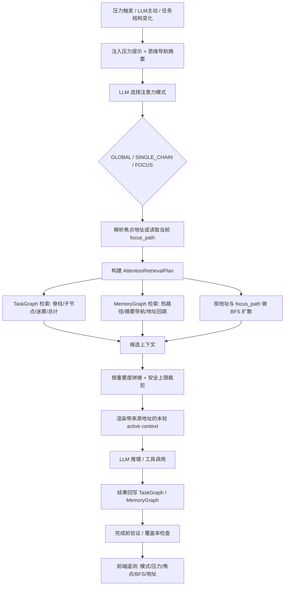

# 动态注意力切换协同设计（收敛版）

> 阶段：设计文档收敛版，暂不改业务代码。
> 目标：把注意力切换从“历史上下文裁剪”收敛为“图位置感知的动态上下文检索”。
> 核心约束：**不建设全局上下文去重层、不全量注入全图、不把动态注意力做成压缩器**。
> 对齐基线：TSD 1.7 §26.1.0–26.1.6（v2.9.23～v2.9.27）。本方案以最新 TSD 为准，旧表述按 §18.3a 裁决规则收敛。
> 注入原则：所有上下文遵循「增量注入、局部变化更新」；active context 每轮按本轮检索结果重建，导航地图仅在真实变化时注入，不每轮注入。

---

## 1. 一句话定义

动态注意力切换应定义为：

> **图位置感知的动态上下文检索系统。**

它不是：

- 不是把旧上下文压缩一下再塞回 LLM。
- 不是全局去重系统。
- 不是 GLOBAL 模式下把全图完整注入。
- 不是每轮全量重建上下文；上下文遵循增量注入与局部变化更新。

它是：

```text
LLM 选择注意力模式
→ 系统确定当前图位置
→ 根据模式构建检索计划
→ 从 TaskGraph / MemoryGraph / 地址入口做检索和 BFS 扩散
→ 按本轮检索命中内容渲染 active context（仅以安全上限兜底）
→ 未命中的内容自然不进入本轮 LLM
```

---

## 2. 四个核心概念边界

| 概念 | 本质 | 谁提供 | 作用 |
|---|---|---|---|
| 地址体系 | 图坐标系统 | TaskGraph / MemoryGraph / Adapter | 让每个节点、摘要、证据可定位、可回跳 |
| 思维深度导航 | 当前路线 / GPS | `focus_path` + `get_focus_path_summary()` | 让 LLM 知道“我当前站在哪里” |
| 节点地址感知 | 上下文来源坐标 | BFS 输出 / 记忆检索 / 导航地图 | 让每条上下文可追溯、可下钻 |
| 注意力模式 | 视野大小 | LLM 选择 | 决定看全局、看单链、还是看局部 |

更准确的关系：

```text
地址体系 = 坐标系统
思维深度导航 = 当前所在路线
节点地址感知 = 每条上下文都带来源坐标
注意力切换 = 决定以当前坐标为中心看多大范围
BFS 扩散 = 从坐标和路线出发找本轮上下文
```

注意：**思维导航不是地址的来源**。地址来自 TaskGraph / MemoryGraph；思维导航只是把当前焦点路径暴露给 LLM。

---

## 3. 各板块职责

| 板块 | 回答的问题 | 输出 |
|---|---|---|
| PressureDetector | 是否需要触发注意力选择？ | NORMAL / YELLOW / RED |
| LLM 注意力选择 | 当前该用什么视野？ | GLOBAL / SINGLE_CHAIN / FOCUS，可选焦点地址 |
| 思维深度导航 | 当前站在哪条路径上？ | `focus_path`、`focus_depth`、`focus_summary` |
| 节点地址感知 | 上下文来自哪里？ | `tg:{graph_id}/{node_id}`、`graph_memory_id`、`memory_address` |
| TaskGraph | 当前任务结构是什么？ | root、current、parent、children、siblings、coverage |
| MemoryGraph | 相关记忆在哪里？ | hot path、summary navigation、historical BFS、graph address 回跳 |
| BFS 扩散 | 当前模式下该激活哪些节点？ | activated nodes、scores、paths |
| Context Renderer | 本轮给 LLM 看什么？ | 带来源地址的 active context |
| CircuitBreaker / RED | 高压或卡死时如何恢复？ | 保存现场 + 受限注意力重选 |
| 完成前验证门 | 是否还有不可见/未处理节点？ | pass / partial / blocked 依据 |
| 前端遥测 | 用户如何看懂发生了什么？ | 模式、压力、焦点、BFS、注入数量 |

---

## 4. 完整协同链路



---

## 5. 触发与决策规则

### 5.1 触发来源

| 触发来源 | 行为 |
|---|---|
| active context pressure `>90%` | YELLOW：提醒 LLM 选择注意力模式 |
| active context pressure `>100%` | RED：先保存现场，再强制注意力重选 |
| LLM 主动判断 | 可主动 `navigate_attention` 或 `adjust_attention_mode` |
| 任务结构变化 | 子任务完成上浮、失败/阻塞聚焦、高激活候选提示 |

普通工具调用不能直接作为模式切换规则。普通工具结果只能作为：节点锚点、工具账本、压力观测、质量证据。

### 5.2 LLM 决策输入

LLM 选择模式时应看到：

- 当前压力百分比。
- 当前 `focus_path_summary`。
- 当前焦点地址。
- TaskGraph 进度、阻塞、未完成项。
- 高激活候选节点地址。
- 最近失败/成功工具证据。
- 用户最新目标。

LLM 输出建议结构：

```text
mode: GLOBAL | SINGLE_CHAIN | FOCUS
reason: 切换原因
focus_address: 可选；如果不填，使用当前 focus_path[-1]
```

---

## 6. AttentionRetrievalPlan

注意力切换后构建一次本轮检索计划。它不是上下文池，也不是去重对象，只是本轮执行单。

```python
@dataclass
class AttentionRetrievalPlan:
    mode: str                       # GLOBAL / SINGLE_CHAIN / FOCUS
    query_text: str
    trigger_reason: str             # llm_attention_switch / pressure_dive / restricted_recovery / ...
    pressure_percent: float         # 本轮触发时的压力百分比

    # 思维导航：当前路线
    focus_node_id: str
    focus_path: list[str]
    focus_depth: int

    # 地址体系：可回跳坐标
    focus_node_address: str
    focus_path_addresses: list[str]
    seed_addresses: list[str]

    # MemoryGraph / 摘要导航入口
    graph_memory_ids: list[str]
    memory_addresses: list[dict]
    source_node_ids: list[str]

    # BFS 与安全边界
    bfs_depth: int
    allowed_edge_types: list[str]
    allowed_node_types: list[str]
    target_tokens: int               # 统一安全上限，防止拼接结果超过模型窗口；不按模式设不同值
    max_items: int                   # 最多注入片段数，同属安全边界
```

渲染产物以 `AttentionContextBundle` 承载，与检索计划分离（对齐 TSD §26.1.5）：

```python
@dataclass
class AttentionContextBundle:
    plan: AttentionRetrievalPlan
    rendered_text: str                      # 本轮临时 active context 文本，不写回长期 state.messages
    source_addresses: list[str]             # 本轮注入项的来源地址集合，服务覆盖率与下钻
    token_estimate: int                     # 本地估算 token（provider usage 返回前）
    navigation_map_injected: bool
    navigation_map_reason: str              # none / deduped / llm_attention_switch / ...
    retrieved_memory_count: int
    bfs_seed_count: int
    bfs_activated_count: int
    provider_prompt_tokens: int | None      # provider usage 返回后回填
    provider_context_pressure_percent: float | None
```

`[来源: ...]`、`graph_memory_id`、`memory_address`、`source_node_ids` 只表示地址回跳和覆盖率证据，不是全局去重键。

---

## 7. 三种注意力模式策略

| 模式 | 目标 | 种子 | BFS 边界 | 注入策略 |
|---|---|---|---|---|
| GLOBAL | 恢复全局态势 | root、session、focus_path、阻塞节点、高重要摘要 | 1-2 跳，可跨主干但不全量展开 | 全局摘要、进度、阻塞、关键入口地址 |
| SINGLE_CHAIN | 推进当前主链 | focus_path、当前链 open leaf、依赖/证据节点 | 1-2 跳，仅沿链路/依赖/证据边 | 当前链目标、节点状态、链内证据、下一步 |
| FOCUS | 解决局部问题 | focus_node_address、最新错误、失败工具节点 | 默认 1 跳 | 当前焦点、必要背景、直接证据、最小下一步 |

> 注：模式只决定「检索什么、从哪扩散、BFS 多深」，**不预设注入量百分比**。各模式的实际注入量由本轮检索命中的内容按重要度拼接决定——GLOBAL 命中多就多注入、FOCUS 命中少就少注入，没有"该塞满多少预算"的目标水位。触发线以 TSD §26.1.1 为唯一口径：yellow `>90%`、red `>100%`。`target_tokens` 仅作为统一安全上限（防止超过模型窗口），不按模式设不同值。

---

## 8. 模型能感知哪些节点

### 8.1 当前焦点

通过：

- `focus_path[-1]`
- `focus_node_address`
- `render_navigator_map()` 的 `📍 tg:{graph_id}/{node_id} 深度x/y`

### 8.2 上级路径

通过：

- `focus_path`
- `get_focus_path_summary()`
- `TaskGraph.get_ancestor_chain()`
- 导航地图“脊柱行”

示例：

```text
req[✅] › o1[✅] › o1_1[🔄] › o1_1_2[🔄] ◀
```

### 8.3 当前焦点的直接下级

通过：

- `get_children(current_id)`
- 导航地图直接子节点行
- `navigate_attention(deeper)`
- 当前焦点 1-hop BFS

限制：只展示少量直接子节点，完整子树按需下钻。

### 8.4 其他节点

通过分层感知：

| 节点类型 | 感知方式 |
|---|---|
| 兄弟分支 | 迷雾行：`id[status](子树计数)` |
| 高激活节点 | BFS 候选地址 |
| 远端历史节点 | summary_navigation 摘要 + `graph_memory_id` |
| 未覆盖节点 | `❓未探索` / 覆盖率提示 |
| 全图状态 | 总计行 |

模型不默认看到其他节点全文，只知道入口、状态和是否需要下钻。

---

## 9. 全图感知如何避免上下文溢出

全图感知不是全量注入，而是四层策略：

```text
地图压缩：脊柱 + 迷雾 + 总计 ≤15 行
地址回跳：只给入口地址，不给全文
BFS 下钻：需要时从地址局部扩散
安全裁剪：命中内容按重要度拼接，仅以 target_tokens 统一上限兜底
```

硬规则：

1. 导航地图最多 15 行。
2. 当前子节点最多展示 4 个，其余折叠数量。
3. 迷雾行最多 4-5 行，每行兄弟分支最多 4 个。
4. 全图只给统计、状态分布和关键入口地址。
5. GLOBAL 也不是全图完整注入。
6. FOCUS 默认只取当前节点一跳邻域。
7. summary_navigation 只注入摘要和地址，不直接注入冷历史全文。
8. active skeleton 只作为后台活跃骨架与 BFS/Web 辅助，不整体注入 LLM。
9. 前端图谱可以展示更多，但 LLM 上下文不能等同前端全图快照。
10. 导航地图遵循「变化时注入」：仅在真实注意力切换、焦点变化、上浮、下探、压力导致切换或状态签名变化时注入；普通轮次只更新 telemetry，不注入地图。`mode != GLOBAL` 本身不是注入理由。
11. 所有上下文遵循「增量注入、局部变化更新」：active context 每轮按本轮检索命中重建，只注入本轮新增/变化/局部相关项；未被本轮检索命中的旧上下文自然不进入 LLM，无需额外裁剪或去重层。

---

## 10. 上下文渲染格式

本轮 active context 由 `AttentionRetrievalPlan` 检索后渲染。其中【导航地图】块为**条件注入**（见 §9 规则 10 与 §10a），普通轮次不注入；其余三块每轮按本轮检索命中重建，遵循增量注入与局部变化更新。

```text
【注意力模式】FOCUS
【思维导航】req › o1 › o1_1 › o1_1_2 ← 当前焦点
【当前焦点地址】tg:tg_178xxx/o1_1_2

【导航地图】  ← 仅在真实切换/上浮/下探/压力切换/状态签名变化时注入；普通轮次省略此块
📍 tg:tg_178xxx/o1_1_2 深度3/5
req[✅] › o1[✅] › o1_1[🔄] › o1_1_2[🔄] ◀
  ├─ o1_1_2_1[⏳] Token刷新
  └─ … 还有 3 个子节点
🌫 o1 下其他分支: o1_2[⏳](5子) o1_3[🚫](3子)
📊 全局: 45/121 完成 | 18进行中 | 58待执行 | 2阻塞

【本轮相关上下文】
1. [来源: tg:tg_178xxx/o1_1_2] 当前节点缺少验证证据。
2. [来源: graph_memory_id=dialogue:session_xxx/round_12] 用户强约束：不引入隐藏上下文池。
3. [来源: tg:tg_178xxx/o1_1_2/evidence_1] 最近工具失败: ...

【下一步约束】
- 只处理当前焦点问题，不回到无关分支。
```

其中 `[来源: ...]` 是位置感知，不是全局去重字段。

## 10a. 导航地图注入门禁

对齐 TSD §26.1.4，导航地图注入受签名门禁约束，避免每轮注入或 pinned 堆积：

```text
navigation_map_key = graph_id | mode | focus_node_id | trigger_reason | status_signature
```

- 签名未变化时：`navigation_map_injected=false`，只更新 telemetry，不注入地图块。
- 真实注入时必须写入 `navigation_map_reason`，取值枚举：
  `none | deduped | llm_attention_switch | focus_changed | auto_float_up | pressure_dive | restricted_recovery | status_signature_changed`
- 以下**不得单独**作为注入理由：`mode != GLOBAL`、普通工具调用、普通 `_call_model()` 循环、本地 token 估算变化。
- active context 每轮可重建为临时系统消息/上下文块，**不写回长期 `state.messages`**，不 pinned；状态中仅保留 `attention_context_plan / attention_context_telemetry / last_attention_context_key` 等诊断字段。

---

## 11. 检索与 BFS 执行顺序

建议顺序：

1. **定位**
   - 若 LLM 给出 `focus_address`，先解析地址。
   - 若无新焦点，读取当前 `focus_path[-1]`。
   - 若无焦点，GLOBAL 从 root/session 开始；FOCUS/SINGLE_CHAIN 找 active/in_progress 节点。

2. **TaskGraph 检索**
   - root/current/parent/children/dependency。
   - in_progress / blocked / failed / recently completed。
   - 脊柱、直接子节点、迷雾、总计。

3. **MemoryGraph 检索**
   - query 语义检索。
   - hot path。
   - summary navigation。
   - `graph_memory_id` / `memory_address` 回跳。

4. **BFS 扩散**
   - 从 `focus_path_addresses`、`seed_addresses`、`graph_memory_ids` 解析出的节点启动。
   - 根据模式限制深度、边类型和节点类型。

5. **裁剪与拼接**
   - 注入量由本轮检索命中的内容按距离、激活分、任务状态、重要度、新鲜度排序后拼接决定；命中多则多注入，命中少则少注入，不预设模式目标水位。
   - `target_tokens` 仅作为统一安全上限：当拼接结果即将超过上限时，按上述排序裁剪低优先项，防止超过模型窗口；它不是"每个模式该注入多少"的目标值。
   - 不建设全局上下文去重层；未被本轮检索命中的旧上下文自然不进入 LLM。

---

## 12. RED 受限恢复链路

RED 不是直接硬中断任务，而是：

```text
RED 触发
→ 收走普通执行工具，只保留落盘/记忆/注意力能力
→ 先把当前证据、未完成项、失败原因、下一步建议写到当前焦点节点
→ LLM 选择注意力模式和焦点
→ 按新模式重检索 + BFS
→ 继续经过完成前验证门
```

RED 现场落盘必须锚定：

- 当前 `focus_node_address`。
- 当前 TaskGraph 节点。
- 相关 `graph_memory_id` / `memory_address`。

---

## 13. 覆盖率与完成前验证

旧覆盖率依赖 AttentionWindow 可见 envelopes；新方案建议改为：

```text
本轮注入地址集合
vs
TaskGraph 中 in_progress / blocked / required evidence 节点集合
```

验证门检查：

- 是否还有 in_progress 叶子节点未被本轮上下文覆盖。
- 是否有失败工具结果未解释。
- 是否有用户强约束未引用。
- 是否有 required evidence 没有对应地址证据。

未通过时只能输出 partial / blocked，不得伪完成。

---

## 14. 前端遥测

前端显示语义状态，不暴露工具噪声。对齐 TSD §26.1.5 / §26.1.6 最小可观测字段：

```json
{
  "attention_mode": "GLOBAL|SINGLE_CHAIN|FOCUS",
  "focus_address": "tg:{graph_id}/{node_id} 或 graph_memory_id",
  "focus_path": ["root", "...", "current"],
  "navigation_map_injected": false,
  "navigation_map_reason": "none|deduped|llm_attention_switch|focus_changed|auto_float_up|pressure_dive|restricted_recovery|status_signature_changed",
  "retrieved_memory_count": 0,
  "bfs_seed_count": 0,
  "bfs_activated_count": 0,
  "active_context_item_count": 0,
  "active_context_source_addresses": [],
  "active_context_token_estimate": 0,
  "active_context_rendered_chars": 0,
  "provider_prompt_tokens": null,
  "provider_context_pressure_percent": null,
  "provider_usage_source": "provider|local_estimate|null",
  "registered_context_pressure": 0.0,
  "visible_node_coverage": false,
  "pressure_stage": "normal|yellow_guidance|restricted_recovery"
}
```

字段口径裁决（TSD §26.1.5）：

- `registered_context_pressure`：AttentionWindow 已登记消息池相对阈值预算的压力，是**诊断字段**，不等于本轮实际发给 LLM 的 active context。
- `provider_context_pressure_percent`：本轮实际注入压力，优先由 `provider_prompt_tokens / threshold_budget_tokens` 计算；`provider_usage_source` 标明来源，无 provider usage 时才退回 `local_estimate`。
- `pressure_stage`：`normal` / `yellow_guidance`（首次达 yellow/red 只引导）/ `restricted_recovery`（第二次仍 RED 且未落盘/未显式选择）。
- 前端颜色阈值统一为 yellow `>90%`、red `>100%`，不得使用 50%/60% 兜底。

不展示：去重数量、原始工具噪声，以及任何与隐藏上下文池相关的旧字段（字段命名禁用清单以 TSD §26.1.5 为准，不在本设计文档枚举）。

---

## 15. 与当前旧实现的关系

| 当前旧倾向 | 收敛后目标 |
|---|---|
| `AttentionWindow.apply_window()` 从已有 envelope 裁剪 | 注意力切换后重新按模式检索 + BFS 生成上下文 |
| 压力可能受历史消息池影响 | 主压力看本轮 active context |
| 思维导航只是 prompt 摘要 | 思维导航进入检索计划，作为 GPS / focus_path |
| 节点地址注入格式不统一 | 每条关键上下文统一带来源地址 |
| 覆盖率看旧窗口可见节点 | 覆盖率看本轮注入地址集合 |
| 导航地图和动态注意力松散 | 地图/焦点路径/地址/BFS 统一到 AttentionRetrievalPlan |

旧 `AttentionWindow.apply_window()` 保留为**低层安全兜底**（保证消息不超模型窗口），不再是动态注意力主机制的唯一入口。主机制由模式选择、焦点解析、TaskGraph/MemoryGraph/摘要导航/BFS 检索和 active context 渲染共同完成。

---

## 16. 最终验收要点

后续实现至少验证：

1. YELLOW/RED 触发时，LLM 选择模式而不是工具名硬切换。
2. 每次注意力切换前，LLM 能看到当前思维导航 GPS。
3. 注意力切换时导航地图包含当前地址、脊柱、直接子节点、迷雾、总计；且仅在真实变化时注入，普通轮次不注入。
4. MemoryGraph 检索结果带 `graph_memory_id/shard_id/full_path/memory_address/source_node_ids`。
5. 摘要导航命中后可用 `graph_memory_id` 做 BFS 增量回忆。
6. 本轮注入上下文的关键证据带 `[来源: ...]`。
7. FOCUS 不拉全图，GLOBAL 也不全量注入。
8. active skeleton 只作为后台活跃骨架与 BFS/Web 辅助，不整体注入 LLM。
9. 完成前验证能指出未覆盖的 in_progress 节点地址。
10. 前端能看到模式、压力（区分 registered / provider）、焦点地址、BFS 数量、注入片段数量、navigation_map_reason。

---

## 17. 最终推荐实现路径

```text
select_attention_mode()
→ resolve_focus_position()
→ build_attention_retrieval_plan()
→ retrieve_attention_context()
→ run_bfs_expansion()
→ render_attention_context()
→ inject_active_context_to_llm()
→ call_llm()
→ record_provider_usage_to_telemetry()
→ write_back_task_and_memory()
→ validate_coverage_and_quality()
```

> 注意：`inject_active_context_to_llm()` 是每轮临时 prepend，不写回长期 `state.messages`；`record_provider_usage_to_telemetry()` 在 provider usage 返回后回填 `provider_prompt_tokens / provider_context_pressure_percent`，无 usage 时退回本地估算。

这条链路保留用户原始意图：

> **注意力切换就是一次新的上下文定位与检索，而不是对旧上下文做压缩、去重或反复裁剪。**
---

## 18. 执行目标任务书（待手动启动）

> 状态：**待用户手动启动**。
> 本节只把方案串成可执行目标，不代表已经进入代码实现。用户明确说“启动目标任务”后，才按本节执行代码改动与回归验证。

### 18.1 执行目标

把当前分散的动态注意力、图记忆、思维导航、全图感知、位置感知、压力监控和完成验证串成一条真实可运行链路：

```text
压力监控 / LLM 主动注意力选择
→ 读取当前思维导航与图位置
→ 构建 AttentionRetrievalPlan
→ TaskGraph 导航地图：脊柱 + 迷雾 + 总计
→ MemoryGraph 检索：hot path + summary navigation + historical BFS
→ BFS 扩散激活：从焦点地址 / focus_path / graph_memory_id 出发
→ 渲染本轮 active context
→ 注入 LLM
→ 工具执行结果回写 TaskGraph / MemoryGraph
→ 更新焦点、覆盖率、压力 telemetry
→ 完成前验证门 / 质量评分
```

最终效果：这些板块不再各自为战，也不再只停留在“有代码但未进入主链路”的状态。

### 18.2 非目标与硬边界

本轮执行明确不做：

1. 不建设全局上下文去重层。
2. 不把动态注意力写成上下文压缩器。
3. 不把 GLOBAL 解释成全图全文注入。
4. 不绕过 `memory_graph_factory` 直接创建旧 NetworkX / 单 JSON 记忆后端。
5. 不用固定普通工具名作为 GLOBAL / FOCUS / SINGLE_CHAIN 的主切换规则。
6. 不把 active skeleton 当作 LLM 上下文池。
7. 不每轮注入导航地图；只在真实切换、上浮、下探、压力导致切换或状态签名变化时注入。
8. 不把 active context 写回长期 `state.messages`，不 pinned 堆积。

### 18.3 TSD 对齐基线

启动后以 TSD 1.7 §26.1.0–26.1.6（v2.9.23～v2.9.27）为硬基线：

| TSD 条款 | 执行口径 |
|---|---|
| v2.9.27 真实 Full 验收基线 | 必须用 `start.py` 启动 Full，经非诱导式真实编程任务验收，不得只用离线脚本宣称完成（见 §18.7a） |
| v2.9.26 全路径落地与遥测闭环 | IDE / Full Web+Core FC / L2 单次决策三条模型入口必须共用 `attention_context_retrieval.py`；公开压力字段为 `registered_context_pressure`，实际注入压力用 `provider_context_pressure_percent`；`AttentionWindow.apply_window()` 仅作低层安全兜底 |
| v2.9.25 active context 与导航地图注入边界 | active context 可每轮重建为临时上下文块、不写回长期 `state.messages`；导航地图受 `navigation_map_key` 签名门禁，`mode != GLOBAL` 不得单独触发注入（见 §10a） |
| v2.9.24 执行目标与回归编码范围 | 本方案 §18 整体纳入 TSD 执行基线；胶水模块落点 `zulong/l2/attention_context_retrieval.py` |
| v2.9.23 上下文检索与重组收敛 | 动态注意力 = 图位置感知的动态上下文检索与重组；GLOBAL 按全局态势视野解释，非全图全文注入；区分压力 RED（两阶段）与 CB RED（立即受限恢复）；删除“预测 5 秒提前触发” |
| v2.9.22 动态注意力原则 | 动态注意力 = LLM 自主选择当前必要上下文并按需注入，不是压缩 |
| v2.9.22 压力口径 | yellow `>90%`，red `>100%`，LLM 只看压力百分比，不看公式 |
| v2.9.22 两阶段响应 | 第一次达阈值只引导；第二次仍 RED 且未完成现场落盘/注意力选择才受限恢复 |
| v2.9.21 TaskGraph 导航地图 | `render_navigator_map()` 输出脊柱 + 迷雾 + 总计，≤15 行 |
| v2.9.21 节点地址感知 | BFS / 记忆检索 / 上下文渲染都带地址或来源 |
| v2.9.21 覆盖率 | 用可见节点集合与 TaskGraph 对比，阻止伪完成 |
| v2.9.20 MemoryGraph 运行态 | 新链路必须通过 `memory_graph_factory` / 统一入口使用 ShardedMemoryGraph / Hybrid |
| v2.9.18 检索冷热术语 | hot/cold 是本轮检索路由，不等于存储温度 HOT/WARM/COLD |
| 21.9.5 Active Skeleton | 只作为热/活跃骨架和 BFS/Web 辅助，不整体注入 LLM |
| 21.9.6 摘要导航与回跳 | summary_navigation 命中只注入摘要 + `graph_memory_id/shard_id/full_path/memory_address/source_node_ids`，详情按需 BFS |

TSD 中旧表述如“GLOBAL 关注完整上下文 / 全图高亮”，执行时按更优解释收敛为：

```text
GLOBAL = 全局态势、关键入口、覆盖缺口、阻塞点、摘要导航和地址回跳
GLOBAL ≠ 全图全文注入
```


### 18.3a TSD 再对齐与裁决规则

本节用于处理 TSD 内部新旧表述、实现现状与本方案之间的优先级。执行时按以下裁决顺序：

```text
TSD v2.9.27 / v2.9.26 / v2.9.25 / v2.9.24 / v2.9.23 收敛条款
> TSD v2.9.22 / v2.9.21 / v2.9.20 新增收敛条款
> 本方案明确写入的更优解释
> TSD 旧 UI/概念性表述
> 当前旧实现的兼容行为
```

#### A. 动态注意力定位

硬对齐 TSD v2.9.22 / v2.9.23：

- L2 动态注意力不是上下文压缩机制。
- 主目标是让 LLM 在上下文压力上升时自主选择当前必要上下文。
- 普通工具调用只进入工具账本、压力观测、质量证据，不能直接触发模式切换。
- 显式注意力能力可以执行 LLM 的选择：`navigate_attention` / `adjust_attention_mode` 或后续等价接口。

本方案的更优落地解释：

```text
动态注意力 = 图位置感知的动态上下文检索与重组
不是 apply_window 裁剪历史消息的同义词
```

因此，`AttentionWindow.apply_window()` 保留为**低层安全兜底**（保证消息不超模型窗口），不再是动态注意力主机制的唯一入口；后续主链路应为：

```text
select_attention_mode
→ resolve_focus_position
→ build_attention_retrieval_plan
→ retrieve_attention_context
→ run_bfs_expansion
→ render_attention_context
→ inject_active_context_to_llm
```

#### B. GLOBAL 的含义

TSD 旧段落中出现过：

- `GLOBAL(全图高亮)`
- `GLOBAL 模式：关注完整上下文`
- `all_nodes: string[]`

执行时不解释成“全图全文注入 LLM”。这些旧表述更适合作为前端可视化或状态模型，而不是 LLM prompt 注入策略。

本方案采用更优解释：

```text
GLOBAL = 全局态势视野
包含：脊柱、迷雾、总计、阻塞点、覆盖缺口、关键摘要、地址入口
不包含：全图所有节点全文、所有历史消息
```

#### C. 压力 RED 与 CircuitBreaker RED 的区分

TSD 中有两类 RED，执行时必须区分：

| RED 类型 | 触发来源 | 执行策略 |
|---|---|---|
| 上下文压力 RED | active context pressure `>100%` | 遵循两阶段：第一次达阈值 guidance only；第二次仍 RED 且未落盘/未显式注意力选择，进入受限恢复 |
| CircuitBreaker RED | 语义卡死、重复结果、连续错误等 CB 信号 | 按 TSD v2.9.22：立即进入受限恢复，不再设置额外第三阶段 |

原因：TSD v2.9.22 正文同时写了“阈值响应必须两阶段”和“CircuitBreaker RED 立即受限恢复”。两者不冲突，但不能混用。

#### D. 压力口径

硬对齐 TSD v2.9.22 / v2.9.26：

```text
实际阈值预算 tokens = Web 端配置的 LLM 原始上下文窗口；历史 `threshold_budget_ratio` 仅保留兼容遥测，正式运行口径固定为 1.0
上下文压力百分比 = 实际上下文占用 / 实际阈值预算 × 100%
触发线：yellow > 90%，red > 100%
```

执行裁决：

1. 主触发压力使用本轮实际进入 LLM 的 active context tokens。
2. 有 provider usage 时优先使用 `prompt_tokens`。
3. 无 provider usage 时才使用本地估算。
4. LLM 可见只显示压力百分比和行动提示。
5. telemetry 可以记录完整字段，包括 `threshold_budget_ratio`、`threshold_budget_tokens`、`active_window_tokens` 等；其中 `threshold_budget_ratio` 在正式系统中固定为 1.0，仅表示阈值预算等于 Web 设置的完整 LLM 上下文窗口。
6. 不再使用“预测 5 秒后超过红线就提前触发”作为触发机制；预测值最多作为日志观测字段。
7. 公开字段区分两种压力：`registered_context_pressure`（AttentionWindow 已登记消息池压力，诊断字段）与 `provider_context_pressure_percent`（本轮实际注入压力，优先 provider usage）。前者不等于后者。

#### E. 全图感知：脊柱 + 迷雾 + 总计

硬对齐 TSD v2.9.21 / v2.9.25：

- TaskGraph 本身是结构化账本和导航地图。
- `render_navigator_map()` 输出三层紧凑地图。
- 三层为：脊柱、迷雾、总计。
- 硬限制最多 15 行。
- 地图只在真实注意力切换、上浮、下探、压力导致切换或状态签名变化时注入。
- 不每轮注入，不 pinned 堆积。
- 注入受 `navigation_map_key = graph_id | mode | focus_node_id | trigger_reason | status_signature` 签名门禁；签名未变化时只更新 telemetry（详见 §10a）。
- `mode != GLOBAL`、普通工具调用、普通模型循环、本地 token 估算变化，均不得单独成为注入理由。

本方案补充：

```text
全图感知 = 低 token 地图 + 地址入口 + BFS 下钻
不是全图全文注入
```

#### F. 图位置感知与思维导航

裁决关系：

| 概念 | 权威来源 | 说明 |
|---|---|---|
| 节点地址 | TaskGraph / MemoryGraph | `tg:{graph_id}/{node_id}`、`graph_memory_id`、`memory_address` |
| 思维导航 | MemoryGraph focus context | `focus_path`、`focus_depth`、`get_focus_path_summary()` |
| 当前位置感 | 地址 + focus_path + 导航地图 | LLM 知道“当前站在哪里” |
| 下钻能力 | BFS / read_memory_node / discover_related | LLM 需要细节时再展开 |

纠偏：节点地址感不是思维导航“生成”的；思维导航只是把当前路线暴露出来。地址来自图结构本身。

#### G. MemoryGraph 运行态

硬对齐 TSD v2.9.20：

- 运行态权威后端是 `ShardedMemoryGraph / Hybrid`。
- 新增代码必须通过 `memory_graph_factory` 或统一入口获取图记忆实例。
- 不允许新增路径绕回单 JSON / 旧 NetworkX 持久化后端。

本方案执行要求：

```text
所有动态注意力检索、BFS、summary_navigation、地址回跳，都必须使用运行态统一图记忆实例。
```

#### H. 检索冷热术语

硬对齐 TSD v2.9.18：

- hot/cold 是 `retrieve_context()` 的本轮检索路由术语。
- hot path 由 `hot_window_minutes` 时间窗口决定。
- cold / historical 不等于存储标签 `Temperature.COLD`。
- 存储温度标签用于生命周期、展示、归档和清理策略。

执行时文档、日志、前端都应避免把“检索冷路径命中”说成“存储层冷记忆”。

#### I. Active Skeleton

硬对齐 TSD 21.9.5：

- `active_topology/skeleton.bin` 是热/活跃骨架快照。
- 它不是全量拓扑。
- 它也不是 LLM 上下文池。

本方案使用方式：

```text
active skeleton 只服务 Web 展示、热路径、焦点路径、BFS 候选和后台骨架刷新
不整体注入 LLM
```

#### J. 摘要导航与地址回跳

硬对齐 TSD 21.9.6：

summary_navigation 命中后，注入对象必须携带：

- `graph_memory_id`
- `shard_id`
- `full_path` / `memory_address`
- `source_node_ids`
- 摘要文本与状态标签

更优执行策略：

```text
默认只注入摘要 + 地址
需要细节时，再以 graph_memory_id 为种子做 BFS 增量回忆
```

#### K. 覆盖率与完成门

硬对齐 TSD v2.9.21 / v2.9.22：

- 使用可见节点集合与 TaskGraph 全部节点比对。
- 检查 in_progress 叶子、未处理工具错误、覆盖缺口。
- 受限恢复后仍必须经过完成前验证门与质量评分。
- 覆盖不通过只能输出 partial / blocked summary，不得伪完成。

#### L. 本方案相对 TSD 的增强点

TSD 已定义方向，但没有完整落到一个统一执行对象。本方案补齐：

1. `AttentionRetrievalPlan` 作为注意力切换后的本轮执行单。
2. `resolve_focus_position()` 统一 TaskGraph / MemoryGraph 焦点。
3. `retrieve_attention_context()` 统一 TaskGraph、MemoryGraph、BFS、summary_navigation。
4. `render_attention_context()` 统一 active context 格式；渲染产物以 `AttentionContextBundle` 承载。
5. 明确 `AttentionWindow.apply_window()` 为低层安全兜底（保证消息不超模型窗口），不再是动态注意力主机制的唯一入口。
6. 明确不建设全局去重层，靠检索 + BFS 天然淘汰无关上下文。
7. 导航地图注入门禁（`navigation_map_key` 签名，见 §10a），保证只在真实变化时注入。
8. 三条模型入口（IDE FC / Full Web+Core FC / L2 单次决策）统一走 `attention_context_retrieval.py`。
### 18.4 启动前检查清单

用户手动启动后，先做以下只读检查，确认当前实际代码状态：

1. 检查工作区改动，避免覆盖既有未提交工作。
2. 确认当前运行入口仍是 `zulong/ide/ide_fc_runner.py` + `zulong/l2/inference_engine.py`。
3. 确认 `AttentionWindowManager.apply_window()` 当前仍作为低层安全兜底（保证消息不超模型窗口），不再作为动态注意力主机制。
4. 确认 `TaskGraph.render_navigator_map()` 已支持脊柱、迷雾、总计和 15 行限制。
5. 确认 `ShardedMemoryGraph.retrieve_context()` 返回结果包含 `graph_memory_id/shard_id/full_path/memory_address/source_node_ids` 或可补齐。
6. 确认 `navigate_attention` / `adjust_attention_mode` 能更新注意力模式与 MemoryGraph 焦点。
7. 确认压力 telemetry 当前使用的是 active context pressure，而不是旧历史 envelope 总量作为主触发口径。

### 18.5 推荐实现分期

#### Phase 0：只读审计与断链定位

目标：找出哪些模块已经存在但未进入主链路。

检查点：

- PressureDetector 当前压力口径。
- AttentionWindow 的裁剪/模式切换是否仍旧承担主机制。
- IDEFCRunner 中压力引导、受限恢复、导航地图注入位置。
- MemoryGraph 检索结果的地址字段完整性。
- 思维导航 `focus_path/get_focus_path_summary()` 是否稳定可取。
- BFS 激活结果是否能转换成带 TaskGraph 地址的位置感知对象。

产出：断链表。

#### Phase 1：定义统一计划对象

新增或集中定义一个轻量执行对象：

```python
AttentionRetrievalPlan
```

职责：只描述本轮要检索什么，不保存全局上下文池。

必须包含：

- mode：`GLOBAL / FOCUS / SINGLE_CHAIN`
- query_text
- focus_node_id
- focus_path
- focus_depth
- focus_node_address
- focus_path_addresses
- seed_addresses
- graph_memory_ids
- memory_addresses
- source_node_ids
- bfs_depth
- target_tokens
- max_items
- trigger_reason
- pressure_percent

#### Phase 2：焦点解析与图位置感知

目标：让系统稳定知道“当前站在哪里”。

链路：

```text
LLM focus_address / navigate_attention / 当前 in_progress 节点
→ resolve_focus_position()
→ TaskGraph 地址 tg:{graph_id}/{node_id}
→ MemoryGraph focus_path
→ focus_path_summary
```

要求：

- 有 TaskGraph 焦点时，优先以 TaskGraph 当前节点为本轮焦点。
- 有 MemoryGraph 焦点时，同步提供 `graph_memory_id`。
- 地址解析失败时，退回当前 in_progress / root / session，不中断任务。

#### Phase 3：全图感知最小注入

目标：把“全图感知”落到低 token 导航地图，而不是全量注入。

注入内容：

```text
[导航地图]
- 当前地址
- 脊柱
- 当前直接子节点
- 迷雾兄弟分支
- 总计
```

规则：

- 最多 15 行。
- 只在真实注意力切换 / 上浮 / 下探 / 压力导致切换 / 状态签名变化时注入；受 `navigation_map_key` 签名门禁（见 §10a）。
- 普通轮次不注入，只更新 telemetry。
- 不 pinned 堆积。
- GLOBAL 也只注入全局态势，不注入全图全文。

#### Phase 4：MemoryGraph 检索与 BFS 扩散接入

目标：让图记忆和 BFS 真正服务注意力上下文。

执行顺序：

```text
retrieve_context(query_text)
→ hot path / summary_navigation / historical_bfs
→ 从 graph_memory_id / focus_path / seed_address 做 BFS
→ 生成候选 context items
```

要求：

- 通过 `memory_graph_factory` 或统一 `get_memory_graph()` 入口拿运行态图。
- summary_navigation 只注入摘要 + 地址。
- 详情必须通过 `graph_memory_id` 增量回忆。
- active skeleton 只作为后台骨架，不整体进 LLM。

#### Phase 5：Context Renderer

目标：统一渲染本轮 active context。

推荐结构：

```text
【注意力计划】mode / reason / pressure / focus
【思维导航】focus_path_summary
【导航地图】脊柱 + 迷雾 + 总计   ← 条件注入，见 §10a；普通轮次省略
【当前必要上下文】按 score 排序的 TaskGraph / MemoryGraph / BFS 结果
【地址回跳】可继续下钻的 tg:... / graph_memory_id / memory_address
```

每条上下文必须尽量带来源：

```text
[来源: tg:{graph_id}/{node_id}]
[来源: graph_memory_id=..., shard_id=..., memory_address=...]
```

#### Phase 6：压力监控接入

目标：压力监控触发“选择上下文”，不是触发“压缩上下文”。

规则：

- 主压力：本轮实际注入 LLM 的 active context pressure。
- 优先 provider usage；无 usage 时才本地估算。
- LLM 可见：只看到压力百分比与行动提示。
- 日志/telemetry：可记录完整字段用于复盘。
- 删除或禁用“预测 5 秒后超过红线就提前触发”的策略。

#### Phase 7：RED 受限恢复

目标：高压时保存现场并重新聚焦，不硬停任务。

链路：

```text
RED 第一次：guidance only
RED 第二次仍未落盘/未注意力选择：restricted recovery
→ 只保留便签/标签/记忆落盘能力 + 注意力切换能力
→ 先保存现场并锚定当前焦点
→ 再选择 GLOBAL / FOCUS / SINGLE_CHAIN
→ 重新构建 AttentionRetrievalPlan
→ 继续执行完成前验证
```

#### Phase 8：覆盖率、完成门与前端遥测

目标：把注意力链路变成可验收闭环。

后端必须可观测：

- pressure tier
- pressure percent
- mode
- focus address
- focus_path
- navigation map injected / skipped reason
- retrieved memory count
- BFS seed count / activated count
- active context token estimate
- visible node coverage
- restricted recovery stage

完成前验证必须检查：

- 是否仍有 in_progress 叶子。
- 是否存在未处理工具错误。
- 是否有不可见但未完成的关键节点。
- 覆盖率不足时只能 partial / blocked，不能伪完成。

### 18.6 建议改动文件范围

启动后优先限制在这些文件内。三条模型入口（IDE FC / Full Web+Core FC / L2 单次决策）必须共用 `attention_context_retrieval.py`：

| 文件 | 预期职责 |
|---|---|
| `zulong/l2/attention_context_retrieval.py` | **新增胶水模块**：`AttentionRetrievalPlan`、`AttentionContextBundle`、焦点解析、TaskGraph/MemoryGraph/BFS 检索与 active context 渲染集中在此，不得散落多套 |
| `zulong/l2/attention_window.py` | 低层安全兜底（保证消息不超模型窗口）；不再作为动态注意力主机制唯一入口 |
| `zulong/l2/pressure_detector.py` | 压力口径和提前预测策略修正 |
| `zulong/l2/attention_pressure_view.py` | 统一压力展示口径（区分 `registered_context_pressure` 与 `provider_context_pressure_percent`） |
| `zulong/ide/ide_fc_runner.py` | IDE FC 主链路接入：`_call_model()` 前构建并 prepend 本轮 active context；provider usage 回填 telemetry |
| `zulong/l2/fc_nodes.py` | **Full Web/Core FC 主链路接入**：`_make_call_model_node()` 调 provider 前必须调 `_build_l2_active_context_messages(...)`；usage 返回后调 `_record_attention_provider_usage(...)` |
| `zulong/l2/inference_engine.py` | L2 单次决策路径：非 FC 一次性 provider 调用也必须走 `_build_l2_active_context_messages(...)`，不得回退旧历史裁剪 |
| `zulong/launcher/web_chat_router.py` | `ATTENTION_UPDATE` 必须透传 active context 与 provider usage 遥测字段 |
| `zulong/tools/attention_tool.py` | 显式注意力切换输出 focus/path/address 信息 |
| `zulong/memory/storage_hybrid/sharded_memory_graph.py` | 检索结果地址字段、summary_navigation、BFS 回跳补齐 |
| `zulong/memory/memory_graph_factory.py` | 确认运行态入口，不绕过分片 Hybrid |
| `zulong/l2/task_graph.py` | 导航地图/覆盖率所需接口；尽量少改 |
| `zulong_web/static/index.html` | 前端压力颜色、注意力 telemetry 显示对齐 90%/100%，字段对齐 §14 |

如果需要新增文件，优先新增单一胶水模块，例如：

```text
zulong/l2/attention_context_retrieval.py
```

只放：计划对象、焦点解析、检索、BFS、渲染，不把逻辑散到各处。

### 18.7 最小回归验收

启动实现后至少跑这些验证：

1. 语法检查：相关 Python 文件全部通过编译（覆盖 `attention_context_retrieval.py`、`attention_window.py`、`pressure_detector.py`、`fc_nodes.py`、`inference_engine.py`、`ide_fc_runner.py`、`web_chat_router.py`）。
2. 单元级：构造 mock TaskGraph，验证导航地图 ≤15 行且包含脊柱、迷雾、总计。
3. 单元级：构造 MemoryGraph 检索结果，验证 `graph_memory_id/shard_id/full_path/memory_address/source_node_ids` 保留。
4. 单元级：构造 FOCUS / SINGLE_CHAIN / GLOBAL 三种计划，验证输出上下文大小和来源地址。
5. 单元级：验证导航地图签名门禁——签名未变化时 `navigation_map_injected=false`。
6. 压力回归：压力 89% 不触发，91% 只引导，101% 第二次仍 RED 才受限恢复。
7. 浏览器/真实服务：用 Web UI 触发一次多步任务，日志中能看到：
   - `ATTENTION_UPDATE`
   - 压力百分比（区分 `registered_context_pressure` 与 `provider_context_pressure_percent`）
   - focus address
   - navigation map injected / reason
   - retrieve_context 命中
   - BFS activated
   - coverage check
8. 前端颜色：压力黄/红阈值对齐 90%/100%，不再使用 50%/60% 兜底。
9. 字段命名：公开事件、DOM 字段、日志不得出现与隐藏上下文池相关的旧字段（禁用清单以 TSD §26.1.5 为准）。

> 以上为最小离线/半离线回归。**最终验收必须再通过 §18.7a 的真实 Full 编程任务验收**，不得只用离线脚本宣称完成。

### 18.7a 真实 Full 编程任务验收（对齐 TSD v2.9.27 / §26.1.6）

动态注意力的最终验收必须让祖龙在真实 Full 运行态中执行一个可观察的非诱导式编程任务，用 WebSocket、后台日志、任务产物和完成门结果共同证明链路有效。

**验收要求**：

- 必须启动 `zulong_env\Scripts\python.exe start.py`，并通过 `/api/launch` 进入 `mode=full`。
- 必须通过 Web UI 或 `ws://127.0.0.1:8090/ws` 的 `CHAT_MESSAGE` 投递**普通开发任务**；可见任务文本**不得明示** GLOBAL / SINGLE_CHAIN / FOCUS、动态注意力、TaskGraph、MemoryGraph、BFS、压力切换等机制词，也不得要求“先用某模式扫描、再切某模式修复”。
- 推荐验收项目为外部临时工作区的小型真实多文件项目（如 Markdown 知识库索引器），包含源码、fixtures、测试、README/报告，至少含一条“解析器 → 图构建 → 报告/摘要”主链和一条可失败再修复的测试路径。工作区不得指向 AiMaMi 本地代理配置，除用户明确要求外不应把祖龙源码目录作为被改造项目。
- 必须持续采集 `ATTENTION_UPDATE`（建议同时采集 `TASK_GRAPH_UPDATE`、`TASK_EXECUTION_STATUS`、`INTERACTION_EVENT`）和日志中的 `[InferenceEngine][AttentionContext]` / `[IDEFCRunner][AttentionContext]`。

**后台验收映射**（自然开发行为 → 动态注意力验收点）：

| 自然开发行为 | 后台验收点 |
|---|---|
| 读 README/fixtures/tests/源码骨架 | 全局态势视野自然形成：脊柱/迷雾/总计/阻塞/覆盖缺口/关键入口，非全图全文注入 |
| 沿主链实现核心功能 | 主链焦点自然形成，focus_path、链内依赖与证据进入 Plan |
| pytest 失败后修复 | 局部修复焦点自然形成，只注入失败测试/相关源码/直接证据，不拉全图 |
| 检索历史要求/文件地址/任务节点 | 检索结果携带 `graph_memory_id/shard_id/full_path/memory_address/source_node_ids`，可从焦点地址增量扩散 |
| 从当前文件/测试失败点继续下钻 | 可观测 `bfs_seed_count`、`bfs_activated_count` 与来源地址集合 |
| 多文件读写致上下文增大 | yellow `>90%`、red `>100%` 口径；provider usage 优先，本地估算仅兜底 |
| 运行测试/写总结 | 覆盖不足/in_progress 残留/未处理失败时不得伪完成 |

**通过标准**（全部满足）：

1. 真实产生或修改源码、测试、fixtures、README/报告。
2. 真实执行 pytest 或等价命令，并据失败结果修复或给出 blocked 证据。
3. 至少证明 GLOBAL / SINGLE_CHAIN / FOCUS 三种计划均可构建并渲染 active context；未自然出现的模式用专项回归补证据，但专项回归不得替代真实 Full 任务。
4. 导航地图 ≤15 行，仅在真实变化时注入。
5. MemoryGraph 经 `memory_graph_factory` / 统一入口参与检索。
6. 本轮 active context 为临时注入，不写回长期 `state.messages`，不 pinned，无隐藏上下文池，无全局去重层。
7. Web 前端与日志使用 yellow `>90%`、red `>100%`，并区分 `registered_context_pressure` 与 `provider_context_pressure_percent`。
8. 完成前验证门检查 in_progress 叶子、未处理工具错误、覆盖率和质量评分；未通过只能 partial / blocked。

**推荐验收产物**：

- `docs/动态注意力上下文检索与重组_验收编程任务.md`：验收任务设计与覆盖矩阵。
- `tmp/dynamic_attention_acceptance_result.json` 或等价 JSONL：WebSocket 事件、日志摘要、压力与模式统计。
- 验收项目目录：真实源码、测试和报告文件。
- 最终审计报告：逐项映射 TSD 条款、任务书要求、事件证据、日志证据和产物证据。

### 18.8 启动指令

后续用户手动启动时，建议使用明确指令：

```text
启动动态注意力上下文检索与重组执行目标，按 docs/动态注意力上下文检索与重组方案.md 第 18 节实施。
```

启动后默认执行顺序：

```text
Phase 0 审计
→ Phase 1/2 计划对象与焦点解析
→ Phase 3/4 导航地图 + MemoryGraph/BFS
→ Phase 5/6 渲染 + 压力
→ Phase 7/8 RED 恢复 + telemetry + 验收
→ §18.7a 真实 Full 编程任务验收（最终门槛）
```
